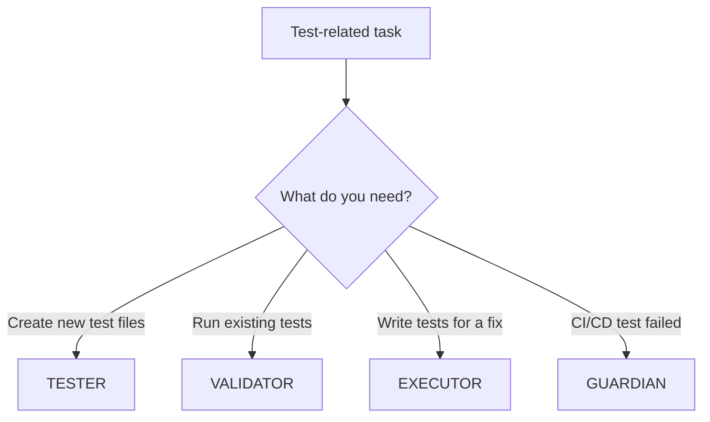
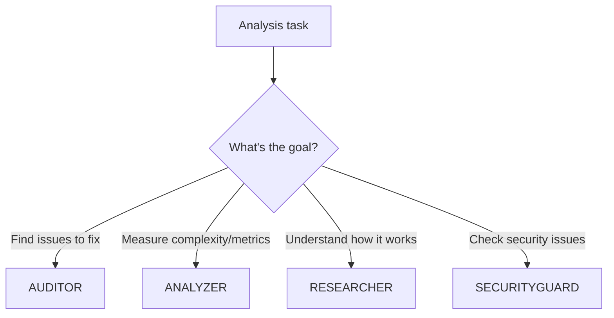
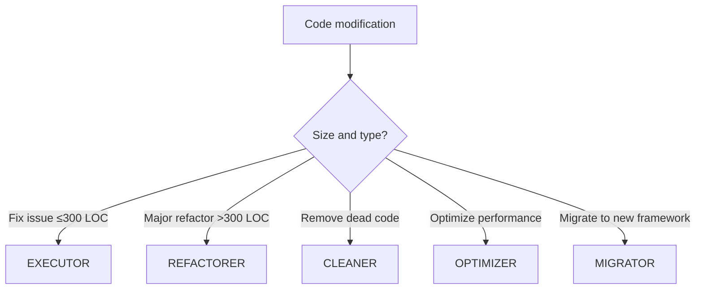
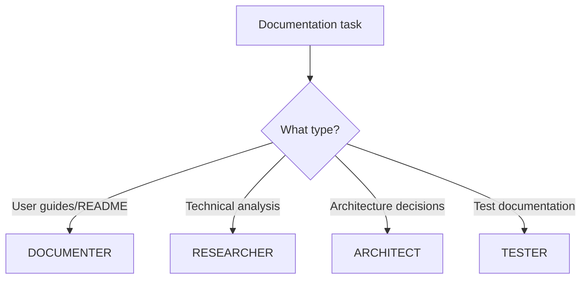

# Agent Selection Decision Guide

## Quick Decision Trees

### "I need to work with tests"


### "I need to analyze code"


### "I need to modify code"


### "I need documentation"


## Decision Matrix by Task Type

### Testing Tasks
| Task | Agent | Why |
|------|-------|-----|
| Write unit test for new function | TESTER | Creates new test files |
| Check if tests pass | VALIDATOR | Runs existing tests |
| Fix failing test | EXECUTOR | Modifies code ≤300 LOC |
| Generate test data | TESTER | Creates fixtures |
| Measure test coverage | VALIDATOR | Analyzes coverage |
| Debug CI failure | GUARDIAN | Pipeline specialist |

### Code Quality Tasks
| Task | Agent | Why |
|------|-------|-----|
| Find code smells | AUDITOR | Identifies issues |
| Calculate complexity | ANALYZER | Measures metrics |
| Remove unused imports | CLEANER | Deletes unnecessary code |
| Improve variable names | EXECUTOR | Small fixes |
| Extract large class | REFACTORER | Major restructuring |
| Speed up slow function | OPTIMIZER | Performance focus |

### Understanding Tasks
| Task | Agent | Why |
|------|-------|-----|
| "How does this work?" | RESEARCHER | Explains code |
| "What issues exist?" | AUDITOR | Finds problems |
| "How complex is this?" | ANALYZER | Measures metrics |
| "Is this secure?" | SECURITYGUARD | Security analysis |

### Documentation Tasks
| Task | Agent | Why |
|------|-------|-----|
| Update README | DOCUMENTER | Persistent docs |
| Explain algorithm | RESEARCHER | Temporary analysis |
| Document API | DOCUMENTER | User-facing docs |
| Write ADR | ARCHITECT | Design decisions |

## Common Confusions Resolved

### TESTER vs VALIDATOR
- **TESTER**: Creates test files (generation)
- **VALIDATOR**: Runs test files (execution)
- Never overlap: One creates, one runs

### AUDITOR vs ANALYZER vs RESEARCHER
- **AUDITOR**: "What's wrong?" (finds issues)
- **ANALYZER**: "How much?" (measures metrics)
- **RESEARCHER**: "How does it work?" (explains code)

### EXECUTOR vs REFACTORER vs CLEANER vs OPTIMIZER
- **EXECUTOR**: Fixes specific issues (≤300 LOC)
- **REFACTORER**: Major restructuring (>300 LOC)
- **CLEANER**: Only removes code (never adds)
- **OPTIMIZER**: Only improves performance

### DOCUMENTER vs RESEARCHER
- **DOCUMENTER**: Creates files in /docs (permanent)
- **RESEARCHER**: Provides explanations (temporary)

## Size-Based Rules

### Small Changes (≤300 LOC)
- Fix bugs → EXECUTOR
- Add feature → EXECUTOR
- Clean code → EXECUTOR
- Update tests → EXECUTOR

### Large Changes (>300 LOC)
- Restructure module → REFACTORER
- Migrate framework → MIGRATOR
- Redesign architecture → ARCHITECT
- Major optimization → OPTIMIZER

### Deletion Only
- Remove dead code → CLEANER
- Delete unused deps → CLEANER
- Purge old files → CLEANER

## Agent Chaining Patterns

### Common Workflows
1. **Full Assessment**: AUDITOR → EXECUTOR → VALIDATOR
2. **Major Refactor**: RESEARCHER → ARCHITECT → REFACTORER → TESTER → VALIDATOR
3. **Performance Fix**: ANALYZER → OPTIMIZER → VALIDATOR
4. **Security Audit**: SECURITYGUARD → EXECUTOR → VALIDATOR
5. **Documentation**: RESEARCHER → DOCUMENTER

### Pipeline Recovery
```
GUARDIAN (detect) → EXECUTOR (fix) → VALIDATOR (verify) → DEPLOYER (redeploy)
```

### Code Understanding
```
RESEARCHER (explain) → ANALYZER (measure) → AUDITOR (assess)
```

## Quick Reference Commands

### Testing
```bash
# Create tests
npm run agent:invoke TESTER:generate-tests

# Run tests
npm run agent:invoke VALIDATOR:execute-tests

# Test in TDD
npm run agent:invoke EXECUTOR:implement-fix --test-first
```

### Analysis
```bash
# Find issues
npm run agent:invoke AUDITOR:assess-code

# Measure metrics
npm run agent:invoke ANALYZER:measure-complexity

# Understand code
npm run agent:invoke RESEARCHER:explain-code
```

### Modification
```bash
# Small fix
npm run agent:invoke EXECUTOR:implement-fix

# Large refactor
npm run agent:invoke REFACTORER:restructure-modules

# Remove dead code
npm run agent:invoke CLEANER:remove-dead-code

# Optimize performance
npm run agent:invoke OPTIMIZER:profile-performance
```

## Remember

1. **One agent per specific task type**
2. **Size matters**: ≤300 LOC → EXECUTOR, >300 LOC → REFACTORER
3. **Creation vs Execution**: TESTER creates, VALIDATOR runs
4. **Permanent vs Temporary**: DOCUMENTER persists, RESEARCHER explains
5. **When in doubt**: Check "NOT For" column in quick reference

---

*This guide ensures clear agent selection without overlaps or confusion.*