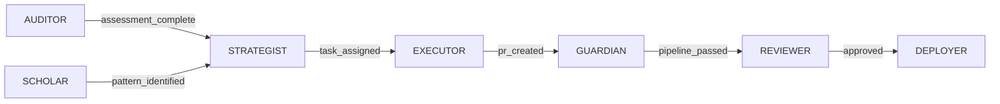

# Agent System Reference Guide

This directory contains the complete multi-agent AI system for autonomous code quality management. Each agent is specialized for specific tasks with dedicated MCP server assignments.

## Quick Reference - OPTIMIZED BOUNDARIES

| Agent | PRIMARY Role (Use For) | NOT For | Key Commands |
|-------|------------------------|---------|--------------|
| **AUDITOR** | Find quality issues & create tasks | Measuring metrics, explaining code | assess-code, scan-repository, identify-debt |
| **EXECUTOR** | Fix issues ≤300 LOC (Fix Packs) | Large refactoring, removing code | implement-fix, write-test, create-pr |
| **GUARDIAN** | Monitor CI/CD pipeline failures | Running local tests, creating tests | analyze-failure, auto-recover, optimize-pipeline |
| **STRATEGIST** | Orchestrate multi-agent workflows | Direct implementation, code analysis | plan-workflow, coordinate-agents, resolve-conflicts |
| **SCHOLAR** | Extract patterns from past fixes | Current code analysis, documentation | extract-patterns, train-agents, analyze-effectiveness |
| **VALIDATOR** | RUN existing tests & coverage | CREATE new tests, write test code | execute-tests, mutation-test, verify-coverage |
| **OPTIMIZER** | Improve performance ONLY | Code quality, structure, readability | profile-performance, optimize-algorithms, reduce-memory |
| **MONITOR** | Real-time metrics & alerts | Pipeline monitoring, code analysis | track-metrics, set-alerts, detect-anomalies |
| **DEPLOYER** | Deploy to environments | Local development, testing | deploy-application, rollback-deployment, manage-releases |
| **ARCHITECT** | Design NEW architecture & ADRs | Understanding existing code, docs | design-system, refactor-architecture, create-adr |
| **REFACTORER** | Large refactoring >300 LOC | Small fixes, cleanup, optimization | restructure-modules, extract-class, modernize-subsystem |
| **SECURITYGUARD** | Find security vulnerabilities | General quality issues, performance | scan-vulnerabilities, detect-secrets, generate-sbom |
| **DOCUMENTER** | Create persistent user docs | Analysis reports, code explanations | generate-api-docs, update-readme, create-guides |
| **INTEGRATOR** | Setup external services | Internal code changes, testing | setup-integration, manage-webhooks, sync-data |
| **ANALYZER** | Measure code metrics ONLY | Find issues, understand code | measure-complexity, calculate-metrics, generate-reports |
| **MIGRATOR** | Database/framework migrations | Simple updates, refactoring | plan-migration, execute-migration, rollback-migration |
| **CLEANER** | DELETE dead code & unused deps | Fix/modify code, update deps | remove-dead-code, delete-unused, purge-artifacts |
| **REVIEWER** | Review PRs automatically | Creating PRs, implementing fixes | review-pr, check-standards, suggest-improvements |
| **TESTER** | CREATE new test files | RUN tests, validate coverage | generate-tests, create-fixtures, build-mocks |
| **RESEARCHER** | EXPLAIN how code works | Find issues, create documentation | explain-code, trace-execution, answer-questions |

## Agent Selection

**For clear agent selection without confusion, see [AGENT-SELECTION-GUIDE.md](AGENT-SELECTION-GUIDE.md)**

## Agent Invocation

### Command Line Interface

```bash
# Basic syntax
npm run agent:invoke <AGENT>:<COMMAND> -- [parameters]

# Examples
npm run agent:invoke AUDITOR:assess-code -- --scope full --depth deep
npm run agent:invoke EXECUTOR:implement-fix -- --task-id CLEAN-123
npm run agent:invoke GUARDIAN:analyze-failure -- --auto-fix
```

### Common Workflows

#### 1. Code Quality Assessment
```bash
# Full assessment with Linear task creation
npm run agent:invoke AUDITOR:assess-code -- --scope full --depth deep
npm run agent:invoke AUDITOR:create-backlog -- --team ACO --cycle current
```

#### 2. Fix Implementation (TDD)
```bash
# Implement a specific task
npm run agent:invoke EXECUTOR:implement-fix -- --task-id CLEAN-123 --test-first

# Or for Python
npm run agent:invoke EXECUTOR:implement-fix -- --task-id CLEAN-456 --language python
```

#### 3. Pipeline Recovery
```bash
# Analyze and auto-fix pipeline failure
npm run agent:invoke GUARDIAN:analyze-failure -- --pipeline-id latest --auto-fix
npm run agent:invoke GUARDIAN:detect-flaky-tests -- --threshold 3
```

#### 4. Security Scanning
```bash
# Run comprehensive security scan
npm run agent:invoke SECURITYGUARD:scan-vulnerabilities -- --level critical
npm run agent:invoke SECURITYGUARD:detect-secrets -- --scan-history
```

#### 5. Performance Optimization
```bash
# Profile and optimize
npm run agent:invoke OPTIMIZER:profile-performance -- --type cpu --duration 60
npm run agent:invoke OPTIMIZER:optimize-bundle -- --target-size 500
```

## Agent Files

### Core Structure

Each agent has multiple files defining its behavior:

```
.claude/agents/
├── CLAUDE.md                    # This file - agent system reference
├── auditor.md                   # AUDITOR agent specification
├── executor.md                  # EXECUTOR agent specification
├── guardian.md                  # GUARDIAN agent specification
├── strategist.md                # STRATEGIST agent specification
├── scholar.md                   # SCHOLAR agent specification
├── validator.md                 # VALIDATOR agent specification
├── optimizer.md                 # OPTIMIZER agent specification
├── monitor.md                   # MONITOR agent specification
├── deployer.md                  # DEPLOYER agent specification
├── architect.md                 # ARCHITECT agent specification
├── refactorer.md                # REFACTORER agent specification
├── securityguard.md             # SECURITYGUARD agent specification
├── documenter.md                # DOCUMENTER agent specification
├── integrator.md                # INTEGRATOR agent specification
├── analyzer.md                  # ANALYZER agent specification
├── migrator.md                  # MIGRATOR agent specification
├── cleaner.md                   # CLEANER agent specification
├── reviewer.md                  # REVIEWER agent specification
├── tester.md                    # TESTER agent specification
└── researcher.md                # RESEARCHER agent specification
```

### Implementation Structure

The agent system is defined entirely within the `.claude/` directory structure:

```
.claude/
├── agents/                       # Agent definitions
│   ├── CLAUDE.md                # This file - agent system reference
│   ├── auditor.md               # Individual agent specifications
│   ├── executor.md              # (20 agent files total)
│   └── ...
├── commands/                     # Command documentation
│   └── *.md                     # Command-specific documentation
└── mcp.json                     # MCP server configuration
```

Scripts for agent operations are located in:

```
scripts/
├── assess-code-quality.js       # AUDITOR operations
├── execute-improvements.js      # EXECUTOR operations
├── monitor-pipeline.js          # GUARDIAN operations
├── linear-sync.js               # Linear integration
└── ...                          # Other operational scripts
```

## Language Support

All agents support both JavaScript/TypeScript and Python:

### JavaScript/TypeScript
- **Testing**: Jest, Mocha, Vitest
- **Linting**: ESLint
- **Formatting**: Prettier
- **Type Checking**: TypeScript
- **Coverage**: NYC, C8

### Python
- **Testing**: pytest, unittest
- **Linting**: Pylint, Ruff
- **Formatting**: Black
- **Type Checking**: mypy
- **Coverage**: coverage.py

## Linear Task Management Matrix

### Who Does What in Linear

| Agent | Linear Access | Permission | Task Types | Operations |
|-------|--------------|------------|------------|------------|
| **STRATEGIST** | ✅ PRIMARY | FULL CRUD | ALL task types | Manage sprints, assign, prioritize |
| **AUDITOR** | ✅ | CREATE only | Quality issues (CLEAN-XXX) | Create improvement tasks |
| **MONITOR** | ✅ | CREATE only | Incidents (INCIDENT-XXX) | Create incident tasks |
| **SCHOLAR** | ✅ | READ only | N/A | Analyze patterns |
| **REVIEWER** | ✅ | UPDATE only | N/A | Update PR status |
| **DEPLOYER** | ✅ | UPDATE only | N/A | Update deployment status |
| **INTEGRATOR** | ✅ | READ/UPDATE | N/A | Sync external tools |
| Others | ❌ | NONE | N/A | N/A |

### Linear Operation Decision Tree
```
Need Linear operation?
├─ CREATE task?
│  ├─ Quality issue? → AUDITOR
│  ├─ Incident? → MONITOR
│  └─ Other? → STRATEGIST
├─ MANAGE tasks? → STRATEGIST (only)
├─ UPDATE status?
│  ├─ PR review? → REVIEWER
│  ├─ Deployment? → DEPLOYER
│  └─ Other? → STRATEGIST
└─ ANALYZE tasks? → SCHOLAR (read-only)
```

## MCP Server Assignments

### Task Management
- **linear/linear-server**: AUDITOR, STRATEGIST, SCHOLAR, MONITOR, REVIEWER, DEPLOYER, INTEGRATOR

### Testing & Automation
- **playwright**: VALIDATOR, TESTER

### Complex Reasoning
- **sequential-thinking**: OPTIMIZER, ARCHITECT, REFACTORER, ANALYZER, MIGRATOR

### Documentation & Research
- **context7**: ARCHITECT, RESEARCHER, DOCUMENTER, SECURITYGUARD, INTEGRATOR, ANALYZER, REVIEWER, TESTER

### Infrastructure
- **kubernetes**: DEPLOYER, MIGRATOR
- **timeserver**: MONITOR

### Version Control
- **github**: STRATEGIST (primary orchestrator only)

### Data Storage
- **memory**: AUDITOR, STRATEGIST, SCHOLAR
- **filesystem**: Most agents for code access

## Performance SLAs

| Agent Operation | Target SLA | Measurement |
|-----------------|------------|-------------|
| AUDITOR: Code assessment | ≤12min | 150k LOC JS/TS |
| AUDITOR: Code assessment | ≤15min | 150k LOC Python |
| EXECUTOR: Fix implementation | ≤15min | Per Fix Pack |
| GUARDIAN: Pipeline recovery | ≤10min | Detection to green |
| STRATEGIST: Coordination | ≤2min | Per decision |
| SCHOLAR: Pattern extraction | ≤5min | Per pattern |
| OPTIMIZER: Profiling | ≤10min | Full profile |
| MONITOR: Metric collection | <1s | Per metric |
| DEPLOYER: Deployment | ≤10min | Standard deploy |
| SECURITYGUARD: Scan | ≤10min | Full scan |

## Agent Communication

Agents communicate through:

1. **Linear Tasks**: Issue tracking and assignment
2. **MCP Messages**: Inter-agent protocol
3. **Event Bus**: Asynchronous events
4. **Shared Context**: Repository and task state

### Event Flow Example



## Quality Gates

All agents enforce:

- **TDD Compliance**: [RED]→[GREEN]→[REFACTOR] cycle
- **Coverage Requirements**: ≥80% diff coverage
- **Mutation Testing**: ≥30% on changed files
- **Language Standards**: ESLint/Prettier (JS), Black/Ruff (Python)
- **Security Scanning**: No critical vulnerabilities
- **Documentation**: All changes documented

## Best Practices

### When to Use Each Agent

**AUDITOR**:
- Initial repository assessment
- Regular quality reviews
- Technical debt identification

**EXECUTOR**:
- Implementing Fix Packs
- Simple refactorings
- Pattern-based improvements

**GUARDIAN**:
- CI/CD failures
- Flaky test detection
- Pipeline optimization

**STRATEGIST**:
- Multi-agent coordination
- Resource allocation
- Conflict resolution

**SCHOLAR**:
- Pattern extraction
- Knowledge sharing
- System learning

**VALIDATOR**:
- Test execution
- Coverage verification
- Mutation testing

**OPTIMIZER**:
- Performance bottlenecks
- Memory optimization
- Bundle size reduction

**MONITOR**:
- Real-time metrics
- Alert configuration
- Anomaly detection

**DEPLOYER**:
- Automated deployments
- Rollback scenarios
- Release management

**ARCHITECT**:
- System design
- Architecture refactoring
- ADR creation

## Troubleshooting

### Common Issues

1. **Agent not responding**
   - Check MCP server connectivity
   - Verify Linear API key
   - Review agent logs

2. **Command not found**
   - Use `npm run agent:invoke --help`
   - Check agent definition file
   - Verify command syntax

3. **Language detection fails**
   - Specify `--language` parameter
   - Check file extensions
   - Verify project structure

4. **MCP server errors**
   - Check server configuration in `.claude/mcp.json`
   - Verify API credentials
   - Test server connectivity

## Version Information

- **System Version**: 1.3.0
- **Agent Protocol**: v2.0
- **MCP Version**: 1.0
- **CLI Version**: 2.0.0

---

For detailed agent specifications, refer to individual agent files in this directory.
For system-wide documentation, see [/CLAUDE.md](/CLAUDE.md).