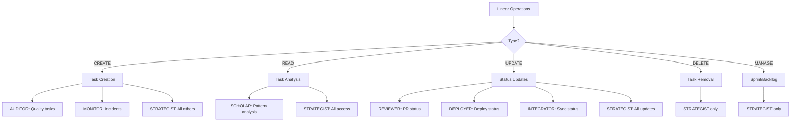

# Linear Operations Guide

## Executive Summary

**STRATEGIST is the primary Linear manager**. Other agents have limited, specific Linear permissions to avoid confusion and conflicts.

## Quick Decision Guide

### "I need to..."

| Task | Use Agent | Why |
|------|-----------|-----|
| Create quality improvement task | AUDITOR | Specializes in code quality issues |
| Create incident task | MONITOR | Handles production incidents |
| Create any other task | STRATEGIST | General task creation authority |
| Assign a task to someone | STRATEGIST | Only agent with assignment rights |
| Update task priority | STRATEGIST | Central prioritization control |
| Move task to different sprint | STRATEGIST | Sprint management authority |
| Update PR review status | REVIEWER | Updates PR-related status |
| Mark task as deployed | DEPLOYER | Updates deployment status |
| Sync with external tool | INTEGRATOR | Bidirectional sync specialist |
| Analyze task patterns | SCHOLAR | Read-only analysis |

## Agent Permissions Matrix



## Detailed Agent Responsibilities

### STRATEGIST (Primary Linear Manager)
- **Role**: Central task orchestrator
- **Permissions**: FULL CRUD
- **Can do**:
  - Create any type of task
  - Assign tasks to team members
  - Update any task field
  - Manage sprints and cycles
  - Prioritize backlog
  - Delete tasks
  - Move tasks between projects
- **Use when**: Any general Linear operation

### AUDITOR (Quality Task Creator)
- **Role**: Code quality issue reporter
- **Permissions**: CREATE only
- **Can do**:
  - Create CLEAN-XXX tasks
  - Add quality metrics to tasks
  - Attach assessment reports
- **Cannot do**:
  - Assign tasks
  - Update status
  - Manage sprints
- **Task format**: `CLEAN-001: Remove dead code in module X`

### MONITOR (Incident Creator)
- **Role**: Production incident reporter
- **Permissions**: CREATE only
- **Can do**:
  - Create INCIDENT-XXX tasks
  - Mark severity levels
  - Add monitoring data
- **Cannot do**:
  - Assign to agents
  - Update resolution
  - Close incidents
- **Task format**: `INCIDENT-001: API response time degradation`

### SCHOLAR (Pattern Analyzer)
- **Role**: Historical analysis
- **Permissions**: READ only
- **Can do**:
  - Read all task data
  - Analyze completion patterns
  - Extract success metrics
- **Cannot do**:
  - Create tasks
  - Update anything
  - Add comments
- **Use case**: Learning from past tasks

### REVIEWER (PR Status Updater)
- **Role**: Code review tracker
- **Permissions**: UPDATE only
- **Can do**:
  - Link PRs to tasks
  - Update review status
  - Add review comments
- **Cannot do**:
  - Create tasks
  - Assign reviewers
  - Close tasks
- **Updates**: "PR #123 approved"

### DEPLOYER (Deployment Tracker)
- **Role**: Deployment status updater
- **Permissions**: UPDATE only
- **Can do**:
  - Mark tasks as deployed
  - Add deployment IDs
  - Update environment info
- **Cannot do**:
  - Create deployment tasks
  - Assign deployments
  - Manage releases
- **Updates**: "Deployed to production v1.2.3"

### INTEGRATOR (External Sync)
- **Role**: Tool synchronizer
- **Permissions**: READ/UPDATE
- **Can do**:
  - Map external issues
  - Sync status bidirectionally
  - Update integration fields
- **Cannot do**:
  - Create new tasks
  - Delete tasks
  - Manage workflow
- **Use case**: GitHub ↔ Linear sync

## Common Workflows

### Quality Issue Flow
```
1. AUDITOR: Scans code, finds issues
2. AUDITOR: Creates CLEAN-XXX task
3. STRATEGIST: Assigns to EXECUTOR
4. EXECUTOR: Implements fix
5. REVIEWER: Updates PR status
6. DEPLOYER: Updates deployment status
7. STRATEGIST: Closes task
```

### Incident Response Flow
```
1. MONITOR: Detects production issue
2. MONITOR: Creates INCIDENT-XXX task
3. STRATEGIST: Assigns to GUARDIAN
4. GUARDIAN: Implements recovery
5. DEPLOYER: Updates deployment status
6. STRATEGIST: Closes incident
```

### Sprint Planning Flow
```
1. STRATEGIST: Reviews backlog
2. STRATEGIST: Prioritizes tasks
3. STRATEGIST: Assigns to sprint
4. STRATEGIST: Assigns to agents
5. SCHOLAR: Analyzes capacity
6. STRATEGIST: Adjusts assignments
```

## Rules and Constraints

### Task Naming Conventions
- **CLEAN-XXX**: Code quality improvements (AUDITOR)
- **INCIDENT-XXX**: Production incidents (MONITOR)
- **FEAT-XXX**: New features (STRATEGIST)
- **BUG-XXX**: Bug fixes (STRATEGIST)
- **TASK-XXX**: General tasks (STRATEGIST)

### Permission Boundaries
1. **Only STRATEGIST** can:
   - Assign tasks to agents/humans
   - Manage sprints and cycles
   - Change task priorities
   - Delete tasks

2. **Task creators** cannot:
   - Assign their own tasks
   - Update task status
   - Close tasks

3. **Status updaters** cannot:
   - Create new tasks
   - Change task ownership
   - Modify task descriptions

## Error Prevention

### Common Mistakes to Avoid
❌ **Don't**: Use EXECUTOR to create Linear tasks
✅ **Do**: Use AUDITOR for quality tasks

❌ **Don't**: Use multiple agents to manage sprints
✅ **Do**: Use STRATEGIST exclusively

❌ **Don't**: Have GUARDIAN create incident tasks
✅ **Do**: Use MONITOR for incidents

❌ **Don't**: Let task creators self-assign
✅ **Do**: Route through STRATEGIST

## Linear API Usage

### Authentication
All agents with Linear access use the same API key but have different permission scopes enforced by agent logic.

### Rate Limits
- **CREATE operations**: Max 100/hour
- **UPDATE operations**: Max 500/hour
- **READ operations**: Max 1000/hour
- **Batch operations**: Use STRATEGIST

### Error Handling
```typescript
if (agent !== 'STRATEGIST' && operation === 'assign') {
  throw new Error('Only STRATEGIST can assign tasks');
}

if (agent === 'AUDITOR' && !taskId.startsWith('CLEAN-')) {
  throw new Error('AUDITOR can only create CLEAN-XXX tasks');
}
```

## Quick Reference Commands

### Task Creation
```bash
# Quality issue
npm run agent:invoke AUDITOR:create-backlog

# Incident
npm run agent:invoke MONITOR:create-incident

# General task
npm run agent:invoke STRATEGIST:create-task
```

### Task Management
```bash
# Assign tasks
npm run agent:invoke STRATEGIST:assign-tasks

# Update priority
npm run agent:invoke STRATEGIST:prioritize-backlog

# Manage sprint
npm run agent:invoke STRATEGIST:manage-sprint
```

### Status Updates
```bash
# PR status
npm run agent:invoke REVIEWER:update-pr-status

# Deployment
npm run agent:invoke DEPLOYER:update-deploy-status

# External sync
npm run agent:invoke INTEGRATOR:sync-status
```

## Summary

- **STRATEGIST** = Linear task manager (full control)
- **AUDITOR** = Quality task creator (CLEAN-XXX)
- **MONITOR** = Incident creator (INCIDENT-XXX)
- **Others** = Limited update/read permissions
- **Default** = When in doubt, use STRATEGIST

This clear separation ensures no confusion about which agent handles Linear operations.

---

*For general agent selection, see [AGENT-SELECTION-GUIDE.md](AGENT-SELECTION-GUIDE.md)*