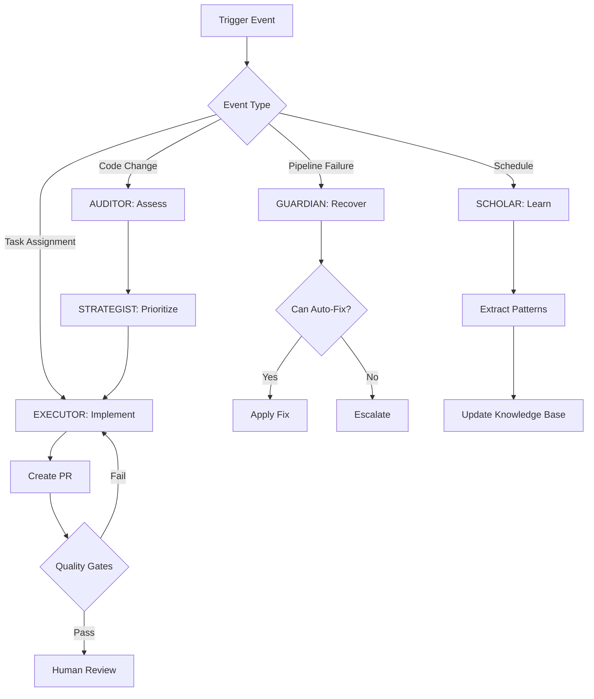

# Agent Workflow Specification

## Repository Information

- **Name**: Linear TDD Workflow System
- **Type**: Multi-agent AI Development Framework
- **Language**: TypeScript/JavaScript, Python
- **Status**: Active Development
- **Phase**: 0 - Foundation

## Workflow Overview

This document defines the machine-readable workflow specifications for autonomous agent operations within the Linear TDD Workflow System.

## Agent Execution Flow



## Operational States

### System States
```yaml
states:
  - idle: No active operations
  - scanning: AUDITOR analyzing code
  - planning: STRATEGIST organizing tasks
  - executing: EXECUTOR implementing fixes
  - recovering: GUARDIAN fixing pipeline
  - learning: SCHOLAR extracting patterns
  - blocked: Awaiting human intervention
```

### Task States
```yaml
task_states:
  - pending: Not yet started
  - assigned: Agent assigned
  - in_progress: Active execution
  - testing: Running validations
  - review_required: Awaiting approval
  - completed: Successfully finished
  - failed: Execution failed
  - cancelled: Manually stopped
```

## Guardrails

### Execution Guardrails
1. **Maximum Execution Time**: 30 minutes per task
2. **Resource Limits**: 4GB RAM, 2 CPU cores per agent
3. **Concurrent Tasks**: Max 5 per repository
4. **Retry Attempts**: 3 for transient failures
5. **Rollback Trigger**: >2 consecutive failures

### Quality Guardrails
1. **Test Coverage**: Must maintain or improve
2. **Performance**: No degradation >10%
3. **Security**: Zero new vulnerabilities
4. **Documentation**: All public APIs documented
5. **Breaking Changes**: Require explicit approval

## Agent Capabilities

### AUDITOR
```yaml
capabilities:
  read:
    - source_code
    - test_files
    - documentation
    - git_history
  analyze:
    - code_complexity
    - test_coverage
    - security_issues
    - code_patterns
  create:
    - linear_tasks
    - assessment_reports
```

### EXECUTOR
```yaml
capabilities:
  read:
    - linear_tasks
    - source_code
    - test_suite
  write:
    - code_changes (via PR)
    - test_files
    - documentation
  execute:
    - test_suite
    - linting
    - formatting
```

### GUARDIAN
```yaml
capabilities:
  monitor:
    - pipeline_status
    - test_results
    - deployment_status
  analyze:
    - failure_logs
    - error_traces
    - performance_metrics
  execute:
    - pipeline_restart
    - rollback
    - auto_fix
```

### STRATEGIST
```yaml
capabilities:
  coordinate:
    - agent_assignments
    - task_prioritization
    - resource_allocation
  monitor:
    - agent_status
    - task_progress
    - system_metrics
  report:
    - progress_updates
    - performance_metrics
    - bottleneck_analysis
```

### SCHOLAR
```yaml
capabilities:
  analyze:
    - fix_patterns
    - success_rates
    - failure_patterns
  learn:
    - pattern_extraction
    - optimization_opportunities
    - anti_patterns
  update:
    - knowledge_base
    - best_practices
    - agent_training
```

## Workflow Steps

### 1. Code Assessment
```yaml
name: code_assessment
trigger: [push, schedule, manual]
steps:
  - name: scan_repository
    agent: AUDITOR
    timeout: 900s
    inputs:
      - repository_path
      - file_patterns
      - rule_sets
    outputs:
      - issues[]
      - metrics{}
      - suggestions[]

  - name: create_tasks
    agent: AUDITOR
    condition: issues.length > 0
    inputs:
      - issues[]
      - team_id
    outputs:
      - task_ids[]
```

### 2. Fix Implementation
```yaml
name: fix_implementation
trigger: [task_assigned]
steps:
  - name: validate_task
    agent: EXECUTOR
    timeout: 60s
    validations:
      - is_fix_pack
      - estimated_loc <= 300

  - name: write_test
    agent: EXECUTOR
    timeout: 300s
    tag: "[RED]"
    outputs:
      - test_file
      - test_name

  - name: implement_fix
    agent: EXECUTOR
    timeout: 600s
    tag: "[GREEN]"
    validations:
      - test_passes
      - no_breaking_changes

  - name: refactor
    agent: EXECUTOR
    timeout: 300s
    tag: "[REFACTOR]"
    condition: code_quality_score < 0.8

  - name: create_pr
    agent: EXECUTOR
    timeout: 120s
    validations:
      - diff_coverage >= 0.8
      - mutation_score >= 0.3
      - all_tests_pass
```

### 3. Pipeline Recovery
```yaml
name: pipeline_recovery
trigger: [pipeline_failure]
steps:
  - name: analyze_failure
    agent: GUARDIAN
    timeout: 300s
    outputs:
      - failure_type
      - root_cause
      - can_auto_fix

  - name: attempt_fix
    agent: GUARDIAN
    condition: can_auto_fix == true
    max_attempts: 3
    timeout: 600s

  - name: validate_fix
    agent: GUARDIAN
    timeout: 300s
    validations:
      - pipeline_green
      - no_regressions

  - name: escalate
    agent: GUARDIAN
    condition: attempts >= 3
    actions:
      - notify_oncall
      - create_incident
      - disable_auto_fix
```

### 4. Pattern Learning
```yaml
name: pattern_learning
trigger: [schedule: "0 2 * * 0"]
steps:
  - name: collect_fixes
    agent: SCHOLAR
    timeout: 1800s
    inputs:
      - time_range: 7d
      - min_success_rate: 0.9

  - name: extract_patterns
    agent: SCHOLAR
    timeout: 3600s
    outputs:
      - patterns[]
      - confidence_scores[]

  - name: validate_patterns
    agent: SCHOLAR
    timeout: 1800s
    validations:
      - confidence >= 0.8
      - sample_size >= 10

  - name: update_knowledge
    agent: SCHOLAR
    timeout: 600s
    actions:
      - update_pattern_db
      - notify_agents
      - generate_report
```

## Change Control

### Change Classification
```yaml
FIL-0:  # Auto-approved
  criteria:
    - formatting_only
    - comment_changes
    - dead_code_removal
  approval: none

FIL-1:  # Low risk
  criteria:
    - loc < 50
    - no_api_changes
    - no_dependency_changes
  approval: none

FIL-2:  # Medium risk
  criteria:
    - loc < 200
    - internal_api_changes
    - config_changes
  approval: tech_lead

FIL-3:  # High risk
  criteria:
    - external_api_changes
    - database_changes
    - breaking_changes
  approval: [tech_lead, product_owner]
```

### Approval Flow
```yaml
approval_workflow:
  - classify_change
  - check_policies
  - request_approval (if needed)
  - wait_for_approval (timeout: 48h)
  - proceed_or_cancel
```

## Communication

### Inter-Agent Messages
```yaml
message_schema:
  id: uuid
  timestamp: iso8601
  from: agent_id
  to: agent_id | broadcast
  type: request | response | event
  priority: low | normal | high | critical
  payload:
    action: string
    data: object
    context:
      task_id: string
      repository: string
      correlation_id: uuid
```

### External Notifications
```yaml
notification_channels:
  - slack:
      events: [pipeline_failure, pr_created, incident]
      channel: "#dev-notifications"
  - email:
      events: [approval_required, escalation]
      recipients: [tech_lead, on_call]
  - linear:
      events: [task_complete, blocked]
      update: real_time
```

## Error Handling

### Error Categories
```yaml
transient:
  - network_timeout
  - api_rate_limit
  - resource_unavailable
  action: retry with backoff

permanent:
  - syntax_error
  - permission_denied
  - invalid_configuration
  action: escalate immediately

recoverable:
  - test_failure
  - lint_error
  - build_failure
  action: attempt auto-fix
```

### Recovery Strategies
```yaml
strategies:
  retry:
    max_attempts: 3
    backoff: exponential
    base_delay: 1s

  rollback:
    trigger: consecutive_failures > 2
    scope: last_known_good

  escalate:
    levels: [agent, strategist, human, lead]
    timeout_per_level: 5m
```

## Monitoring

### Key Metrics
```yaml
metrics:
  - agent_availability
  - task_completion_rate
  - mean_time_to_fix
  - pattern_reuse_rate
  - rollback_frequency
  - cost_per_fix
```

### Alerting Rules
```yaml
alerts:
  - name: agent_down
    condition: availability < 0.95
    severity: critical

  - name: high_failure_rate
    condition: failure_rate > 0.2
    severity: warning

  - name: budget_exceeded
    condition: monthly_cost > limit * 0.9
    severity: info
```

## Compliance

### Audit Requirements
```yaml
audit:
  - all_agent_actions
  - approval_workflows
  - configuration_changes
  - access_attempts
  retention: 90d
  export: [json, csv]
```

### Security Policies
```yaml
security:
  - no_hardcoded_secrets
  - encrypted_communication
  - least_privilege_access
  - signed_commits
  - vulnerability_scanning
```

## Version Control

### Supported Workflows
```yaml
gitflow:
  branches:
    - main: production
    - develop: integration
    - feature/*: new_features
    - release/*: release_prep
    - hotfix/*: urgent_fixes

github_flow:
  branches:
    - main: production
    - feature/*: all_changes
```

### Branch Protection
```yaml
protection_rules:
  - require_pr_reviews: 1
  - dismiss_stale_reviews: true
  - require_status_checks: true
  - require_up_to_date: true
  - restrict_push: [agents, junior_devs]
```

## Integration Points

### GitHub
```yaml
webhooks:
  - push
  - pull_request
  - workflow_run
  - issue_comment

api_operations:
  - create_pr
  - update_status
  - add_comment
  - request_review
```

### Linear
```yaml
sync:
  - task_creation: immediate
  - status_updates: real_time
  - progress_tracking: every_5m

operations:
  - create_issue
  - update_status
  - add_comment
  - attach_pr
```

### CI/CD
```yaml
pipelines:
  - test: on_every_commit
  - build: on_pr
  - deploy: on_merge_to_main

quality_gates:
  - tests_pass: required
  - coverage_threshold: required
  - security_scan: required
  - performance_check: optional
```

---

*This specification is authoritative for agent operations. Any modifications require approval from the Engineering Excellence team and must be backwards compatible.*