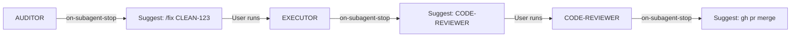
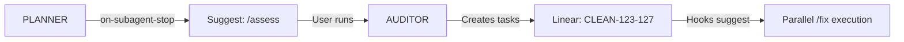
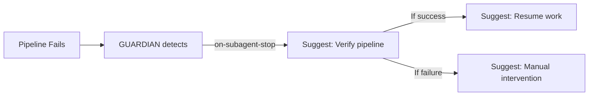

# Hooks System Guide

## Overview

The Linear TDD Workflow System includes a **hooks-based automation layer** that enables reliable workflow chaining, automated next-step suggestions, and production-grade orchestration.

**Key Principle**: *"Chain subagents with hooks, not prompt glue, for reliable automation"*

---

## What Are Hooks?

**Hooks** are shell scripts that execute automatically in response to system events:

- **`on-subagent-stop.sh`**: Triggers when any subagent completes
- **`on-stop.sh`**: Triggers when main Claude Code session ends

**Benefits**:
1. **Reliable Automation**: More dependable than prompt-based chaining
2. **Workflow Suggestions**: System suggests next steps automatically
3. **Queue Management**: Tracks multi-phase workflows (BACKLOG → DONE)
4. **Audit Trail**: Logs all agent activities with timestamps

---

## Directory Structure

```
.claude/
├── hooks/
│   ├── on-subagent-stop.sh    # Agent completion handler
│   ├── on-stop.sh              # Session end handler
│   └── README.md               # (optional) Custom hooks documentation
├── queue/
│   └── enhancements.json       # Enhancement queue state
└── settings.json               # Hook registration
```

---

## Configuration

### settings.json

Hooks are configured in `.claude/settings.json`:

```json
{
  "hooks": {
    "enabled": true,
    "onSubagentStop": ".claude/hooks/on-subagent-stop.sh",
    "onStop": ".claude/hooks/on-stop.sh",
    "timeout": 30,
    "environment": {
      "CLAUDE_PROJECT_ROOT": "${PROJECT_ROOT}",
      "CLAUDE_AGENTS_DIR": ".claude/agents",
      "CLAUDE_QUEUE_DIR": ".claude/queue"
    }
  }
}
```

**Fields**:
- `enabled`: Enable/disable hooks system
- `onSubagentStop`: Path to subagent completion hook
- `onStop`: Path to session end hook
- `timeout`: Max execution time for hooks (seconds)
- `environment`: Custom environment variables for hooks

---

## Hook: on-subagent-stop.sh

### Purpose

Executes after each subagent completes, providing:
- Workflow suggestions based on agent type
- Status updates to enhancement queue
- Next-step commands

### Environment Variables

Claude Code provides these variables:

```bash
CLAUDE_AGENT_NAME       # Name of completed agent (e.g., "AUDITOR")
CLAUDE_AGENT_STATUS     # success, failure, timeout, error
CLAUDE_AGENT_DURATION   # Execution time in seconds
CLAUDE_AGENT_OUTPUT     # Summary of agent output (truncated)
```

### Workflow Logic

```bash
case "$AGENT_NAME" in
  "AUDITOR")
    # Assessment complete → Suggest fix implementation
    echo "Next step: /fix CLEAN-123"
    ;;

  "EXECUTOR")
    # Fix implemented → Suggest code review
    echo "Next step: /invoke CODE-REVIEWER:review PR-456"
    update_queue "current-fix" "READY_FOR_REVIEW" "EXECUTOR"
    ;;

  "CODE-REVIEWER")
    # Review complete → Suggest merge
    echo "Next step: gh pr merge 456 --squash"
    update_queue "current-fix" "READY_FOR_MERGE" "CODE-REVIEWER"
    ;;
esac
```

### Example Output

```
✓ Assessment complete (180s)

Next steps:
  1. Review assessment results in Linear
  2. Execute fix pack: /fix CLEAN-XXX
  3. Or implement specific task: /invoke EXECUTOR:implement CLEAN-123

Suggested command:
  /fix CLEAN-123

─────────────────────────────────────────────────────────
```

---

## Hook: on-stop.sh

### Purpose

Executes when Claude Code session ends, providing:
- Session summary (duration, exit reason)
- Quick status check (PRs, uncommitted changes)
- Next steps based on exit reason
- Command reference

### Environment Variables

```bash
CLAUDE_SESSION_ID           # Unique session identifier
CLAUDE_SESSION_DURATION     # Total session time in seconds
CLAUDE_EXIT_REASON          # normal, timeout, error, user_interrupt
```

### Exit Reason Handling

```bash
case "$EXIT_REASON" in
  "normal")
    echo "✓ Session completed successfully"
    # Suggest: Review work, check CI/CD, continue next task
    ;;

  "timeout")
    echo "⚠ Session timed out"
    # Suggest: Resume workflow, check partial completions
    ;;

  "error")
    echo "✗ Session ended with error"
    # Suggest: Review logs, consider /recover
    ;;

  "user_interrupt")
    echo "⚠ Session interrupted by user"
    # Suggest: Resume when ready
    ;;
esac
```

### Example Output

```
═══════════════════════════════════════════════════════════
         Linear TDD Workflow System - Session End
═══════════════════════════════════════════════════════════

Session Summary:
  Session ID: abc123def456
  Duration: 1830s (30m 30s)
  Exit Reason: normal

Quick Status Check:
  Open PRs: 2
  ✓ Working directory clean
  Current branch: feature/user-auth

✓ Session completed successfully

Next steps:
  • Review completed work in Linear
  • Check CI/CD pipeline status
  • Continue with next task or feature

═══════════════════════════════════════════════════════════
Quick Command Reference:
  /assess         - Run code quality assessment
  /fix TASK-ID    - Implement fix with TDD
  /status         - Check workflow and Linear status
  /cycle plan     - Plan next sprint
  /recover        - Auto-fix broken CI/CD pipeline
  /docs           - Validate and generate documentation
═══════════════════════════════════════════════════════════
```

---

## Enhancement Queue

### Structure

The enhancement queue (`enhancements.json`) tracks multi-phase workflows:

```json
{
  "enhancements": {
    "user-auth": {
      "slug": "user-auth",
      "title": "User Authentication Feature",
      "status": "READY_FOR_BUILD",
      "linear_task": "FEAT-123",
      "agent_history": [
        {
          "agent": "PM",
          "timestamp": "2025-10-01T10:00:00Z",
          "status": "READY_FOR_ARCH",
          "notes": "Requirements gathered"
        },
        {
          "agent": "ARCHITECT",
          "timestamp": "2025-10-01T10:30:00Z",
          "status": "READY_FOR_BUILD",
          "notes": "ADR created, design approved"
        }
      ],
      "next_agent": "EXECUTOR",
      "priority": "high",
      "estimate_hours": 16
    }
  }
}
```

### Status Flow

```
BACKLOG
  ↓
READY_FOR_DESIGN (PM completes)
  ↓
READY_FOR_ARCH (Design approved)
  ↓
READY_FOR_BUILD (Architecture approved)
  ↓
READY_FOR_REVIEW (Implementation complete)
  ↓
READY_FOR_TEST (Code review passed)
  ↓
READY_FOR_DEPLOY (Testing complete)
  ↓
DONE

Alternative paths:
  → BLOCKED (Dependencies not met)
  → ON_HOLD (Intentional pause)
```

### Updating Queue

Hooks automatically update the queue:

```bash
update_queue() {
  local slug="$1"
  local new_status="$2"
  local agent="$3"

  jq --arg slug "$slug" \
     --arg status "$new_status" \
     --arg agent "$agent" \
     '.enhancements[$slug].status = $status |
      .enhancements[$slug].agent_history += [{
        agent: $agent,
        timestamp: now | todate,
        status: $status
      }]' \
     "$QUEUE_FILE" > "$QUEUE_FILE.tmp"

  mv "$QUEUE_FILE.tmp" "$QUEUE_FILE"
}
```

---

## Common Workflows

### Workflow 1: Assessment → Fix → Review



**Hook Actions**:
1. AUDITOR completes → Hook suggests `/fix CLEAN-123`
2. EXECUTOR completes → Hook suggests `/invoke CODE-REVIEWER`
3. CODE-REVIEWER completes → Hook suggests `gh pr merge`

### Workflow 2: Sprint Planning → Execution



**Hook Actions**:
1. PLANNER completes → Hook suggests `/assess`
2. AUDITOR creates tasks → Hook lists fix commands
3. User runs fixes → Hooks track completion per task

### Workflow 3: CI/CD Recovery



**Hook Actions**:
1. GUARDIAN completes → Hook checks recovery status
2. Success → Hook suggests resuming development
3. Failure → Hook suggests manual intervention with INCIDENT-XXX reference

---

## Customizing Hooks

### Adding New Agent Support

Edit `.claude/hooks/on-subagent-stop.sh`:

```bash
case "$AGENT_NAME" in
  "YOUR-AGENT")
    if [ "$STATUS" = "success" ]; then
      echo "✓ Your agent completed successfully"
      echo "Next step: <your-suggested-command>"

      # Optional: Update queue
      update_queue "your-slug" "YOUR_STATUS" "YOUR-AGENT"
    fi
    ;;
esac
```

### Adding Custom Hooks

Create new hooks in `.claude/hooks/`:

```bash
# .claude/hooks/pre-commit.sh
#!/bin/bash
# Run before git commits
npm run lint && npm test
```

Register in `settings.json`:

```json
{
  "hooks": {
    "preCommit": ".claude/hooks/pre-commit.sh"
  }
}
```

### Hook Best Practices

1. **Keep hooks fast** (<30s execution time)
2. **Print to STDOUT** for user visibility
3. **Use color codes** for readability (GREEN/YELLOW/RED)
4. **Handle failures gracefully** (exit 0 even on errors)
5. **Document hook behavior** in comments
6. **Test hooks independently** before integration

---

## Debugging Hooks

### Enable Debug Mode

```bash
# Run hook manually with debug output
bash -x .claude/hooks/on-subagent-stop.sh AUDITOR success 180
```

### Check Hook Execution

```bash
# Verify hooks are executable
ls -la .claude/hooks/

# Expected output:
-rwxr-xr-x  1 user  staff  2.5K Oct 1 12:00 on-subagent-stop.sh
-rwxr-xr-x  1 user  staff  1.8K Oct 1 12:00 on-stop.sh
```

### Common Issues

**Issue**: Hook not executing
- **Solution**: Verify `hooks.enabled: true` in settings.json
- **Solution**: Check file permissions (`chmod +x hook.sh`)

**Issue**: Environment variables not set
- **Solution**: Hooks receive variables from Claude Code - may not be available in manual testing

**Issue**: Queue updates failing
- **Solution**: Ensure `jq` is installed (`brew install jq` on macOS)

---

## Performance Considerations

### Hook Execution Time

- Hooks run synchronously after agent completion
- Target: <5s execution time
- Maximum: 30s (configurable timeout)

### Queue File Size

- JSON file grows with each enhancement
- Recommend: Archive completed enhancements monthly
- Script example:

```bash
#!/bin/bash
# Archive completed enhancements
jq '.enhancements |= with_entries(select(.value.status != "DONE"))' \
   .claude/queue/enhancements.json > .claude/queue/enhancements.tmp
mv .claude/queue/enhancements.tmp .claude/queue/enhancements.json
```

---

## Security Considerations

### Hook Permissions

- Hooks execute with user's shell permissions
- **Never** store secrets in hook scripts
- Use environment variables for sensitive data

### Input Validation

Hooks receive data from Claude Code - validate inputs:

```bash
# Validate agent name
if [[ ! "$AGENT_NAME" =~ ^[A-Z-]+$ ]]; then
  echo "Invalid agent name: $AGENT_NAME"
  exit 0
fi
```

### Audit Trail

All hook executions should be logged:

```bash
# Add to hook scripts
echo "[$(date)] $AGENT_NAME completed with $STATUS" >> .claude/logs/hook-audit.log
```

---

## Integration with CI/CD

### GitHub Actions Example

```yaml
name: Linear TDD Workflow

on: [push, pull_request]

jobs:
  validate:
    runs-on: ubuntu-latest
    steps:
      - uses: actions/checkout@v3

      - name: Run Hooks
        run: |
          # Simulate subagent completion
          bash .claude/hooks/on-subagent-stop.sh AUDITOR success 180
```

### Pre-commit Hook Integration

Add to `.git/hooks/pre-commit`:

```bash
#!/bin/bash
# Run Linear TDD Workflow hooks before commit
.claude/hooks/pre-commit.sh || exit 1
```

---

## Advanced Patterns

### Multi-Model Integration

Use hooks to bridge to other LLMs:

```bash
# .claude/hooks/on-subagent-stop.sh
if [ "$AGENT_NAME" = "CODE-REVIEWER" ]; then
  # Send to external LLM for additional review
  curl -X POST https://api.example.com/review \
       -d "{\"code\": \"$(cat pr-diff.txt)\"}"
fi
```

### Git Worktree Isolation

Create isolated workspaces for parallel agents:

```bash
# .claude/hooks/pre-parallel-execution.sh
for i in {1..5}; do
  git worktree add "../workspace-$i" -b "agent-$i"
done
```

### Notification Integration

Send alerts via Slack/email:

```bash
# .claude/hooks/on-subagent-stop.sh
if [ "$STATUS" = "failure" ]; then
  curl -X POST $SLACK_WEBHOOK \
       -d "{\"text\": \"Agent $AGENT_NAME failed\"}"
fi
```

---

## Troubleshooting

### Hook Not Appearing in Output

1. Check settings.json: `hooks.enabled: true`
2. Verify file exists: `ls .claude/hooks/on-subagent-stop.sh`
3. Check permissions: `chmod +x .claude/hooks/*.sh`
4. Test manually: `bash .claude/hooks/on-subagent-stop.sh AUDITOR success 180`

### Queue Updates Not Working

1. Install jq: `brew install jq` (macOS) or `apt install jq` (Linux)
2. Validate JSON: `jq . .claude/queue/enhancements.json`
3. Check file permissions: `ls -la .claude/queue/`

### Hooks Timing Out

1. Increase timeout in settings.json: `"timeout": 60`
2. Profile hook execution: `time bash .claude/hooks/on-subagent-stop.sh ...`
3. Remove expensive operations (API calls, large file processing)

---

## Migration Guide

### From Manual Orchestration

**Before** (Manual):
```
User: "Run assessment"
AUDITOR: Completes
User: "Now fix CLEAN-123"
EXECUTOR: Completes
User: "Review the PR"
CODE-REVIEWER: Completes
```

**After** (Hooks):
```
User: "/assess"
AUDITOR: Completes
  Hook: "Next step: /fix CLEAN-123"
User: "/fix CLEAN-123"
EXECUTOR: Completes
  Hook: "Next step: /invoke CODE-REVIEWER"
User: "/invoke CODE-REVIEWER"
CODE-REVIEWER: Completes
  Hook: "Next step: gh pr merge"
```

**Benefits**:
- Reduced cognitive load (system suggests next steps)
- Consistent workflows (same suggestions every time)
- Audit trail (queue tracks all transitions)

---

## FAQ

**Q: Are hooks required?**
A: No - system works perfectly without hooks via manual STRATEGIST orchestration

**Q: Can I disable hooks?**
A: Yes - set `hooks.enabled: false` in settings.json

**Q: Do hooks work on Windows?**
A: Currently bash-only - Windows support via WSL or Git Bash

**Q: Can hooks modify code?**
A: Yes, but not recommended - use agents for code changes

**Q: How do I add custom statuses to the queue?**
A: Edit `queue.statuses` array in settings.json

---

## Related Documentation

- [PARALLEL-EXECUTION.md](./PARALLEL-EXECUTION.md) - Parallel orchestration patterns
- [DECISION-MATRIX.md](./DECISION-MATRIX.md) - When to use agents vs workflows vs hooks
- [ANTHROPIC-BEST-PRACTICES.md](../ANTHROPIC-BEST-PRACTICES.md) - Alignment with best practices

---

**Version**: 1.0.0
**Status**: Active (Phase 5 - Enterprise Features)
**Last Updated**: 2025-10-01
