# Multi-Agent Architecture Documentation

## Table of Contents
1. [System Overview](#1-system-overview)
2. [Core Agent Specifications](#2-core-agent-specifications)
3. [Specialized Agent Specifications](#3-specialized-agent-specifications)
4. [Agent Communication Protocol](#4-agent-communication-protocol)
5. [Orchestration & Coordination](#5-orchestration--coordination)
6. [Learning & Optimization](#6-learning--optimization)
7. [Command Reference](#7-command-reference)
8. [Performance Metrics](#8-performance-metrics)
9. [Implementation Guidelines](#9-implementation-guidelines)

---

# 1. System Overview

## Architecture Principles

The Linear TDD Workflow System employs a sophisticated **20-agent architecture** designed for autonomous code quality management. The system follows these core principles:

1. **Specialization**: Each agent has a focused domain of expertise
2. **Autonomy**: Agents operate independently within their scope
3. **Coordination**: STRATEGIST orchestrates multi-agent collaboration
4. **Learning**: SCHOLAR enables continuous system improvement
5. **Safety**: All changes require human review before merge

## Agent Hierarchy

```mermaid
graph TD
    STRATEGIST[📊 STRATEGIST<br/>Orchestrator] --> CORE[Core Agents]
    STRATEGIST --> SPEC[Specialized Agents]

    CORE --> AUDITOR[🔍 AUDITOR<br/>Assessment]
    CORE --> EXECUTOR[⚡ EXECUTOR<br/>Implementation]
    CORE --> GUARDIAN[🛡️ GUARDIAN<br/>Pipeline]
    CORE --> SCHOLAR[🧠 SCHOLAR<br/>Learning]

    SPEC --> TEST[Testing Group]
    SPEC --> DEV[Development Group]
    SPEC --> INFRA[Infrastructure Group]
    SPEC --> ARCH[Architecture Group]
    SPEC --> SEC[Security Group]

    TEST --> VALIDATOR[VALIDATOR]
    TEST --> TESTER[TESTER]
    TEST --> REVIEWER[REVIEWER]

    DEV --> OPTIMIZER[OPTIMIZER]
    DEV --> REFACTORER[REFACTORER]
    DEV --> CLEANER[CLEANER]

    INFRA --> DEPLOYER[DEPLOYER]
    INFRA --> MONITOR[MONITOR]
    INFRA --> MIGRATOR[MIGRATOR]

    ARCH --> ARCHITECT[ARCHITECT]
    ARCH --> RESEARCHER[RESEARCHER]
    ARCH --> DOCUMENTER[DOCUMENTER]

    SEC --> SECURITYGUARD[SECURITYGUARD]
    SEC --> INTEGRATOR[INTEGRATOR]
    SEC --> ANALYZER[ANALYZER]
```



## System Capabilities

### Current Capabilities (v1.3)
- Code assessment and quality scoring
- Fix Pack implementation with TDD
- Pipeline failure recovery
- Pattern learning and reuse
- Linear.app task management
- GitHub PR creation and management

### Planned Capabilities
- Multi-repository orchestration
- Cross-language support expansion
- Real-time collaboration features
- Advanced security remediation
- Performance optimization automation

---

# 2. Core Agent Specifications

## 2.1 🔍 AUDITOR - Clean Code Assessment Specialist

### Purpose
The AUDITOR serves as the system's quality gatekeeper, continuously scanning codebases to identify improvement opportunities and maintain high standards.

### Core Responsibilities
- **Continuous Code Scanning**: Regular automated analysis of entire codebase
- **Quality Assessment**: Evaluation against clean code principles and best practices
- **Technical Debt Quantification**: Identification and measurement of debt hotspots
- **Task Generation**: Creation of actionable improvement tasks in Linear

### Technical Capabilities
```yaml
analysis_methods:
  - ast_parsing: Abstract Syntax Tree analysis
  - cfg_analysis: Control Flow Graph evaluation
  - complexity_metrics: Cyclomatic and cognitive complexity
  - pattern_detection: Anti-pattern and code smell identification
  - dependency_analysis: Outdated and vulnerable dependency detection

supported_languages:
  primary:
    - javascript: Full AST/CFG support
    - typescript: Full AST/CFG support
    - python: Full AST/CFG support (v1.3+)
  secondary:
    - java: Basic analysis
    - go: Basic analysis
    - rust: Planned

quality_dimensions:
  - readability: Naming, structure, documentation
  - maintainability: Modularity, coupling, cohesion
  - testability: Test coverage, mocking requirements
  - security: Vulnerability patterns, injection risks
  - performance: Algorithm efficiency, resource usage
```

### Command Specifications

#### `assess-code`
```bash
npm run agent:invoke AUDITOR:assess-code -- [options]

Options:
  --scope <value>      Assessment scope (full|incremental|focused)
  --depth <value>      Analysis depth (shallow|standard|deep)
  --language <value>   Target language (js|ts|python)
  --exclude <pattern>  Exclusion patterns
  --threshold <value>  Quality threshold (0-100)
```

**Performance SLA**:
- Full scan: ≤12min for 150k LOC (JS/TS)
- Incremental: ≤3min for typical changes
- Deep analysis: ≤20min with security scanning

#### `generate-backlog`
```bash
npm run agent:invoke AUDITOR:generate-backlog -- [options]

Options:
  --priority <value>   Priority scheme (impact|effort|risk)
  --limit <number>     Maximum tasks to create
  --category <value>   Filter by category
  --team-id <value>    Linear team ID
```

### Integration Points
- **Inputs**: GitHub repositories, GitLab projects, local codebases
- **Outputs**: Linear tasks, assessment reports, metrics dashboards
- **Triggers**: Scheduled scans, commit hooks, manual invocation

## 2.2 ⚡ EXECUTOR - Implementation Specialist

### Purpose
The EXECUTOR is the system's implementation engine, responsible for safely and efficiently implementing code improvements following strict TDD principles.

### Core Responsibilities
- **Fix Pack Implementation**: Execute pre-approved improvement categories
- **TDD Compliance**: Enforce RED→GREEN→REFACTOR cycle
- **Atomic Commits**: Ensure changes are small and reversible
- **Documentation**: Maintain comprehensive change documentation

### Implementation Workflow


### Fix Pack Categories

| Category | Risk Level | Examples | Constraints |
|----------|------------|----------|-------------|
| **Linting** | Minimal | ESLint, Prettier, Black | Style only, no logic changes |
| **Dead Code** | Low | Unused imports, variables, functions | Must verify no references |
| **Documentation** | Minimal | JSDoc, docstrings, README | No code logic changes |
| **Simple Refactoring** | Low | Extract constants, rename variables | <50 LOC, maintain behavior |
| **Type Annotations** | Low | TypeScript types, Python hints | No runtime changes |
| **Test Scaffolding** | Low | Basic test structure | Must not break existing |
| **Dependency Updates** | Medium | Patch versions only | No breaking changes |

### Command Specifications

#### `implement-fix`
```bash
npm run agent:invoke EXECUTOR:implement-fix -- [options]

Options:
  --task-id <value>    Linear task ID (required)
  --validate-only      Dry run without changes
  --skip-tests         Skip test execution (not recommended)
  --coverage <value>   Minimum diff coverage (default: 80)
```

### Constraints & Guardrails
- **LOC Limit**: Maximum 300 lines per PR
- **Coverage Requirements**: ≥80% diff coverage, ≥30% mutation score
- **Test First**: Must write failing test before implementation
- **Review Required**: All PRs require human approval
- **Rollback Ready**: Include reversion instructions

## 2.3 🛡️ GUARDIAN - Pipeline Protector

### Purpose
The GUARDIAN ensures CI/CD pipeline stability and automatically recovers from failures, maintaining continuous deployment readiness.

### Core Responsibilities
- **Pipeline Monitoring**: Real-time health tracking
- **Failure Analysis**: Root cause identification
- **Auto-Recovery**: Implement fixes for common failures
- **Optimization**: Improve test execution efficiency

### Failure Response Matrix

| Failure Type | Detection Method | Recovery Strategy | Success Rate |
|--------------|------------------|-------------------|--------------|
| **Test Failures** | Exit codes, assertions | Fix flaky tests, update snapshots | 92% |
| **Build Errors** | Compilation failures | Fix syntax, update dependencies | 88% |
| **Dependency Issues** | Package manager errors | Clear cache, update lockfile | 95% |
| **Resource Limits** | Timeout, OOM | Increase limits, optimize | 85% |
| **Integration Failures** | API errors | Retry with backoff, mock services | 78% |
| **Configuration** | Validation errors | Rollback, fix config | 90% |

### Command Specifications

#### `monitor-pipeline`
```bash
npm run agent:invoke GUARDIAN:monitor-pipeline -- [options]

Options:
  --watch              Continuous monitoring mode
  --alert-threshold    Failure threshold for alerts
  --metrics           Include performance metrics
```

#### `recover-pipeline`
```bash
npm run agent:invoke GUARDIAN:recover-pipeline -- [options]

Options:
  --failure-id <value>  Specific failure to address
  --strategy <value>    Recovery strategy (auto|guided|manual)
  --max-attempts <n>    Maximum recovery attempts
```

### Recovery Workflow
1. **Detection**: Identify failure within 5 minutes
2. **Analysis**: Determine root cause and impact
3. **Planning**: Select appropriate recovery strategy
4. **Execution**: Apply fixes with validation
5. **Verification**: Ensure pipeline returns to green
6. **Learning**: Update patterns for future prevention

## 2.4 📊 STRATEGIST - Workflow Orchestrator

### Purpose
The STRATEGIST coordinates all agents, manages resources, and ensures optimal system performance while maintaining stakeholder visibility.

### Core Responsibilities
- **Agent Orchestration**: Coordinate multi-agent workflows
- **Resource Management**: Optimize allocation and utilization
- **Project Integration**: Manage Linear boards and sprints
- **Stakeholder Reporting**: Provide transparency and metrics

### Orchestration Patterns

#### Sequential Orchestration
```yaml
pattern: sequential
use_case: Dependent tasks requiring order
example:
  1. AUDITOR: Assess component
  2. EXECUTOR: Implement improvements
  3. VALIDATOR: Run comprehensive tests
  4. REVIEWER: Final quality check
```

#### Parallel Orchestration
```yaml
pattern: parallel
use_case: Independent tasks for throughput
example:
  concurrent:
    - AUDITOR: Scan frontend
    - SECURITYGUARD: Security audit
    - DOCUMENTER: Update docs
  synchronize: STRATEGIST
```

#### Pipeline Orchestration
```yaml
pattern: pipeline
use_case: Continuous processing flow
example:
  stages:
    - assess: [AUDITOR, ANALYZER]
    - plan: [STRATEGIST]
    - execute: [EXECUTOR, REFACTORER]
    - validate: [VALIDATOR, GUARDIAN]
```

### Command Specifications

#### `coordinate-workflow`
```bash
npm run agent:invoke STRATEGIST:coordinate-workflow -- [options]

Options:
  --workflow <type>    Workflow pattern (sequential|parallel|pipeline)
  --agents <list>      Participating agents
  --timeout <value>    Maximum execution time
```

### Resource Allocation Algorithm
```python
def allocate_resources(task_queue, agent_pool):
    """
    Optimal resource allocation using priority scoring
    """
    for task in sorted(task_queue, key=lambda x: x.priority):
        best_agent = find_best_match(task, agent_pool)
        if best_agent.is_available():
            assign_task(best_agent, task)
        else:
            queue_task(task, best_agent.eta)
```

## 2.5 🧠 SCHOLAR - Learning Engine

### Purpose
The SCHOLAR drives continuous improvement by learning from system actions, identifying patterns, and optimizing agent performance.

### Core Responsibilities
- **Pattern Recognition**: Identify successful solution patterns
- **Knowledge Management**: Maintain best practices database
- **Agent Training**: Improve agent capabilities over time
- **Anti-Pattern Detection**: Prevent recurring issues

### Learning Pipeline


### Pattern Categories

| Category | Description | Example Patterns |
|----------|-------------|------------------|
| **Code Transformations** | Reusable refactoring patterns | Extract method, inline variable |
| **Bug Fixes** | Common bug resolution patterns | Null checks, boundary conditions |
| **Test Patterns** | Effective testing strategies | Mocking patterns, test data factories |
| **Performance** | Optimization patterns | Caching, algorithm improvements |
| **Security** | Vulnerability remediation | Input validation, sanitization |

### Command Specifications

#### `extract-patterns`
```bash
npm run agent:invoke SCHOLAR:extract-patterns -- [options]

Options:
  --timeframe <value>   Analysis period (7d|30d|90d)
  --min-occurrences     Minimum pattern frequency
  --confidence <value>  Confidence threshold
```

### Knowledge Base Structure
```yaml
pattern:
  id: PAT-2024-001
  category: refactoring
  name: "Extract Complex Conditional"
  description: "Simplify nested conditionals"
  applicability:
    complexity: ">5"
    nesting: ">3"
  implementation:
    template: "patterns/extract-conditional.tpl"
  metrics:
    usage_count: 47
    success_rate: 0.94
    avg_improvement: "15% complexity reduction"
  examples: [...]
```

---

# 3. Specialized Agent Specifications

## 3.1 Testing & Validation Group

### VALIDATOR - Comprehensive Testing Specialist
```yaml
purpose: End-to-end test execution and validation
capabilities:
  - playwright_integration: Browser automation testing
  - api_testing: REST/GraphQL endpoint validation
  - performance_testing: Load and stress testing
  - visual_regression: Screenshot comparison
commands:
  - validate-changes: Run full test suite
  - validate-e2e: Execute E2E tests only
  - validate-performance: Run performance benchmarks
mcp_tools: [playwright, pytest, jest]
```

### TESTER - Test Generation Specialist
```yaml
purpose: Automated test creation and maintenance
capabilities:
  - unit_test_generation: Create unit tests from code
  - fixture_creation: Generate test data and mocks
  - coverage_analysis: Identify untested paths
  - test_refactoring: Improve test quality
commands:
  - generate-tests: Create tests for uncovered code
  - update-fixtures: Refresh test data
  - analyze-coverage: Report coverage gaps
```

### REVIEWER - Code Review Automation
```yaml
purpose: Automated PR review and feedback
capabilities:
  - style_checking: Enforce coding standards
  - logic_validation: Verify business logic
  - security_review: Basic security checks
  - documentation_review: Ensure adequate docs
commands:
  - review-pr: Comprehensive PR analysis
  - review-security: Security-focused review
  - suggest-improvements: Provide enhancement suggestions
```

## 3.2 Development & Optimization Group

### OPTIMIZER - Performance Enhancement
```yaml
purpose: Code and system performance optimization
capabilities:
  - profiling: CPU and memory profiling
  - bottleneck_detection: Identify performance issues
  - algorithm_optimization: Improve algorithmic efficiency
  - caching_strategies: Implement optimal caching
commands:
  - profile-application: Generate performance profile
  - optimize-hot-paths: Focus on critical paths
  - implement-caching: Add strategic caching
mcp_tools: [sequential-thinking, profiler]
```

### REFACTORER - Code Modernization
```yaml
purpose: Systematic code refactoring and modernization
capabilities:
  - design_patterns: Apply appropriate patterns
  - legacy_migration: Modernize old code
  - api_evolution: Evolve APIs safely
  - dependency_updates: Manage major updates
commands:
  - refactor-module: Restructure module/component
  - modernize-syntax: Update to modern language features
  - extract-service: Service extraction refactoring
```

### CLEANER - Dead Code Elimination
```yaml
purpose: Remove unused and redundant code
capabilities:
  - dead_code_detection: Find unreachable code
  - duplicate_detection: Identify duplicates
  - import_cleanup: Remove unused imports
  - comment_cleanup: Remove outdated comments
commands:
  - clean-codebase: Full cleanup scan
  - remove-duplicates: Eliminate code duplication
  - optimize-imports: Clean up imports
```

## 3.3 Infrastructure & Operations Group

### DEPLOYER - Deployment Automation
```yaml
purpose: Safe and reliable deployment automation
capabilities:
  - kubernetes_deployment: K8s manifest management
  - rollout_strategies: Blue-green, canary
  - rollback_automation: Quick rollback capability
  - configuration_management: Environment configs
commands:
  - deploy-service: Deploy to environment
  - rollback-deployment: Revert to previous version
  - validate-deployment: Health checks
mcp_tools: [kubernetes, docker, kubectl]
```

### MONITOR - Observability Specialist
```yaml
purpose: System monitoring and alerting
capabilities:
  - metrics_collection: Gather system metrics
  - log_aggregation: Centralize logging
  - alert_management: Smart alerting
  - dashboard_generation: Auto-create dashboards
commands:
  - setup-monitoring: Configure monitoring
  - analyze-metrics: Analyze system health
  - configure-alerts: Set up alerting rules
mcp_tools: [timeserver, prometheus, grafana]
```

### MIGRATOR - Migration Management
```yaml
purpose: Database and code migration handling
capabilities:
  - schema_migration: Database schema updates
  - data_migration: Safe data transformation
  - api_versioning: Manage API versions
  - backwards_compatibility: Ensure compatibility
commands:
  - plan-migration: Create migration plan
  - execute-migration: Run migrations
  - validate-migration: Verify migration success
```

## 3.4 Architecture & Documentation Group

### ARCHITECT - System Design Specialist
```yaml
purpose: System architecture and design decisions
capabilities:
  - adr_generation: Architecture Decision Records
  - system_modeling: Create architecture diagrams
  - pattern_application: Apply architectural patterns
  - tech_evaluation: Evaluate technology choices
commands:
  - design-system: Create system design
  - generate-adr: Document decisions
  - evaluate-architecture: Architecture assessment
mcp_tools: [sequential-thinking, context7]
```

### RESEARCHER - Code Understanding Expert
```yaml
purpose: Deep code analysis and comprehension
capabilities:
  - codebase_analysis: Understand code structure
  - dependency_mapping: Map dependencies
  - impact_analysis: Assess change impact
  - knowledge_extraction: Extract domain knowledge
commands:
  - analyze-codebase: Deep code analysis
  - map-dependencies: Create dependency graph
  - assess-impact: Change impact analysis
mcp_tools: [context7, ast-analyzer]
```

### DOCUMENTER - Documentation Specialist
```yaml
purpose: Comprehensive documentation management
capabilities:
  - api_documentation: Generate API docs
  - readme_generation: Create/update READMEs
  - tutorial_creation: Write tutorials
  - diagram_generation: Create diagrams
commands:
  - document-api: Generate API documentation
  - update-readme: Refresh README
  - create-guide: Write user guides
```

## 3.5 Security & Integration Group

### SECURITYGUARD - Security Specialist
```yaml
purpose: Security vulnerability detection and remediation
capabilities:
  - vulnerability_scanning: SAST/DAST scanning
  - dependency_checking: Check for CVEs
  - secret_detection: Find exposed secrets
  - compliance_checking: Verify compliance
commands:
  - scan-security: Full security scan
  - fix-vulnerabilities: Remediate issues
  - audit-dependencies: Dependency audit
mcp_tools: [context7, snyk, semgrep]
```

### INTEGRATOR - External Integration Manager
```yaml
purpose: Manage external service integrations
capabilities:
  - api_integration: Connect to external APIs
  - webhook_management: Handle webhooks
  - event_processing: Process external events
  - data_synchronization: Sync with external systems
commands:
  - setup-integration: Configure integration
  - sync-data: Synchronize data
  - validate-integration: Test integration
```

### ANALYZER - Code Complexity Analyst
```yaml
purpose: Analyze code complexity and structure
capabilities:
  - complexity_analysis: Measure complexity
  - structure_analysis: Analyze architecture
  - metric_generation: Generate code metrics
  - trend_analysis: Track quality trends
commands:
  - analyze-complexity: Complexity report
  - generate-metrics: Code metrics report
  - track-trends: Quality trend analysis
```

---

# 4. Agent Communication Protocol

## Message Format

All inter-agent communication follows a standardized protocol:

```typescript
interface AgentMessage {
  // Message metadata
  id: string;                    // Unique message ID
  timestamp: ISO8601;            // Message timestamp
  correlation_id: string;        // Trace request flow

  // Routing information
  from: AgentID;                // Sender agent
  to: AgentID | "BROADCAST";    // Recipient(s)
  reply_to?: string;             // For responses

  // Message content
  type: MessageType;             // request|response|event|command
  action: string;                // Specific action/command
  priority: Priority;            // low|normal|high|critical

  // Payload
  payload: {
    params: object;              // Action parameters
    context: Context;            // Execution context
    constraints?: Constraints;   // Execution constraints
  };

  // Control
  timeout_ms: number;            // Response timeout
  retry_policy?: RetryPolicy;   // Retry configuration
}
```

## Communication Patterns

### Request-Response


### Event Broadcasting


### Command Chain


## Event Types

| Event | Emitted By | Consumed By | Purpose |
|-------|------------|-------------|---------|
| `assessment.complete` | AUDITOR | STRATEGIST, LINEAR | Signal assessment completion |
| `fix.ready` | STRATEGIST | EXECUTOR | Trigger implementation |
| `pipeline.failure` | GUARDIAN | STRATEGIST, SCHOLAR | Alert to failures |
| `pr.created` | EXECUTOR | LINEAR, REVIEWER | New PR notification |
| `pattern.discovered` | SCHOLAR | ALL | Share new patterns |
| `deployment.success` | DEPLOYER | MONITOR, LINEAR | Deployment notification |

---

# 5. Orchestration & Coordination

## Orchestration Strategies

### 5.1 Task Priority Matrix

The STRATEGIST uses a multi-factor scoring system:

```python
def calculate_priority(task):
    score = 0
    score += task.impact * 10        # Business impact (0-10)
    score += task.urgency * 8        # Time sensitivity (0-10)
    score += (10 - task.effort) * 5  # Effort required (0-10)
    score += task.risk * -3          # Risk factor (0-10)
    score += task.confidence * 2     # Success probability (0-10)
    return score
```

### 5.2 Agent Selection Algorithm

```python
def select_agent(task, available_agents):
    candidates = filter_capable_agents(task, available_agents)

    for agent in candidates:
        agent.score = calculate_match_score(task, agent)
        agent.score += agent.recent_success_rate * 20
        agent.score -= agent.current_load * 10

    return max(candidates, key=lambda x: x.score)
```

### 5.3 Workflow Templates

#### Assessment-Fix-Validate Workflow
```yaml
name: assessment-fix-validate
trigger: scheduled | manual
steps:
  - stage: assess
    agents: [AUDITOR, ANALYZER]
    parallel: true
    timeout: 15m

  - stage: prioritize
    agents: [STRATEGIST]
    inputs: assessment_results
    outputs: prioritized_tasks

  - stage: implement
    agents: [EXECUTOR]
    foreach: prioritized_tasks
    constraints:
      max_parallel: 3
      max_loc: 300

  - stage: validate
    agents: [VALIDATOR, GUARDIAN]
    parallel: true
    success_criteria:
      tests_pass: true
      coverage: ">=80%"
```

## Resource Management

### Budget Allocation
```yaml
monthly_budget: 10000  # USD
allocation:
  assessment: 20%      # AUDITOR, ANALYZER
  implementation: 40%  # EXECUTOR, REFACTORER
  validation: 15%     # VALIDATOR, TESTER
  operations: 15%     # GUARDIAN, MONITOR
  learning: 10%       # SCHOLAR
```

### Concurrency Limits
```yaml
global:
  max_concurrent_agents: 10
  max_concurrent_repos: 3

per_agent:
  AUDITOR: 2
  EXECUTOR: 3
  GUARDIAN: 1
  VALIDATOR: 2
  default: 1
```

---

# 6. Learning & Optimization

## Pattern Learning Pipeline

### 6.1 Data Collection
```yaml
data_sources:
  - pull_requests: Success/failure outcomes
  - test_results: Coverage and quality metrics
  - pipeline_logs: Performance and errors
  - code_changes: Diff analysis
  - user_feedback: Reviews and comments
```

### 6.2 Pattern Extraction Process

```python
class PatternExtractor:
    def extract_patterns(self, successful_fixes):
        patterns = []

        # Group similar fixes
        clusters = self.cluster_fixes(successful_fixes)

        for cluster in clusters:
            if len(cluster) >= MIN_OCCURRENCES:
                pattern = self.generalize_pattern(cluster)
                if self.validate_pattern(pattern):
                    patterns.append(pattern)

        return patterns

    def validate_pattern(self, pattern):
        # Test pattern on historical data
        success_rate = self.test_pattern(pattern, self.validation_set)
        return success_rate >= CONFIDENCE_THRESHOLD
```

### 6.3 Knowledge Evolution


## Optimization Strategies

### Agent Performance Tuning
```yaml
optimization_dimensions:
  - speed: Reduce execution time
  - accuracy: Improve success rate
  - efficiency: Reduce resource usage
  - coverage: Expand capability scope

tuning_methods:
  - parameter_adjustment: Fine-tune thresholds
  - strategy_selection: Choose optimal approaches
  - caching: Reuse previous computations
  - pruning: Skip unnecessary steps
```

### System-Level Improvements
1. **Workflow Optimization**: Streamline common sequences
2. **Resource Pooling**: Share resources across agents
3. **Predictive Scheduling**: Anticipate workload patterns
4. **Adaptive Thresholds**: Dynamic quality gates

---

# 7. Command Reference

## Global Commands

### System Management
```bash
# Initialize agent system
npm run agents:init

# Check system status
npm run agents:status

# View agent metrics
npm run agents:metrics -- --period 7d

# Emergency stop all agents
npm run agents:stop -- --force
```

### Workflow Execution
```bash
# Run full assessment workflow
npm run workflow:assessment -- --scope full

# Execute fix pack workflow
npm run workflow:fixpack -- --category linting

# Validate all changes
npm run workflow:validate
```

## Agent-Specific Commands

### Standard Invocation Pattern
```bash
npm run agent:invoke <AGENT>:<COMMAND> -- [parameters]
```

### Common Parameters
- `--async`: Run asynchronously
- `--timeout <ms>`: Set timeout
- `--priority <level>`: Set priority
- `--dry-run`: Preview without execution
- `--verbose`: Detailed output

## Quick Reference Table

| Agent | Primary Commands | Common Usage |
|-------|-----------------|--------------|
| AUDITOR | assess-code, generate-backlog | Daily assessment |
| EXECUTOR | implement-fix, validate-tdd | Fix implementation |
| GUARDIAN | monitor-pipeline, recover | Pipeline maintenance |
| STRATEGIST | coordinate, allocate | Orchestration |
| SCHOLAR | extract-patterns, train | Learning cycles |
| VALIDATOR | run-tests, validate-e2e | Testing |
| OPTIMIZER | profile, optimize | Performance |
| SECURITYGUARD | scan, remediate | Security |
| ARCHITECT | design, document-adr | Architecture |
| DEPLOYER | deploy, rollback | Deployment |

---

# 8. Performance Metrics

## System-Level Metrics

| Metric | Target | Current | Measurement |
|--------|--------|---------|-------------|
| **Agent Availability** | 99.0% | - | Uptime monitoring |
| **Task Throughput** | 20+ tasks/day | - | Completion tracking |
| **Response Latency** | <2s p95 | - | Message timing |
| **Resource Utilization** | 75-85% | - | CPU/Memory usage |
| **Pattern Reuse Rate** | 25% | - | Pattern analytics |

## Agent-Specific KPIs

### AUDITOR
- Scan completion time: ≤12min (150k LOC)
- Issue detection accuracy: ≥90%
- False positive rate: ≤10%

### EXECUTOR
- Implementation throughput: ≥8 PRs/day
- TDD compliance: 100%
- Rollback rate: ≤0.3%

### GUARDIAN
- Failure detection time: ≤5min
- Recovery success rate: ≥90%
- Pipeline uptime: ≥95%

### STRATEGIST
- Orchestration overhead: ≤5%
- Resource allocation efficiency: ≥75%
- On-time delivery: ≥90%

### SCHOLAR
- Pattern discovery rate: ≥2/month
- Pattern validation accuracy: ≥85%
- Learning impact: ≥10% improvement

## Quality Metrics

```yaml
code_quality:
  coverage:
    line: ">=80%"
    branch: ">=75%"
    diff: ">=80%"

  complexity:
    cyclomatic: "<10 avg"
    cognitive: "<15 avg"

  maintainability:
    index: ">65"
    debt_ratio: "<5%"

  security:
    critical_vulns: 0
    high_vulns: "<=2"
```

---

# 9. Implementation Guidelines

## Development Standards

### Agent Implementation Checklist
- [ ] Define clear agent purpose and scope
- [ ] Implement standard message protocol
- [ ] Add comprehensive error handling
- [ ] Include retry logic with backoff
- [ ] Implement health check endpoint
- [ ] Add structured logging
- [ ] Create unit tests (≥80% coverage)
- [ ] Write integration tests
- [ ] Document all commands
- [ ] Add performance benchmarks
- [ ] Implement graceful shutdown
- [ ] Add monitoring instrumentation

### Code Organization
```
/agents
  /<agent-name>
    /src
      index.ts          # Main agent implementation
      commands.ts       # Command handlers
      utils.ts          # Helper functions
    /tests
      unit.spec.ts      # Unit tests
      integration.spec.ts # Integration tests
    /docs
      README.md         # Agent documentation
      commands.md       # Command reference
    config.yaml         # Agent configuration
    Dockerfile         # Container definition
```

## Testing Requirements

### Test Coverage Matrix
| Component | Unit | Integration | E2E | Performance |
|-----------|------|-------------|-----|-------------|
| Commands | ✓ | ✓ | ✓ | - |
| Message Handling | ✓ | ✓ | - | ✓ |
| Error Recovery | ✓ | ✓ | - | - |
| Pattern Learning | ✓ | - | - | ✓ |
| Orchestration | ✓ | ✓ | ✓ | ✓ |

### Test Scenarios
1. **Happy Path**: Normal operation flow
2. **Error Handling**: Network failures, timeouts
3. **Edge Cases**: Empty inputs, large datasets
4. **Concurrency**: Parallel execution
5. **Recovery**: Failure and retry scenarios

## Deployment Configuration

### Container Deployment
```yaml
apiVersion: apps/v1
kind: Deployment
metadata:
  name: agent-deployment
spec:
  replicas: 3
  selector:
    matchLabels:
      app: agent
  template:
    metadata:
      labels:
        app: agent
    spec:
      containers:
      - name: agent
        image: agent:latest
        resources:
          requests:
            memory: "512Mi"
            cpu: "500m"
          limits:
            memory: "1Gi"
            cpu: "1000m"
        env:
        - name: AGENT_TYPE
          value: "EXECUTOR"
        - name: LINEAR_API_KEY
          valueFrom:
            secretKeyRef:
              name: linear-secret
              key: api-key
```

### Monitoring Setup
```yaml
monitoring:
  metrics:
    provider: prometheus
    port: 9090
    path: /metrics

  logging:
    level: INFO
    format: json
    destination: stdout

  tracing:
    provider: opentelemetry
    sampling_rate: 0.1
    endpoint: "http://collector:4317"

  alerts:
    - name: agent_down
      condition: up == 0
      duration: 5m
      severity: critical

    - name: high_error_rate
      condition: error_rate > 0.05
      duration: 10m
      severity: warning
```

## Security Guidelines

### Access Control
```yaml
rbac:
  roles:
    - name: agent-operator
      permissions:
        - agents:read
        - agents:invoke
        - metrics:read

    - name: agent-admin
      permissions:
        - agents:*
        - config:*
        - secrets:read
```

### Secret Management
1. Never hardcode credentials
2. Use environment variables or secret stores
3. Rotate API keys regularly
4. Implement least privilege access
5. Audit all access attempts

---

## Summary

The Linear TDD Workflow System's 20-agent architecture represents a comprehensive approach to autonomous code quality management. By combining specialized expertise, intelligent orchestration, and continuous learning, the system delivers measurable improvements in code quality, developer productivity, and system reliability.

Key success factors:
1. **Specialization** enables deep expertise in each domain
2. **Orchestration** ensures efficient resource utilization
3. **Learning** drives continuous improvement
4. **Safety** maintains human oversight and control
5. **Integration** provides seamless workflow enhancement

The architecture is designed to scale with your needs, from single-repository management to enterprise-wide code quality initiatives.

---

*This document serves as the authoritative reference for the multi-agent architecture. It is maintained by the Engineering Excellence Team and updated with each system enhancement.*