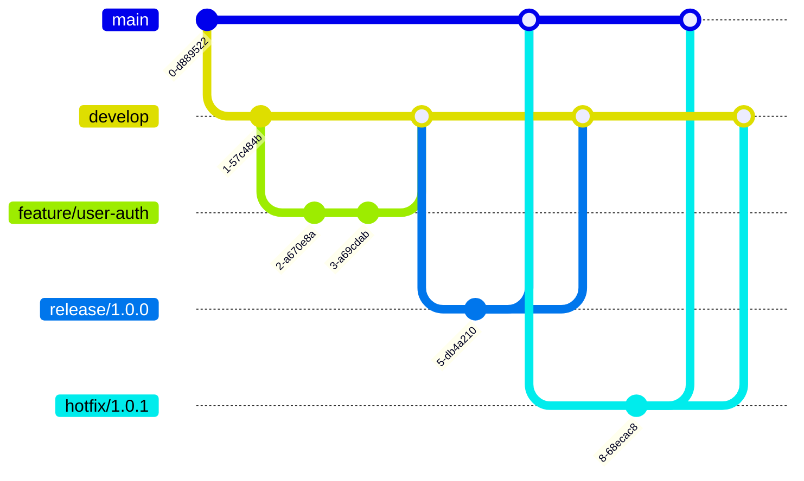

# GitFlow Integration Documentation

## Table of Contents
1. [Overview](#1-overview)
2. [GitFlow Model](#2-gitflow-model)
3. [Branch Management](#3-branch-management)
4. [Automated Workflows](#4-automated-workflows)
5. [CI/CD Integration](#5-cicd-integration)
6. [Best Practices](#6-best-practices)
7. [Troubleshooting](#7-troubleshooting)

---

# 1. Overview

## GitFlow Philosophy

GitFlow provides a robust branching model designed for collaboration, release management, and maintaining production stability. The Linear TDD Workflow System fully embraces GitFlow for organized, predictable releases.

## Core Principles

1. **Separation of Concerns**: Clear distinction between production and development code
2. **Parallel Development**: Support for multiple features and releases
3. **Hotfix Capability**: Quick production fixes without disrupting development
4. **Version Control**: Clear versioning and release management
5. **Automated Protection**: Branch protection and quality gates

---

# 2. GitFlow Model

## Branch Structure



## Core Branches

### Main (Production)
```yaml
branch: main
purpose: Production-ready code
protection:
  - Required reviews: 2
  - Required status checks: All CI/CD
  - Enforce administrators: true
  - Restrict push: Release managers only
```

### Develop (Integration)
```yaml
branch: develop
purpose: Latest development changes
protection:
  - Required reviews: 1
  - Required status checks: Tests, Linting
  - Up-to-date before merge: true
```

---

# 3. Branch Management

## Feature Branches

### Creation
```bash
# Start new feature
git flow feature start FEATURE_NAME
# or manually
git checkout -b feature/JIRA-123-user-authentication develop
```

### Naming Convention
```
feature/[ticket-id]-[brief-description]
Examples:
- feature/CLEAN-123-refactor-auth
- feature/PIPE-456-add-monitoring
- feature/FIX-789-memory-leak
```

### Lifecycle
```typescript
class FeatureBranch {
  async start(name: string): Promise<void> {
    // Create branch from develop
    await git.checkout('develop');
    await git.pull();
    await git.checkoutNewBranch(`feature/${name}`);

    // Create Linear issue
    await linear.createIssue({
      title: `Feature: ${name}`,
      state: "in_progress"
    });
  }

  async finish(name: string): Promise<void> {
    // Run tests
    await runTests();

    // Create PR
    const pr = await github.createPR({
      base: 'develop',
      head: `feature/${name}`,
      title: `Feature: ${name}`
    });

    // Update Linear
    await linear.updateIssue({
      state: "in_review",
      pr: pr.url
    });
  }
}
```

## Release Branches

### Release Process
```yaml
release_workflow:
  1_create_branch:
    source: develop
    naming: release/MAJOR.MINOR.PATCH
    example: release/1.2.0

  2_preparation:
    - Update version numbers
    - Generate changelog
    - Update documentation
    - Final bug fixes only

  3_finalization:
    - Merge to main with tag
    - Merge back to develop
    - Deploy to production
```

## Hotfix Branches

### Emergency Fix Process
```typescript
async function createHotfix(issue: SecurityIssue): Promise<void> {
  // Branch from main
  await git.checkout('main');
  await git.checkoutNewBranch(`hotfix/${issue.version}`);

  // Implement fix with tests
  await implementFix(issue);
  await writeTests(issue);

  // Fast-track review
  const pr = await github.createPR({
    base: 'main',
    head: `hotfix/${issue.version}`,
    title: `HOTFIX: ${issue.title}`,
    labels: ['hotfix', 'critical']
  });

  // Deploy immediately after merge
  await deployToProduction();

  // Merge back to develop
  await git.checkout('develop');
  await git.merge(`hotfix/${issue.version}`);
}
```

---

# 4. Automated Workflows

## Agent Integration

### Automated Branch Creation
```typescript
class GitFlowAutomation {
  async handleLinearIssue(issue: LinearIssue): Promise<void> {
    const branchType = this.determineBranchType(issue);
    const branchName = this.generateBranchName(issue);

    switch(branchType) {
      case 'feature':
        await this.createFeatureBranch(branchName);
        break;
      case 'bugfix':
        await this.createBugfixBranch(branchName);
        break;
      case 'hotfix':
        await this.createHotfixBranch(branchName);
        break;
    }

    // Update Linear with branch info
    await linear.updateIssue(issue.id, {
      branchName: branchName,
      state: "in_progress"
    });
  }
}
```

### Commit Automation
```typescript
interface CommitTemplate {
  type: 'feat' | 'fix' | 'docs' | 'style' | 'refactor' | 'test' | 'chore';
  scope?: string;
  subject: string;
  body?: string;
  footer?: string;
}

function generateCommit(changes: Changes): string {
  const template: CommitTemplate = {
    type: determineType(changes),
    scope: changes.scope,
    subject: changes.summary,
    body: changes.details,
    footer: `Fixes: ${changes.issueId}`
  };

  return formatConventionalCommit(template);
}
```

## Protection Rules

### Branch Protection Configuration
```yaml
main:
  protection_rules:
    required_status_checks:
      strict: true
      contexts:
        - continuous-integration/github-actions
        - security/snyk
        - coverage/codecov

    required_pull_request_reviews:
      required_approving_review_count: 2
      dismiss_stale_reviews: true
      require_code_owner_reviews: true

    enforce_admins: true
    restrictions:
      users: ["release-bot"]
      teams: ["release-managers"]

develop:
  protection_rules:
    required_status_checks:
      contexts:
        - test-suite
        - lint-check

    required_pull_request_reviews:
      required_approving_review_count: 1
```

---

# 5. CI/CD Integration

## Pipeline Configuration

### GitHub Actions Workflow
```yaml
name: GitFlow CI/CD

on:
  pull_request:
    branches: [main, develop]
  push:
    branches: [main, develop]
    tags: ['v*']

jobs:
  test:
    runs-on: ubuntu-latest
    steps:
      - uses: actions/checkout@v3

      - name: Setup Node.js
        uses: actions/setup-node@v3
        with:
          node-version: '18'

      - name: Install dependencies
        run: npm ci

      - name: Run tests
        run: npm test

      - name: Check coverage
        run: npm run coverage

      - name: Verify TDD compliance
        run: |
          if [ "${{ github.base_ref }}" == "main" ]; then
            npm run verify:tdd:strict
          else
            npm run verify:tdd
          fi

  deploy:
    if: github.ref == 'refs/heads/main'
    needs: test
    runs-on: ubuntu-latest
    steps:
      - name: Deploy to production
        run: npm run deploy:prod
```

## Quality Gates

### Merge Requirements
```typescript
interface MergeRequirements {
  develop: {
    tests: "all passing",
    coverage: "≥80% diff coverage",
    reviews: 1,
    conflicts: "none",
    ci: "green"
  },
  main: {
    tests: "all passing",
    coverage: "≥90% diff coverage",
    reviews: 2,
    conflicts: "none",
    ci: "green",
    security: "no critical issues",
    performance: "no regressions"
  }
}
```

---

# 6. Best Practices

## Commit Guidelines

### Conventional Commits
```
<type>(<scope>): <subject>

<body>

<footer>

Examples:
feat(auth): add OAuth2 integration
fix(payment): resolve decimal rounding issue
docs(api): update endpoint documentation
refactor(user): simplify validation logic
```

### Commit Hygiene
- Atomic commits (one logical change)
- Clear, descriptive messages
- Reference issue numbers
- Sign commits when required

## Merge Strategies

### Feature to Develop
```bash
# Squash merge for clean history
git checkout develop
git merge --squash feature/branch
git commit -m "feat: complete feature description"
```

### Release to Main
```bash
# Regular merge to preserve history
git checkout main
git merge --no-ff release/1.0.0
git tag -a v1.0.0 -m "Release version 1.0.0"
```

## Version Management

### Semantic Versioning
```yaml
version_format: MAJOR.MINOR.PATCH

increment_rules:
  MAJOR:
    - Breaking API changes
    - Major architectural changes
    - Incompatible updates

  MINOR:
    - New features
    - Minor enhancements
    - Backward compatible changes

  PATCH:
    - Bug fixes
    - Security patches
    - Performance improvements
```

---

# 7. Troubleshooting

## Common Issues

### Merge Conflicts
```bash
# Resolution workflow
git checkout develop
git pull origin develop
git checkout feature/branch
git rebase develop

# If conflicts occur
git status
# Edit conflicted files
git add .
git rebase --continue
```

### Failed CI Checks
```typescript
async function debugCIFailure(): Promise<void> {
  // Get failure details
  const checks = await github.getCheckRuns(pr.head.sha);
  const failed = checks.filter(c => c.status === 'failure');

  for (const check of failed) {
    console.log(`Failed: ${check.name}`);
    console.log(`Details: ${check.details_url}`);

    // Auto-fix if possible
    if (canAutoFix(check)) {
      await autoFix(check);
      await git.commit('fix: resolve CI failure');
      await git.push();
    }
  }
}
```

### Rollback Procedures
```bash
# Rollback a release
git checkout main
git revert -m 1 <merge-commit>
git push

# Rollback a feature
git checkout develop
git revert <feature-merge-commit>
git push
```

---

## Summary

GitFlow integration provides:
1. **Structured Development**: Clear branching strategy
2. **Parallel Workflows**: Multiple features and releases
3. **Production Safety**: Protected main branch
4. **Quick Fixes**: Hotfix capability
5. **Automation**: CI/CD integration

The system ensures code quality through automated testing, protection rules, and systematic version management.

---

*This document is maintained by the Engineering Excellence Team.*