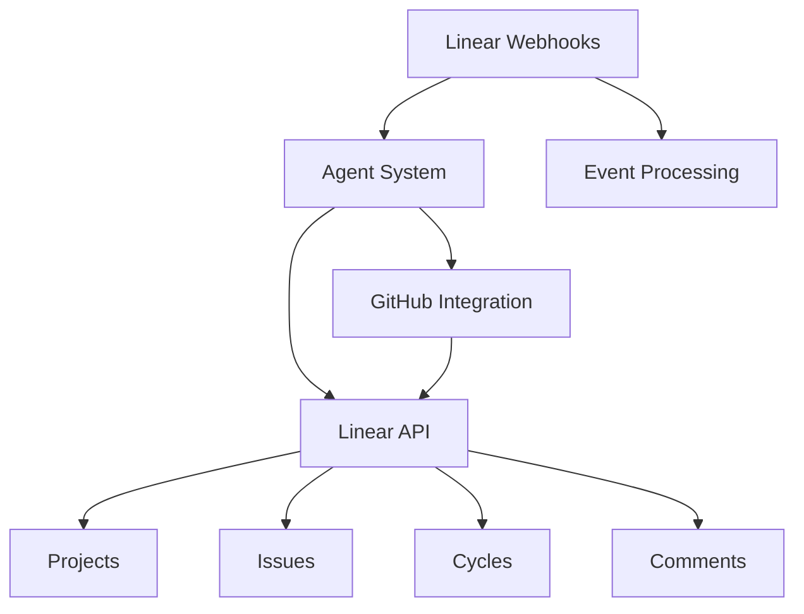
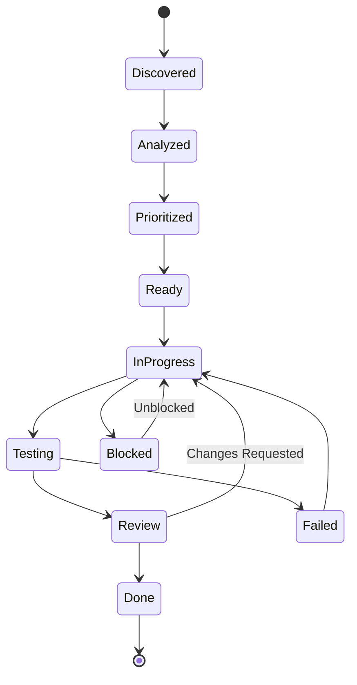

# Linear.app Integration Documentation

## Table of Contents

1. [Overview](#1-overview)
2. [Setup & Configuration](#2-setup--configuration)
3. [Core Integration Features](#3-core-integration-features)
4. [Task Management Workflow](#4-task-management-workflow)
5. [Automated Issue Creation](#5-automated-issue-creation)
6. [Cycle Planning & Sprint Management](#6-cycle-planning--sprint-management)
7. [API Reference](#7-api-reference)
8. [Best Practices](#8-best-practices)
9. [Troubleshooting](#9-troubleshooting)

---

# 1. Overview

## Integration Philosophy

The Linear TDD Workflow System operates as an **autonomous team member** that proactively manages its work queue, maintains transparency through Linear, and self-organizes task execution while keeping human stakeholders informed.

## Core Principles

1. **Transparency**: All agent activities are tracked in Linear
2. **Autonomy**: Agents self-assign and manage their tasks
3. **Accountability**: Complete audit trail of all actions
4. **Collaboration**: Seamless integration with human workflows
5. **Intelligence**: Learning from task patterns and outcomes

## Integration Architecture



## Key Capabilities

- **Bi-directional Sync**: Real-time synchronization between code changes and Linear tasks
- **Automated Task Creation**: Generate issues from code assessment findings
- **Progress Tracking**: Automatic status updates as work progresses
- **Sprint Planning**: Intelligent task allocation to cycles
- **Reporting**: Comprehensive metrics and progress reports

---

# 2. Setup & Configuration

## Prerequisites

### Required Accounts

- Linear.app workspace with API access
- GitHub account with repository permissions
- Admin access to create webhooks

### Environment Variables

```bash
# Required Linear Configuration
LINEAR_API_KEY=lin_api_xxxxxxxxxxxxx      # Your Linear API key
LINEAR_TEAM_ID=a-coders                   # Team identifier
LINEAR_PROJECT_ID=ai-coding               # Project identifier
LINEAR_WORKSPACE_URL=https://linear.app/your-workspace

# Optional Configuration
LINEAR_DEFAULT_PRIORITY=2                 # Default priority (0-4)
LINEAR_DEFAULT_ESTIMATE=3                 # Default points estimate
LINEAR_SYNC_INTERVAL=60                   # Sync interval in seconds
LINEAR_WEBHOOK_SECRET=xxx                 # Webhook verification secret
```

## Initial Setup Steps

### Step 1: Generate Linear API Key

```markdown
1. Navigate to Linear Settings → API
2. Click "Create new API key"
3. Name it "TDD-Workflow-System"
4. Copy the generated key
5. Store securely in environment variables
```

### Step 2: Configure Team and Project

```typescript
// Verify team exists
const team = await linear.teams({
  filter: { key: { eq: 'a-coders' } },
});

// Create or verify project
const project = await linear.projects({
  filter: {
    name: { eq: 'AI Coding' },
    team: { key: { eq: 'a-coders' } },
  },
});

// If not exists, create
if (!project) {
  await linear.createProject({
    name: 'AI Coding',
    teamId: team.id,
    description: 'Autonomous code quality management',
    color: '#5E6AD2',
    state: 'started',
  });
}
```

### Step 3: Create Required Labels

```typescript
const requiredLabels = [
  // Agent Labels
  { name: 'claude-code', color: '#5E6AD2', description: 'Agent-managed task' },
  { name: 'automated', color: '#4CB782', description: 'Automated process' },
  { name: 'fix-pack', color: '#26B5CE', description: 'Pre-approved fix' },

  // Type Labels
  { name: 'assessment', color: '#F7CE45', description: 'Code assessment' },
  { name: 'implementation', color: '#4CB782', description: 'Code changes' },
  { name: 'pipeline', color: '#B5A4DB', description: 'CI/CD related' },

  // Priority Labels
  { name: 'p0-critical', color: '#F2453D', description: 'Critical priority' },
  { name: 'p1-high', color: '#F2994A', description: 'High priority' },
  { name: 'p2-medium', color: '#F7CE45', description: 'Medium priority' },
  { name: 'p3-low', color: '#5E6AD2', description: 'Low priority' },

  // Status Labels
  { name: 'blocked', color: '#95918C', description: 'Blocked task' },
  { name: 'in-review', color: '#26B5CE', description: 'Under review' },
  { name: 'ready', color: '#4CB782', description: 'Ready to start' },
];

for (const label of requiredLabels) {
  await linear.createIssueLabel(label);
}
```

### Step 4: Configure Webhooks

```typescript
const webhook = await linear.createWebhook({
  url: 'https://your-system.com/webhooks/linear',
  teamId: team.id,
  label: 'TDD Workflow System',
  events: [
    'Issue.created',
    'Issue.updated',
    'Issue.deleted',
    'Comment.created',
    'Project.updated',
    'Cycle.created',
  ],
});
```

## Workspace Initialization Protocol

```yaml
ON_PROJECT_START:
  1_verify_connection:
    - Test Linear API connection
    - Verify permissions (read, write, admin)
    - Check rate limits

  2_setup_workspace:
    - Identify or create project
    - Configure team settings
    - Create required labels
    - Set up custom fields

  3_establish_conventions:
    - Create "Claude-Code" assignee label
    - Set up issue templates
    - Configure workflow states
    - Define priority matrix

  4_create_meta_issues:
    - 'Project Setup and Architecture Planning'
    - 'Codebase Analysis and Technical Debt Assessment'
    - 'Claude Code Work Log and Decisions'

  5_configure_automation:
    - Set up webhooks
    - Configure sync intervals
    - Initialize event handlers
    - Test bi-directional sync
```

---

# 3. Core Integration Features

## 3.1 Issue Management

### Creating Issues

```typescript
interface IssueCreation {
  title: string;
  description: string;
  teamId: string;
  projectId?: string;
  priority: 0 | 1 | 2 | 3 | 4;
  estimate?: number;
  labels: string[];
  assigneeId?: string;
  parentId?: string;
  cycleId?: string;
}

async function createAgentIssue(task: AssessmentFinding): Promise<Issue> {
  return await linear.createIssue({
    title: `[CC] ${task.title}`,
    description: formatDescription(task),
    teamId: LINEAR_TEAM_ID,
    projectId: LINEAR_PROJECT_ID,
    priority: mapPriority(task.severity),
    estimate: estimateEffort(task.complexity),
    labels: ['claude-code', 'automated', task.category],
    assigneeId: 'me', // Self-assignment
    state: 'backlog',
  });
}
```

### Issue Templates

```markdown
## Automated Task Template

**Agent**: ${agent_name}
**Created**: ${timestamp}
**Type**: ${task_type}

### Objective

${clear_objective}

### Context

- **Repository**: ${repo_url}
- **Branch**: ${branch_name}
- **Files Affected**: ${file_count}
- **Complexity**: ${complexity_score}

### Success Criteria

- [ ] ${criterion_1}
- [ ] ${criterion_2}
- [ ] All tests passing
- [ ] Coverage ≥80%

### Technical Details

${technical_description}

### Execution Log

- Starting: ${start_time}
- Status: ${current_status}
```

## 3.2 Status Management

### Workflow States

```typescript
enum WorkflowState {
  BACKLOG = 'backlog',
  TODO = 'todo',
  IN_PROGRESS = 'in_progress',
  IN_REVIEW = 'in_review',
  BLOCKED = 'blocked',
  DONE = 'done',
  CANCELLED = 'cancelled',
}

const stateTransitions = {
  discovered: WorkflowState.BACKLOG,
  prioritized: WorkflowState.TODO,
  analyzing: WorkflowState.IN_PROGRESS,
  implementing: WorkflowState.IN_PROGRESS,
  testing: WorkflowState.IN_REVIEW,
  blocked: WorkflowState.BLOCKED,
  complete: WorkflowState.DONE,
};
```

### Automatic Status Updates

```typescript
async function updateTaskStatus(issueId: string, status: string, details: object): Promise<void> {
  // Update issue state
  await linear.updateIssue(issueId, {
    stateId: getStateId(status),
  });

  // Add progress comment
  await linear.createComment({
    issueId,
    body: formatProgressUpdate(status, details),
  });

  // Update metrics
  await updateMetrics(issueId, status);
}
```

## 3.3 Comment System

### Progress Updates

```typescript
function formatProgressUpdate(status: string, details: any): string {
  return `
### Progress Update - ${new Date().toISOString()}

**Status**: ${status}
**Agent**: ${details.agent}

#### Completed
${details.completed.map((item) => `- ✅ ${item}`).join('\n')}

#### In Progress
${details.inProgress.map((item) => `- 🔄 ${item}`).join('\n')}

#### Next Steps
${details.nextSteps.map((item) => `- ⏭️ ${item}`).join('\n')}

**Blockers**: ${details.blockers || 'None'}
**Files Modified**: ${details.filesModified || 0}
**Tests Added/Modified**: ${details.testsModified || 0}
**Coverage**: ${details.coverage || 'N/A'}
`;
}
```

### Decision Documentation

```typescript
async function documentDecision(issueId: string, decision: Decision): Promise<void> {
  const comment = `
### 🎯 Decision Point

**Context**: ${decision.context}
**Options Considered**:
${decision.options.map((opt) => `- ${opt.name}: ${opt.pros} / ${opt.cons}`).join('\n')}

**Decision**: ${decision.chosen}
**Rationale**: ${decision.rationale}

**Impact**:
- Performance: ${decision.impact.performance}
- Maintainability: ${decision.impact.maintainability}
- Timeline: ${decision.impact.timeline}
`;

  await linear.createComment({ issueId, body: comment });
}
```

---

# 4. Task Management Workflow

## 4.1 Task Creation Strategy

### When to Create Issues

```yaml
automatic_creation_triggers:
  assessment_findings:
    - code_quality_violations
    - security_vulnerabilities
    - technical_debt_items
    - missing_test_coverage

  pipeline_events:
    - build_failures
    - test_failures
    - deployment_issues

  pattern_detection:
    - recurring_issues
    - optimization_opportunities
    - refactoring_candidates

  scheduled_tasks:
    - daily_assessments
    - weekly_reports
    - sprint_planning
```

### Task Granularity Rules

```typescript
const granularityRules = {
  maxEstimate: 8, // Maximum story points
  maxDuration: '4h', // Maximum time estimate
  breakdownThreshold: 5, // Points requiring breakdown

  shouldBreakdown(task: Task): boolean {
    return (
      task.estimate > this.breakdownThreshold ||
      task.complexity === 'high' ||
      task.dependencies.length > 3
    );
  },

  createSubtasks(parent: Task): Task[] {
    return [
      { title: `[1/n] Analysis: ${parent.title}`, estimate: 2 },
      { title: `[2/n] Implementation: ${parent.title}`, estimate: 3 },
      { title: `[3/n] Testing: ${parent.title}`, estimate: 2 },
      { title: `[4/n] Documentation: ${parent.title}`, estimate: 1 },
    ];
  },
};
```

## 4.2 Task Prioritization

### Priority Matrix

```typescript
interface PriorityFactors {
  businessImpact: number; // 0-10
  userImpact: number; // 0-10
  technicalRisk: number; // 0-10
  effort: number; // 1-13 (story points)
  dependencies: number; // Count of blocking tasks
}

function calculatePriority(factors: PriorityFactors): number {
  const score =
    factors.businessImpact * 3 +
    factors.userImpact * 2 +
    factors.technicalRisk * 2 +
    (13 - factors.effort) * 1 +
    factors.dependencies * -2;

  // Map to Linear priority (0-4)
  if (score >= 40) return 0; // Urgent
  if (score >= 30) return 1; // High
  if (score >= 20) return 2; // Medium
  if (score >= 10) return 3; // Low
  return 4; // None
}
```

### Smart Queue Management

```typescript
class TaskQueue {
  private queue: PriorityQueue<Task>;

  async processNext(): Promise<void> {
    const task = this.queue.dequeue();

    // Check dependencies
    if (await this.hasPendingDependencies(task)) {
      this.queue.enqueue(task, task.priority - 1);
      return this.processNext();
    }

    // Check resource availability
    if (!(await this.hasAvailableResources(task))) {
      this.queue.enqueue(task, task.priority);
      return this.processNext();
    }

    // Execute task
    await this.executeTask(task);
  }
}
```

## 4.3 Task Lifecycle

### State Machine



### Lifecycle Hooks

```typescript
class TaskLifecycle {
  async onStateChange(task: Task, from: State, to: State): Promise<void> {
    // Log transition
    await this.logTransition(task, from, to);

    // Update Linear
    await linear.updateIssue(task.linearId, {
      stateId: to.linearStateId,
    });

    // Trigger automations
    switch (to) {
      case State.IN_PROGRESS:
        await this.startTracking(task);
        break;
      case State.TESTING:
        await this.runTests(task);
        break;
      case State.DONE:
        await this.extractPatterns(task);
        break;
    }

    // Notify stakeholders
    await this.notify(task, to);
  }
}
```

---

# 5. Automated Issue Creation

## 5.1 Bulk Issue Generation

### From Assessment Results

```typescript
async function createIssuesFromAssessment(assessment: AssessmentResult): Promise<Issue[]> {
  const issues: Issue[] = [];

  // Group findings by category
  const grouped = groupBy(assessment.findings, 'category');

  // Create parent issues for each category
  for (const [category, findings] of Object.entries(grouped)) {
    const parent = await linear.createIssue({
      title: `[Assessment] ${category} Improvements`,
      description: `Found ${findings.length} ${category} issues`,
      labels: ['assessment', category],
      projectId: LINEAR_PROJECT_ID,
    });

    // Create child issues for specific findings
    for (const finding of findings) {
      const child = await linear.createIssue({
        title: `[CC] ${finding.title}`,
        description: formatFinding(finding),
        parentId: parent.id,
        priority: mapSeverityToPriority(finding.severity),
        estimate: estimateFixEffort(finding),
        labels: ['claude-code', 'fix-pack', finding.type],
      });
      issues.push(child);
    }
  }

  return issues;
}
```

### From Pattern Detection

```typescript
async function createPatternIssues(patterns: DetectedPattern[]): Promise<void> {
  for (const pattern of patterns) {
    // Check if issue already exists
    const existing = await linear.issues({
      filter: {
        title: { contains: pattern.signature },
      },
    });

    if (existing.nodes.length === 0) {
      await linear.createIssue({
        title: `[Pattern] ${pattern.name}`,
        description: `
## Recurring Pattern Detected

**Occurrences**: ${pattern.count}
**Locations**: ${pattern.locations.join(', ')}
**Category**: ${pattern.category}

### Suggested Fix
${pattern.suggestedFix}

### Expected Impact
- Lines affected: ~${pattern.estimatedLOC}
- Complexity reduction: ${pattern.complexityReduction}%
- Test coverage increase: +${pattern.coverageIncrease}%
        `,
        priority: pattern.count > 5 ? 1 : 2,
        estimate: pattern.estimatedEffort,
        labels: ['pattern', 'automated', pattern.category],
      });
    }
  }
}
```

## 5.2 Issue Templates

### Fix Pack Template

```typescript
const fixPackTemplate = {
  title: '[Fix Pack] ${category} - ${scope}',
  description: `
## Fix Pack Execution Plan

**Category**: ${category}
**Risk Level**: ${riskLevel}
**Estimated LOC**: ${estimatedLOC}

### Scope
${scopeDescription}

### Changes
${changes.map((c) => `- [ ] ${c.file}: ${c.description}`).join('\n')}

### Test Plan
- [ ] Write failing tests (RED)
- [ ] Implement minimal fix (GREEN)
- [ ] Refactor if needed (REFACTOR)
- [ ] Verify diff coverage ≥80%
- [ ] Run mutation testing

### Rollback Plan
${rollbackInstructions}

### Success Metrics
- All tests passing
- No regressions introduced
- Coverage requirements met
- PR approved and merged
`,
  labels: ['fix-pack', 'automated', '${category}'],
  estimate: '${storyPoints}',
};
```

### Pipeline Recovery Template

```typescript
const pipelineTemplate = {
  title: '[Pipeline] ${failureType} - ${timestamp}',
  description: `
## Pipeline Failure Report

**Build**: ${buildNumber}
**Branch**: ${branch}
**Commit**: ${commitHash}
**Failure Type**: ${failureType}

### Error Details
\`\`\`
${errorOutput}
\`\`\`

### Root Cause Analysis
${rootCause}

### Recovery Actions
${recoverySteps.map((s) => `- [ ] ${s}`).join('\n')}

### Prevention Measures
${preventionMeasures}
`,
  priority: 0, // Pipeline issues are urgent
  labels: ['pipeline', 'incident', 'automated'],
};
```

---

# 6. Cycle Planning & Sprint Management

## 6.1 Cycle Integration

### Automatic Cycle Assignment

```typescript
async function assignToCycle(issue: Issue): Promise<void> {
  // Get current and next cycles
  const currentCycle = await linear.cycles({
    filter: { isActive: { eq: true } },
  });

  const nextCycle = await linear.cycles({
    filter: { startsAt: { gt: new Date() } },
  });

  // Decision logic
  let targetCycle;

  if (issue.priority <= 1 && currentCycle.nodes[0]) {
    // High priority → current cycle
    targetCycle = currentCycle.nodes[0];
  } else if (issue.estimate <= 3) {
    // Small tasks → current cycle if space
    const currentLoad = await getCycleLoad(currentCycle.nodes[0]);
    if (currentLoad.remaining >= issue.estimate) {
      targetCycle = currentCycle.nodes[0];
    } else {
      targetCycle = nextCycle.nodes[0];
    }
  } else {
    // Large tasks → next cycle
    targetCycle = nextCycle.nodes[0];
  }

  // Update issue
  await linear.updateIssue(issue.id, {
    cycleId: targetCycle.id,
  });
}
```

### Sprint Planning Automation

```typescript
async function planSprint(): Promise<SprintPlan> {
  // Get team velocity
  const velocity = await calculateVelocity();

  // Get prioritized backlog
  const backlog = await linear.issues({
    filter: {
      state: { name: { in: ['backlog', 'todo'] } },
      project: { id: { eq: LINEAR_PROJECT_ID } },
    },
    orderBy: LinearDocument.PriorityOrder,
  });

  // Build sprint
  const sprint: Issue[] = [];
  let capacity = velocity * 0.8; // 80% capacity planning

  for (const issue of backlog.nodes) {
    if (issue.estimate <= capacity) {
      sprint.push(issue);
      capacity -= issue.estimate;
    }

    if (capacity < 1) break;
  }

  // Assign to cycle
  const cycle = await getCurrentCycle();
  for (const issue of sprint) {
    await linear.updateIssue(issue.id, {
      cycleId: cycle.id,
      stateId: getStateId('todo'),
    });
  }

  return { cycle, issues: sprint, totalPoints: velocity - capacity };
}
```

## 6.2 Progress Tracking

### Burndown Calculation

```typescript
interface BurndownData {
  cycleId: string;
  totalPoints: number;
  completedPoints: number;
  remainingPoints: number;
  idealLine: number[];
  actualLine: number[];
  projectedCompletion: Date;
}

async function calculateBurndown(cycleId: string): Promise<BurndownData> {
  const cycle = await linear.cycle(cycleId);
  const issues = await linear.issues({
    filter: { cycle: { id: { eq: cycleId } } },
  });

  const totalPoints = sum(issues.nodes.map((i) => i.estimate || 0));
  const completedPoints = sum(
    issues.nodes.filter((i) => i.state.type === 'completed').map((i) => i.estimate || 0),
  );

  // Calculate ideal burndown
  const workingDays = getWorkingDays(cycle.startsAt, cycle.endsAt);
  const idealDaily = totalPoints / workingDays;
  const idealLine = workingDays.map((_, i) => totalPoints - idealDaily * i);

  // Calculate actual burndown
  const actualLine = await calculateActualProgress(cycle, issues);

  // Project completion
  const currentVelocity = calculateDailyVelocity(actualLine);
  const remainingPoints = totalPoints - completedPoints;
  const daysToComplete = remainingPoints / currentVelocity;
  const projectedCompletion = addBusinessDays(new Date(), daysToComplete);

  return {
    cycleId,
    totalPoints,
    completedPoints,
    remainingPoints,
    idealLine,
    actualLine,
    projectedCompletion,
  };
}
```

### Velocity Tracking

```typescript
async function trackVelocity(): Promise<VelocityMetrics> {
  const completedCycles = await linear.cycles({
    filter: {
      endsAt: { lt: new Date() },
      completedIssueCount: { gt: 0 },
    },
    last: 6, // Last 6 cycles
  });

  const velocities = await Promise.all(
    completedCycles.nodes.map(async (cycle) => {
      const issues = await linear.issues({
        filter: {
          cycle: { id: { eq: cycle.id } },
          state: { type: { eq: 'completed' } },
        },
      });

      return sum(issues.nodes.map((i) => i.estimate || 0));
    }),
  );

  return {
    average: mean(velocities),
    median: median(velocities),
    trend: calculateTrend(velocities),
    confidence: standardDeviation(velocities) / mean(velocities),
    recommendation: velocities.slice(-3).reduce((a, b) => a + b, 0) / 3,
  };
}
```

---

# 7. API Reference

## 7.1 Core Operations

### Issue Operations

```typescript
// Create issue
linear.createIssue({
  title: string,
  description?: string,
  teamId: string,
  projectId?: string,
  priority?: 0 | 1 | 2 | 3 | 4,
  estimate?: number,
  labels?: string[],
  assigneeId?: string,
  parentId?: string,
  cycleId?: string,
  stateId?: string,
  dueDate?: Date
}): Promise<Issue>

// Update issue
linear.updateIssue(id: string, input: Partial<IssueInput>): Promise<Issue>

// Get issue
linear.issue(id: string): Promise<Issue>

// List issues
linear.issues({
  filter?: IssueFilter,
  orderBy?: IssueOrderBy,
  first?: number,
  after?: string
}): Promise<IssueConnection>

// Delete issue
linear.deleteIssue(id: string): Promise<Success>
```

### Comment Operations

```typescript
// Create comment
linear.createComment({
  issueId: string,
  body: string,
  parentId?: string
}): Promise<Comment>

// Update comment
linear.updateComment(id: string, body: string): Promise<Comment>

// List comments
linear.comments({
  filter?: CommentFilter,
  orderBy?: CommentOrderBy
}): Promise<CommentConnection>
```

### Project Operations

```typescript
// Create project
linear.createProject({
  name: string,
  description?: string,
  teamId: string,
  state?: "planned" | "started" | "completed" | "canceled",
  leadId?: string,
  memberIds?: string[],
  color?: string
}): Promise<Project>

// Update project
linear.updateProject(id: string, input: Partial<ProjectInput>): Promise<Project>

// Get project
linear.project(id: string): Promise<Project>
```

## 7.2 Webhook Events

### Event Types

```typescript
enum WebhookEvent {
  // Issue events
  ISSUE_CREATED = 'Issue.created',
  ISSUE_UPDATED = 'Issue.updated',
  ISSUE_DELETED = 'Issue.deleted',

  // Comment events
  COMMENT_CREATED = 'Comment.created',
  COMMENT_UPDATED = 'Comment.updated',

  // Project events
  PROJECT_CREATED = 'Project.created',
  PROJECT_UPDATED = 'Project.updated',

  // Cycle events
  CYCLE_CREATED = 'Cycle.created',
  CYCLE_UPDATED = 'Cycle.updated',
  CYCLE_COMPLETED = 'Cycle.completed',
}
```

### Event Handler

```typescript
class LinearWebhookHandler {
  async handleEvent(event: WebhookEvent, payload: any): Promise<void> {
    switch (event) {
      case WebhookEvent.ISSUE_CREATED:
        await this.onIssueCreated(payload);
        break;

      case WebhookEvent.ISSUE_UPDATED:
        await this.onIssueUpdated(payload);
        break;

      case WebhookEvent.COMMENT_CREATED:
        await this.onCommentCreated(payload);
        break;

      default:
        console.log(`Unhandled event: ${event}`);
    }
  }

  private async onIssueCreated(issue: Issue): Promise<void> {
    // Check if it's for the agent
    if (issue.labels.some((l) => l.name === 'claude-code')) {
      await this.assignAgent(issue);
      await this.startWork(issue);
    }
  }
}
```

## 7.3 Error Handling

### Rate Limiting

```typescript
class LinearRateLimiter {
  private requests: number[] = [];
  private readonly limit = 1500; // Per hour
  private readonly window = 3600000; // 1 hour in ms

  async executeWithLimit<T>(fn: () => Promise<T>): Promise<T> {
    await this.waitIfNeeded();

    try {
      const result = await fn();
      this.recordRequest();
      return result;
    } catch (error) {
      if (error.message.includes('rate limit')) {
        await this.handleRateLimit();
        return this.executeWithLimit(fn);
      }
      throw error;
    }
  }

  private async waitIfNeeded(): Promise<void> {
    const now = Date.now();
    this.requests = this.requests.filter((time) => now - time < this.window);

    if (this.requests.length >= this.limit) {
      const oldestRequest = this.requests[0];
      const waitTime = this.window - (now - oldestRequest);
      await sleep(waitTime);
    }
  }
}
```

### Error Recovery

```typescript
async function withRetry<T>(fn: () => Promise<T>, options: RetryOptions = {}): Promise<T> {
  const { maxAttempts = 3, backoff = 1000, multiplier = 2, maxBackoff = 30000 } = options;

  let lastError: Error;

  for (let attempt = 1; attempt <= maxAttempts; attempt++) {
    try {
      return await fn();
    } catch (error) {
      lastError = error;

      if (attempt === maxAttempts) break;

      const delay = Math.min(backoff * Math.pow(multiplier, attempt - 1), maxBackoff);

      console.log(`Attempt ${attempt} failed, retrying in ${delay}ms`);
      await sleep(delay);
    }
  }

  throw lastError;
}
```

---

# 8. Best Practices

## 8.1 Issue Management Best Practices

### Naming Conventions

```yaml
prefixes:
  agent_tasks: '[CC]' # Claude Code
  assessments: '[ASSESS]' # Assessment findings
  fix_packs: '[FIX]' # Fix pack implementations
  pipeline: '[PIPE]' # Pipeline issues
  patterns: '[PATTERN]' # Pattern detections

title_format: '${prefix} ${action} ${target}'
examples:
  - '[CC] Refactor authentication module'
  - '[ASSESS] High complexity in payment service'
  - '[FIX] Remove dead code from utils'
  - '[PIPE] Failed deployment to staging'
```

### Description Standards

```markdown
## Required Sections

### Objective

Clear statement of what needs to be accomplished

### Context

- Repository and branch information
- Related issues or PRs
- Technical constraints

### Success Criteria

Measurable outcomes that define completion

### Technical Details

Implementation specifics and approach

### Testing Plan

How the changes will be validated

### Rollback Plan

Steps to revert if issues arise
```

## 8.2 Automation Guidelines

### When to Automate

```yaml
automate:
  - recurring_tasks: Daily assessments, reports
  - deterministic_processes: Status updates, labeling
  - high_volume_operations: Bulk issue creation
  - time_sensitive_actions: Pipeline recovery

manual_review_required:
  - strategic_decisions: Architecture changes
  - high_risk_changes: Database migrations
  - user_facing_changes: API modifications
  - security_sensitive: Authentication, authorization
```

### Automation Safeguards

```typescript
class AutomationSafeguards {
  // Rate limiting
  private readonly maxIssuesPerHour = 100;
  private readonly maxCommentsPerIssue = 50;

  // Change limits
  private readonly maxBulkUpdates = 25;
  private readonly requiresApproval = ['delete', 'archive', 'close'];

  // Validation
  async validateAutomation(action: Action): Promise<boolean> {
    // Check rate limits
    if (await this.exceedsRateLimit(action)) {
      throw new Error('Rate limit exceeded');
    }

    // Check permissions
    if (this.requiresApproval.includes(action.type)) {
      return await this.requestApproval(action);
    }

    // Validate scope
    if (action.affectedCount > this.maxBulkUpdates) {
      throw new Error('Bulk operation exceeds limit');
    }

    return true;
  }
}
```

## 8.3 Performance Optimization

### Batch Operations

```typescript
// Inefficient: Individual API calls
for (const issue of issues) {
  await linear.updateIssue(issue.id, { stateId: 'done' });
}

// Efficient: Batch mutation
await linear.bulkUpdateIssues({
  ids: issues.map((i) => i.id),
  stateId: 'done',
});
```

### Caching Strategy

```typescript
class LinearCache {
  private cache = new Map<string, CacheEntry>();
  private readonly ttl = 60000; // 1 minute

  async get<T>(key: string, fetcher: () => Promise<T>): Promise<T> {
    const cached = this.cache.get(key);

    if (cached && Date.now() - cached.timestamp < this.ttl) {
      return cached.data as T;
    }

    const data = await fetcher();
    this.cache.set(key, {
      data,
      timestamp: Date.now(),
    });

    return data;
  }
}
```

---

# 9. Troubleshooting

## Common Issues

### Issue: API Connection Failures

```yaml
symptoms:
  - "401 Unauthorized" errors
  - "Network timeout" messages
  - Intermittent connection drops

diagnosis:
  - Check API key validity
  - Verify network connectivity
  - Review rate limit status

solutions:
  - Regenerate API key if expired
  - Implement exponential backoff
  - Add connection pooling
  - Use webhook events instead of polling
```

### Issue: Webhook Events Not Received

```yaml
symptoms:
  - Missing status updates
  - Delayed synchronization
  - No event triggers

diagnosis:
  - Check webhook configuration
  - Verify endpoint accessibility
  - Review webhook logs

solutions:
  - Confirm webhook URL is public
  - Check firewall/proxy settings
  - Validate webhook secret
  - Test with webhook.site
```

### Issue: Duplicate Issues Created

```yaml
symptoms:
  - Multiple issues for same finding
  - Repeated task creation
  - Sync conflicts

diagnosis:
  - Check idempotency implementation
  - Review deduplication logic
  - Analyze race conditions

solutions:
  - Implement unique identifiers
  - Add existence checks before creation
  - Use database transactions
  - Add distributed locking
```

## Debugging Tools

### Linear API Explorer

```typescript
async function exploreLinearAPI(): Promise<void> {
  // Test connection
  const viewer = await linear.viewer;
  console.log('Connected as:', viewer.email);

  // List accessible teams
  const teams = await linear.teams();
  console.log(
    'Teams:',
    teams.nodes.map((t) => t.name),
  );

  // Check permissions
  const team = teams.nodes[0];
  const permissions = await linear.teamMembership(team.id);
  console.log('Permissions:', permissions);

  // Test issue creation
  try {
    const test = await linear.createIssue({
      title: '[TEST] API Connection Test',
      teamId: team.id,
    });
    console.log('Test issue created:', test.identifier);

    // Clean up
    await linear.deleteIssue(test.id);
  } catch (error) {
    console.error('Issue creation failed:', error);
  }
}
```

### Webhook Tester

```typescript
async function testWebhook(url: string): Promise<void> {
  const testPayload = {
    action: 'issue.created',
    type: 'Issue',
    data: {
      id: 'test-123',
      title: 'Test Issue',
      createdAt: new Date().toISOString(),
    },
  };

  const response = await fetch(url, {
    method: 'POST',
    headers: {
      'Content-Type': 'application/json',
      'Linear-Event': 'Issue.created',
      'Linear-Signature': generateSignature(testPayload),
    },
    body: JSON.stringify(testPayload),
  });

  console.log('Response:', response.status, await response.text());
}
```

## Support Resources

### Documentation Links

- [Linear API Documentation](https://developers.linear.app/docs/graphql/working-with-the-graphql-api)
- [Linear SDK Reference](https://github.com/linear/linear-js)
- [Webhook Events Guide](https://developers.linear.app/docs/graphql/webhooks)
- [Rate Limiting Guidelines](https://developers.linear.app/docs/graphql/rate-limiting)

### Community Support

- Linear Developer Forum
- GitHub Discussions
- Stack Overflow: `[linear-api]` tag

---

## Summary

The Linear integration provides comprehensive task management capabilities for the autonomous agent system. By following these guidelines and best practices, the system maintains transparency, accountability, and efficiency while seamlessly integrating with human workflows.

Key takeaways:

1. **Automation with Oversight**: Automate routine tasks while maintaining human control
2. **Real-time Transparency**: Keep all stakeholders informed through Linear
3. **Intelligent Prioritization**: Use data-driven decisions for task management
4. **Continuous Improvement**: Learn from patterns and optimize workflows
5. **Robust Error Handling**: Gracefully handle failures and edge cases

The integration continues to evolve with new features and improvements based on usage patterns and team feedback.

---

_This document is maintained by the Engineering Excellence Team and updated with each Linear integration enhancement._
