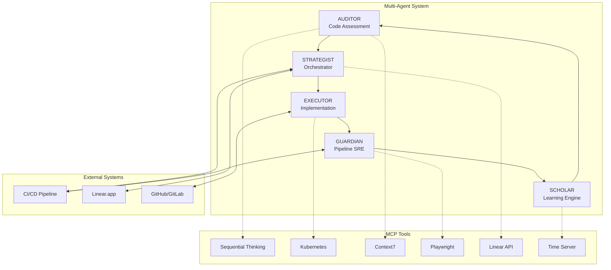

# 🚀 Autonomous Clean Code Workflow System

## Advanced Multi-Agent Architecture for Continuous Code Quality Excellence

[](https://github.com/)
[](https://github.com/)
[](https://github.com/)
[](https://linear.app)
[](https://modelcontextprotocol.org)

## 📋 Table of Contents

- [Overview](#overview)
- [Architecture](#architecture)
- [MCP Tools Integration](#mcp-tools-integration)
- [Agent Roles](#agent-roles)
- [Installation](#installation)
- [Configuration](#configuration)
- [Usage](#usage)
- [CI/CD Integration](#cicd-integration)
- [Linear.app Integration](#linearapp-integration)
- [Metrics & Monitoring](#metrics--monitoring)
- [Contributing](#contributing)

## 🎯 Overview

The **Autonomous Clean Code Workflow System** is a sophisticated multi-agent architecture that continuously elevates code quality through systematic assessment, prioritized execution, and rigorous validation. This system leverages Claude Code AI agents with direct access to CI/CD pipelines and project management tools to maintain exceptional code standards without human intervention.

### Key Features

- **🤖 5 Specialized AI Agents** working in concert
- **🔄 Continuous Quality Improvement** with zero-downtime operation
- **📊 Real-time Metrics** and progress tracking
- **🎯 Test-Driven Development** at its core
- **🔌 Direct CI/CD Integration** for immediate feedback
- **📝 Linear.app Integration** for automatic task management
- **🧠 Self-Learning System** that improves over time
- **⚡ High Velocity** - 20+ improvements per day

### System Goals

| Metric | Target | Current |
|--------|--------|---------|
| Test Coverage | >90% | - |
| Cyclomatic Complexity | <10 avg | - |
| Security Vulnerabilities | 0 critical | - |
| Pipeline Uptime | 99.9% | - |
| Auto-fix Success Rate | 95% | - |
| Technical Debt Reduction | 15% monthly | - |

## 🏗️ Architecture



## 🔧 MCP Tools Integration

The system leverages Model Context Protocol (MCP) tools for enhanced capabilities:

### Available MCP Servers

```bash
# Sequential Thinking - Advanced problem-solving for complex refactoring
claude mcp add-json sequential-thinking '{"command":"npx","args":["-y","@modelcontextprotocol/server-sequential-thinking"],"env":{}}'

# Kubernetes - Container orchestration and deployment management
claude mcp add kubernetes -- npx mcp-server-kubernetes

# Context7 - Code context and documentation retrieval
claude mcp add --transport sse context7 https://mcp.context7.com/sse

# Playwright - E2E test automation and browser testing
claude mcp add playwright npx @playwright/mcp@latest

# Linear - Project management and task tracking
claude mcp add --transport sse linear-server https://mcp.linear.app/sse

# Time Server - Scheduling and time-based operations
claude mcp add --transport http timeserver https://mcp.andybrandt.net/timeserver
```

### MCP Tool Usage by Agent

| Agent | MCP Tools Used | Purpose |
|-------|---------------|---------|
| AUDITOR | Context7, Sequential Thinking | Deep code analysis and pattern recognition |
| EXECUTOR | Kubernetes, Sequential Thinking | Implementation and deployment |
| GUARDIAN | Playwright, Time Server | Test automation and scheduling |
| STRATEGIST | Linear, Time Server | Task management and planning |
| SCHOLAR | Context7, Sequential Thinking | Learning from patterns |

## 👥 Agent Roles

### 1. 🔍 AUDITOR - Clean Code Assessment Specialist
- Performs continuous code quality scanning
- Generates prioritized improvement backlog (CLEAN-XXX tags)
- Identifies technical debt hotspots
- Creates actionable improvement tasks in Linear

### 2. ⚡ EXECUTOR - Implementation Specialist
- Implements prioritized improvements from Linear
- Maintains atomic commits with zero regressions
- Creates/updates tests for modified code
- Documents all changes

### 3. 🛡️ GUARDIAN - TDD/SRE Pipeline Protector
- Monitors CI/CD pipeline health continuously
- Fixes breaking changes immediately
- Optimizes test execution order
- Maintains green pipeline status

### 4. 📊 STRATEGIST - Workflow Orchestrator
- Coordinates all agent activities
- Manages Linear.app boards and sprints
- Allocates resources optimally
- Reports progress to stakeholders

### 5. 🧠 SCHOLAR - Learning and Pattern Recognition
- Learns from successful fixes
- Identifies recurring patterns
- Updates best practices database
- Trains other agents with new patterns

## 📦 Installation

### Prerequisites

```bash
# Required tools
node >= 18.0.0
npm >= 9.0.0
git >= 2.30.0
docker >= 20.10.0 (optional for containerized deployment)
```

### Quick Start

```bash
# Clone the repository
git clone https://github.com/your-org/clean-code-workflow.git
cd clean-code-workflow

# Install dependencies
npm install

# Configure environment variables
cp .env.example .env
# Edit .env with your credentials

# Initialize MCP tools
./scripts/setup-mcp-tools.sh

# Configure Linear.app integration
npm run setup:linear

# Configure CI/CD webhooks
npm run setup:cicd

# Start the workflow system
npm run start:agents
```

## ⚙️ Configuration

### Environment Variables

```bash
# .env file
# CI/CD Configuration
CI_PROVIDER=github_actions|gitlab|jenkins|circleci
CI_API_TOKEN=your_ci_token
CI_WEBHOOK_SECRET=your_webhook_secret
CI_PIPELINE_URL=https://your-ci-url.com

# Linear.app Configuration
LINEAR_API_KEY=your_linear_api_key
LINEAR_TEAM_ID=your_team_id
LINEAR_PROJECT_ID=clean_code_project_id
LINEAR_WEBHOOK_URL=https://your-webhook-url.com

# Repository Configuration
REPO_URL=https://github.com/your-org/your-repo
REPO_TOKEN=your_github_token
DEFAULT_BRANCH=main

# Agent Configuration
AGENT_CONCURRENCY=5
ASSESSMENT_FREQUENCY=4h
EXECUTION_BATCH_SIZE=10
GUARDIAN_RESPONSE_TIME=30s
SCHOLAR_LEARNING_RATE=0.05

# MCP Configuration
MCP_CONTEXT7_ENABLED=true
MCP_KUBERNETES_NAMESPACE=clean-code-agents
MCP_PLAYWRIGHT_HEADLESS=true
```

### Agent Configuration

```yaml
# config/agents.yaml
agents:
  auditor:
    schedule: "*/4 * * * *"  # Every 4 hours
    priorities:
      - security
      - performance
      - readability
      - maintainability
    
  executor:
    max_concurrent_tasks: 3
    commit_strategy: atomic
    test_before_commit: true
    
  guardian:
    fail_fast: true
    max_recovery_attempts: 3
    rollback_on_failure: true
    
  strategist:
    planning_horizon: 7d
    sprint_duration: 2w
    priority_algorithm: weighted_shortest_job
    
  scholar:
    pattern_confidence_threshold: 0.8
    learning_batch_size: 50
    model_update_frequency: weekly
```

## 🚀 Usage

### Starting the System

```bash
# Start all agents
npm run start:agents

# Start specific agent
npm run start:agent -- --name auditor

# Run in development mode with verbose logging
npm run dev:agents

# Run in production with PM2
npm run prod:agents
```

### Manual Commands

```bash
# Trigger immediate assessment
npm run assess -- --depth full --output linear

# Execute specific task
npm run execute -- --task CLEAN-001 --dry-run

# Force pipeline recovery
npm run guardian:recover -- --force

# Generate progress report
npm run report -- --format markdown --period weekly

# Update learning model
npm run scholar:train -- --data ./fixes --epochs 10
```

### Monitoring Commands

```bash
# View agent status
npm run status

# View real-time logs
npm run logs -- --agent all --tail 100

# View metrics dashboard
npm run dashboard

# Health check
npm run health
```

## 🔄 CI/CD Integration

### GitHub Actions Example

```yaml
# .github/workflows/clean-code.yml
name: Clean Code Workflow

on:
  push:
    branches: [main, develop]
  pull_request:
    types: [opened, synchronize]
  schedule:
    - cron: '0 */4 * * *'  # Every 4 hours

jobs:
  assessment:
    runs-on: ubuntu-latest
    steps:
      - uses: actions/checkout@v3
      
      - name: Trigger Clean Code Assessment
        run: |
          curl -X POST ${{ secrets.AGENT_WEBHOOK_URL }}/assess \
            -H "Authorization: Bearer ${{ secrets.AGENT_TOKEN }}" \
            -d '{"depth": "full", "create_linear_tasks": true}'
      
      - name: Wait for Assessment
        run: npm run wait:assessment -- --timeout 300
      
      - name: Upload Assessment Report
        uses: actions/upload-artifact@v3
        with:
          name: assessment-report
          path: reports/assessment-*.json

  execute:
    needs: assessment
    runs-on: ubuntu-latest
    steps:
      - uses: actions/checkout@v3
      
      - name: Execute Priority Tasks
        run: |
          npm run execute:batch -- \
            --priority P0,P1 \
            --limit 10 \
            --commit-strategy atomic
      
      - name: Create Pull Request
        if: success()
        uses: peter-evans/create-pull-request@v5
        with:
          title: "[Clean Code] Automated Improvements"
          body: |
            ## Automated Clean Code Improvements
            
            This PR contains automated improvements identified and implemented by the Clean Code Workflow System.
            
            ### Changes Made
            - See commit history for detailed changes
            - Each commit addresses a specific CLEAN-XXX task
            
            ### Linear Tasks
            - Tasks are automatically updated in Linear
          branch: clean-code/auto-improvements
          commit-message: "fix: [CLEAN-XXX] Automated improvements"
```

## 📋 Linear.app Integration

### Automatic Task Management

The system automatically creates and manages Linear tasks:

```typescript
// Task Creation Flow
Assessment → Create Linear Issue → Assign to Sprint → Execute → Update Status → Close

// Linear Issue Template
{
  title: "[CLEAN-XXX] {improvement_description}",
  description: `
    ## Issue Detected
    {detailed_description}
    
    ## Proposed Solution
    {solution_steps}
    
    ## Expected Impact
    - Code Quality: +{quality_score}
    - Performance: {performance_impact}
    - Test Coverage: +{coverage_increase}%
    
    ## Implementation
    - Estimated Effort: {effort_size}
    - Files Affected: {file_count}
    - Risk Level: {risk_assessment}
  `,
  priority: {priority_level},
  estimate: {story_points},
  labels: ["clean-code", "automated", {category}],
  project: "Clean Code Initiative",
  cycle: {current_sprint}
}
```

### Linear Webhook Events

```javascript
// Supported Linear events
- Issue created → Trigger assessment
- Issue updated → Adjust priority
- Issue completed → Verify fix
- Comment added → Process feedback
- Sprint started → Plan execution
- Sprint completed → Generate report
```

## 📊 Metrics & Monitoring

### Real-time Dashboard

Access the monitoring dashboard at: `http://localhost:3000/dashboard`

```
┌─────────────────────────────────────────────┐
│         Clean Code Workflow Dashboard        │
├─────────────────────────────────────────────┤
│ Pipeline Status: ● GREEN                     │
│ Current Sprint: Week 2 - 65% Complete        │
│                                               │
│ Today's Progress                              │
│ ├─ Tasks Completed: 23/30                     │
│ ├─ Code Coverage: 87.4% ↑2.1%                │
│ ├─ Tech Debt Score: 142 ↓18                  │
│ └─ Build Time: 4m 32s ↓45s                   │
│                                               │
│ Agent Status                                  │
│ ├─ AUDITOR:    🟢 Scanning (78% complete)    │
│ ├─ EXECUTOR:   🟢 Task CLEAN-045 in progress │
│ ├─ GUARDIAN:   🟢 Monitoring pipeline        │
│ ├─ STRATEGIST: 🟢 Planning next sprint       │
│ └─ SCHOLAR:    🟢 Learning from 50 fixes     │
│                                               │
│ Recent Completions                            │
│ ├─ [CLEAN-044] ✅ Extracted auth constants   │
│ ├─ [CLEAN-043] ✅ Refactored user service    │
│ └─ [CLEAN-042] ✅ Added missing tests        │
└─────────────────────────────────────────────┘
```

### Success Metrics

| Metric | Measurement | Target | Current |
|--------|------------|--------|---------|
| **Velocity** | Tasks/Day | 20+ | - |
| **Quality Score** | 0-100 | 90+ | - |
| **Regression Rate** | % of fixes causing issues | <5% | - |
| **Auto-fix Success** | % fixed without human | 95% | - |
| **Cycle Time** | Assessment → Fix → Deploy | <2hr | - |
| **Pattern Reuse** | % of fixes using patterns | 70% | - |
| **Learning Rate** | New patterns/week | 5+ | - |

## 🤝 Contributing

We welcome contributions to improve the Clean Code Workflow System!

### Development Setup

```bash
# Fork and clone
git clone https://github.com/your-username/clean-code-workflow.git
cd clean-code-workflow

# Create feature branch
git checkout -b feature/your-improvement

# Install dev dependencies
npm install --save-dev

# Run tests
npm test

# Run linting
npm run lint

# Submit PR with Linear task reference
git commit -m "feat: [CLEAN-XXX] Your improvement description"
```

### Adding New Agents

```typescript
// src/agents/your-agent.ts
import { BaseAgent } from './base-agent';

export class YourAgent extends BaseAgent {
  async initialize(): Promise<void> {
    // Setup agent capabilities
  }
  
  async execute(): Promise<void> {
    // Implement agent logic
  }
  
  async learn(feedback: Feedback): Promise<void> {
    // Update agent knowledge
  }
}
```

## 📄 License

MIT License - See [LICENSE](LICENSE) file for details

## 🙏 Acknowledgments

- Claude Code by Anthropic for AI-powered code analysis
- Model Context Protocol (MCP) for tool integration
- Linear.app for project management integration
- The open-source community for continuous inspiration

---

## 🚨 Quick Start Checklist

- [ ] Clone repository
- [ ] Configure `.env` file
- [ ] Set up Linear.app API key
- [ ] Configure CI/CD webhooks
- [ ] Install MCP tools
- [ ] Run initial assessment
- [ ] Review generated Linear tasks
- [ ] Start agent system
- [ ] Monitor dashboard
- [ ] Celebrate improved code quality! 🎉

---

**For support, questions, or contributions, please open an issue or contact the team.**