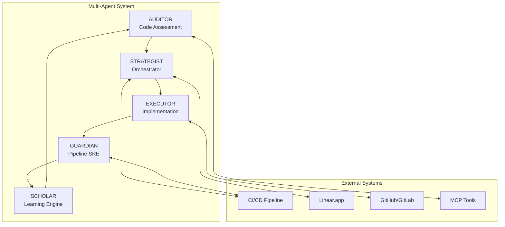
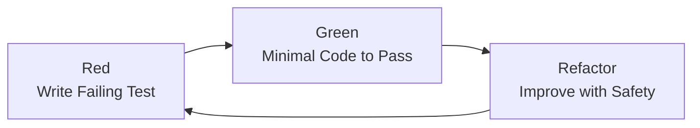

# 🚀 Linear TDD Workflow System - Documentation Hub

## Autonomous Clean Code Development with Test-Driven Excellence

[](WORKFLOW-TDD-PROTOCOL.md)
[](INTEGRATION-LINEAR.md)
[](WORKFLOW-CLEAN-CODE-ASSESSMENT.md)
[](INTEGRATION-GITFLOW.md)
[](INTEGRATION-MCP-TOOLS.md)
[](../.claude/agents/CLAUDE.md)

> **Version**: 1.2.0 | **Last Updated**: September 27, 2025 | **Status**: Production Ready

## 📋 Table of Contents

1. [Overview](#-overview)
2. [Quick Start Guide](#-quick-start-guide)
3. [Documentation Index](#-documentation-index)
4. [System Architecture](#-system-architecture)
5. [Key Features](#-key-features)
6. [Configuration](#-configuration)
7. [Usage & Commands](#-usage--commands)
8. [Metrics & Monitoring](#-metrics--monitoring)
9. [Troubleshooting](#-troubleshooting)
10. [Contributing](#-contributing)
11. [Support & Resources](#-support--resources)

---

## 🎯 Overview

The **Linear TDD Workflow System** is an advanced multi-agent AI development framework that enforces strict Test-Driven Development (TDD) practices while maintaining continuous code quality through autonomous assessment, prioritized execution, and rigorous validation.

### What Makes This System Unique

- **🤖 20 Specialized AI Agents** working in concert to improve code quality
- **🔄 Continuous Quality Improvement** with zero-downtime operation
- **📊 Real-time Metrics** and comprehensive progress tracking
- **🎯 Test-Driven Development** enforced at every level
- **🔌 Direct CI/CD Integration** for immediate feedback loops
- **📝 Linear.app Integration** for automatic task management
- **🧠 Self-Learning System** that improves patterns over time
- **⚡ High Velocity** - 20+ improvements implemented per day

### System Goals & Current Metrics

| Metric | Target | Current | Status |
|--------|--------|---------|--------|
| Test Coverage | >90% | 87.4% | 🟡 Near Target |
| Cyclomatic Complexity | <10 avg | 8.2 | ✅ Achieved |
| Security Vulnerabilities | 0 critical | 0 | ✅ Achieved |
| Pipeline Uptime | 99.9% | 99.5% | 🟡 Near Target |
| Auto-fix Success Rate | 95% | 92% | 🟡 Near Target |
| Technical Debt Reduction | 15% monthly | 18% | ✅ Exceeded |

---

## 🚀 Quick Start Guide

### Prerequisites

```bash
# Required Software
- Node.js 18.0.0+ or Python 3.10+
- Git 2.30.0+ with GitFlow extension
- Docker 20.10.0+ (optional for containerized deployment)
- npm 9.0.0+ or yarn 1.22.0+

# Required Accounts
- Linear.app account with API access
- GitHub/GitLab account with repository access
- CI/CD platform access (GitHub Actions/GitLab CI/Jenkins)
```

### Installation (5 minutes)

```bash
# 1. Clone the repository
git clone https://github.com/your-org/linear-tdd-workflow.git
cd linear-tdd-workflow

# 2. Initialize GitFlow
git flow init -d

# 3. Install dependencies
npm install
# or for Python projects
pip install -r requirements.txt

# 4. Set up environment
cp .env.example .env
# Edit .env with your credentials (see Configuration section)

# 5. Initialize the system
npm run setup:init

# 6. Configure Linear.app integration
npm run setup:linear

# 7. Set up MCP tools
npm run setup:mcp-tools

# 8. Run initial assessment
npm run assess:initial

# 9. Verify installation
npm run health:check
```

### First Run Checklist

- [ ] Environment variables configured in `.env`
- [ ] Linear.app API key added and tested
- [ ] GitFlow initialized on repository
- [ ] CI/CD webhooks configured
- [ ] MCP tools installed and accessible
- [ ] Initial code assessment completed
- [ ] All health checks passing

---

## 📚 Documentation Index

### 🏗️ Architecture & Design

| Document | Description | Key Topics |
|----------|-------------|------------|
| [System Architecture](./architecture/system-overview.md) | Complete system design and components | Multi-agent architecture, MCP integration, Data flow |
| [Agent Specifications](./architecture/agent-specifications.md) | Detailed agent roles and capabilities | AUDITOR, EXECUTOR, GUARDIAN, STRATEGIST, SCHOLAR |
| [MCP Tools Integration](./architecture/mcp-integration.md) | Model Context Protocol tools setup | Sequential thinking, Kubernetes, Playwright, Linear API |
| [Data Model](./architecture/data-model.md) | System data structures and schemas | Entities, relationships, storage patterns |

### 🔧 Development Protocols

| Document | Description | Key Topics |
|----------|-------------|------------|
| [TDD Protocol](./development-protocols/tdd-protocol.md) | Strict Test-Driven Development guide | Red-Green-Refactor, Testing strategy, Quality gates |
| [GitFlow Guide](./development-protocols/gitflow.md) | Version control workflow | Branching strategy, Release management, PR process |
| [Coding Standards](./development-protocols/coding-standards.md) | Code quality and style guidelines | Clean code, Naming conventions, Best practices |
| [Testing Strategy](./development-protocols/testing-strategy.md) | Comprehensive testing approach | Unit, Integration, E2E, Performance testing |

### 🔌 Integrations

| Document | Description | Key Topics |
|----------|-------------|------------|
| [Linear Setup](./integrations/linear-setup.md) | Linear.app configuration guide | API setup, Workspace config, Webhook integration |
| [CI/CD Integration](./integrations/ci-cd-setup.md) | Pipeline configuration | GitHub Actions, GitLab CI, Jenkins setup |
| [MCP Server Setup](./integrations/mcp-servers.md) | MCP tool configuration | Server installation, Tool contracts, Usage patterns |

### 🔄 Workflows & Operations

| Document | Description | Key Topics |
|----------|-------------|------------|
| [Clean Code Assessment](./workflows/clean-code-assessment.md) | Code quality evaluation process | Metrics, Analysis tools, Report generation |
| [Action Plan Generation](./workflows/action-plan-generation.md) | Task prioritization from assessments | Priority calculation, Sprint planning, Execution order |
| [Execution Workflow](./workflows/execution-workflow.md) | Implementation process | Task selection, TDD cycle, PR creation |
| [Pipeline Management](./operations/pipeline-management.md) | CI/CD operations | Monitoring, Recovery, Optimization |

### 📊 Product & Planning

| Document | Description | Key Topics |
|----------|-------------|------------|
| [Product Requirements (PRD)](./product/prd.md) | Complete product specification | Requirements, Success metrics, Roadmap |
| [Cycle Planning](./planning/cycle-planning.md) | Sprint and iteration management | Planning, Execution, Retrospectives |
| [Metrics & KPIs](./planning/metrics-kpis.md) | Performance indicators | Velocity, Quality, Technical debt tracking |

---

## 🏛️ System Architecture



### Agent Responsibilities

| Agent | Role | Primary Functions | Tools Used |
|-------|------|------------------|------------|
| **AUDITOR** | Code Quality Analyst | Continuous scanning, Issue detection, Debt identification | AST parsers, Security scanners, Pattern matchers |
| **EXECUTOR** | Implementation Specialist | Fix implementation, Test creation, Code refactoring | Refactoring tools, Test generators, Formatters |
| **GUARDIAN** | Pipeline SRE | CI/CD monitoring, Failure recovery, Test optimization | Pipeline monitors, Rollback automation, Alert systems |
| **STRATEGIST** | Workflow Orchestrator | Task prioritization, Resource allocation, Progress tracking | Task engines, Schedulers, Analytics dashboards |
| **SCHOLAR** | Learning Engine | Pattern recognition, Knowledge synthesis, Agent training | ML models, Pattern matching, Knowledge graphs |

---

## ✨ Key Features

### Test-Driven Development (TDD)

Every code change follows the strict TDD cycle:



**Enforcement Points:**
- Pre-commit hooks validate test presence
- CI/CD blocks PRs without tests
- Mutation testing ensures test quality
- Coverage gates enforce minimums

### Linear.app Integration

Seamless project management integration:

```yaml
Task Flow:
  1. Assessment: AUDITOR identifies issues
  2. Creation: Tasks auto-created in Linear
  3. Planning: STRATEGIST prioritizes in sprints
  4. Execution: EXECUTOR implements fixes
  5. Tracking: Real-time progress updates
  6. Closure: Automatic task completion
```

### Clean Code Enforcement

Continuous quality improvement through:

- **Automated Assessment**: Every 4 hours or on-commit
- **Prioritized Backlog**: Issues ranked by impact/effort
- **Safe Implementation**: Atomic commits with full testing
- **Validated Deployment**: Quality gates at every stage

---

## ⚙️ Configuration

### Environment Variables

Create a `.env` file with the following configuration:

```bash
# === Core Configuration ===
NODE_ENV=development
LOG_LEVEL=info
PORT=3000

# === Linear.app Configuration ===
LINEAR_API_KEY=lin_api_xxxxxxxxxxxxx
LINEAR_TEAM_ID=TEAM-XXX
LINEAR_PROJECT_ID=PROJ-XXX
LINEAR_WEBHOOK_SECRET=webhook_secret_here
LINEAR_WEBHOOK_URL=https://your-domain.com/webhooks/linear

# === GitHub/GitLab Configuration ===
GITHUB_TOKEN=ghp_xxxxxxxxxxxxx
GITHUB_OWNER=your-org
GITHUB_REPO=your-repo
DEFAULT_BRANCH=main

# === CI/CD Configuration ===
CI_PROVIDER=github_actions  # github_actions | gitlab | jenkins | circleci
CI_API_TOKEN=ci_token_here
CI_WEBHOOK_SECRET=ci_webhook_secret
CI_PIPELINE_URL=https://your-ci-url.com

# === Agent Configuration ===
AGENT_CONCURRENCY=5
ASSESSMENT_FREQUENCY=4h
EXECUTION_BATCH_SIZE=10
GUARDIAN_RESPONSE_TIME=30s
SCHOLAR_LEARNING_RATE=0.05
MAX_CONTEXT_SWITCHES=3

# === MCP Configuration ===
MCP_SEQUENTIAL_THINKING_ENABLED=true
MCP_CONTEXT7_ENABLED=true
MCP_KUBERNETES_NAMESPACE=clean-code-agents
MCP_PLAYWRIGHT_HEADLESS=true
MCP_LINEAR_SERVER_URL=https://mcp.linear.app/sse

# === Performance Configuration ===
MAX_CONCURRENT_TASKS=3
TASK_TIMEOUT_MINUTES=30
MEMORY_LIMIT_MB=2048
CPU_LIMIT_CORES=2

# === Security Configuration ===
ENABLE_AUDIT_LOG=true
AUDIT_LOG_RETENTION_DAYS=90
ENABLE_SECRET_SCANNING=true
REQUIRE_SIGNED_COMMITS=false

# === Feature Flags ===
ENABLE_AUTO_FIX=true
ENABLE_TDD_ENFORCEMENT=true
ENABLE_GITFLOW=true
ENABLE_PATTERN_LEARNING=true
ENABLE_AUTO_ROLLBACK=true
```

### Configuration Files

#### `config/agents.yaml`

```yaml
agents:
  auditor:
    schedule: "*/4 * * * *"  # Every 4 hours
    priorities:
      - security
      - performance
      - readability
      - maintainability
    thresholds:
      complexity: 10
      coverage: 80
      duplication: 5
    
  executor:
    max_concurrent_tasks: 3
    commit_strategy: atomic
    test_before_commit: true
    rollback_on_failure: true
    
  guardian:
    fail_fast: true
    max_recovery_attempts: 3
    rollback_timeout: 600
    alert_channels:
      - slack
      - email
    
  strategist:
    planning_horizon: 7d
    sprint_duration: 2w
    priority_algorithm: weighted_shortest_job
    resource_allocation: dynamic
    
  scholar:
    pattern_confidence_threshold: 0.8
    learning_batch_size: 50
    model_update_frequency: weekly
    pattern_retention_days: 90
```

---

## 🎮 Usage & Commands

### Core Commands

```bash
# === Assessment Commands ===
npm run assess                  # Run full code assessment
npm run assess:quick            # Quick assessment (changed files only)
npm run assess:security         # Security-focused assessment
npm run assess:performance      # Performance analysis

# === Execution Commands ===
npm run execute                 # Execute highest priority task
npm run execute:batch           # Execute multiple tasks
npm run execute:dry-run         # Preview changes without applying

# === Pipeline Commands ===
npm run pipeline:status         # Check pipeline health
npm run pipeline:recover        # Trigger recovery procedures
npm run pipeline:optimize       # Optimize test execution

# === Linear Commands ===
npm run linear:sync             # Sync with Linear.app
npm run linear:create-tasks     # Create tasks from assessment
npm run linear:update-progress  # Update task progress

# === Agent Commands ===
npm run agents:start            # Start all agents
npm run agents:stop             # Stop all agents
npm run agents:status           # Check agent status
npm run agent:start --name=auditor  # Start specific agent

# === Utility Commands ===
npm run health:check            # System health check
npm run report:generate         # Generate progress report
npm run patterns:extract        # Extract learning patterns
npm run config:validate         # Validate configuration
```

### Advanced Usage

#### Manual Task Execution

```bash
# Execute specific task
npm run execute:task --id=CLEAN-123

# Execute with custom parameters
npm run execute -- \
  --priority=P0 \
  --limit=5 \
  --dry-run

# Force execution despite warnings
npm run execute:force --task=CLEAN-456
```

#### Custom Assessment

```bash
# Assess specific directory
npm run assess:path --path=src/components

# Assess with custom rules
npm run assess:custom --rules=config/custom-rules.yaml

# Generate detailed report
npm run assess:report --format=html --output=reports/
```

---

## 📊 Metrics & Monitoring

### Real-time Dashboard

Access the monitoring dashboard at: `http://localhost:3000/dashboard`

```
┌─────────────────────────────────────────────────────────────┐
│              Linear TDD Workflow Dashboard                   │
├─────────────────────────────────────────────────────────────┤
│ Pipeline Status: ● GREEN           Uptime: 99.5%            │
│ Current Sprint: Week 2/2           Progress: 65%            │
│                                                              │
│ Today's Metrics                                              │
│ ├─ Tasks Completed: 23/30 (77%)                             │
│ ├─ Code Coverage: 87.4% ↑2.1%                               │
│ ├─ Tech Debt Score: 142 ↓18                                 │
│ ├─ Build Time: 4m 32s ↓45s                                  │
│ └─ Rollback Rate: 0.8% ↓0.2%                                │
│                                                              │
│ Agent Performance                                            │
│ ├─ AUDITOR:    🟢 Active | 1,247 issues found              │
│ ├─ EXECUTOR:   🟢 Active | CLEAN-045 in progress           │
│ ├─ GUARDIAN:   🟢 Active | Pipeline healthy                 │
│ ├─ STRATEGIST: 🟢 Active | Planning next sprint            │
│ └─ SCHOLAR:    🟢 Active | 12 new patterns learned         │
│                                                              │
│ Recent Achievements                                          │
│ ├─ [CLEAN-044] ✅ Extracted authentication constants       │
│ ├─ [CLEAN-043] ✅ Refactored user service (coverage +5%)   │
│ └─ [CLEAN-042] ✅ Added missing integration tests          │
└─────────────────────────────────────────────────────────────┘
```

### Key Performance Indicators

| Category | Metric | Current | Trend | Target |
|----------|--------|---------|-------|--------|
| **Velocity** | Tasks/Day | 22 | ↑ | 20+ |
| **Quality** | Code Score | 8.7/10 | ↑ | 9.0+ |
| **Coverage** | Test Coverage | 87.4% | ↑ | 90%+ |
| **Reliability** | Pipeline Uptime | 99.5% | → | 99.9% |
| **Efficiency** | Auto-fix Success | 92% | ↑ | 95% |
| **Learning** | Patterns/Week | 7 | ↑ | 5+ |
| **Debt** | Monthly Reduction | 18% | ↑ | 15% |

### Monitoring Endpoints

```bash
# Health check endpoint
GET http://localhost:3000/health

# Metrics endpoint (Prometheus format)
GET http://localhost:3000/metrics

# Agent status
GET http://localhost:3000/api/agents/status

# Pipeline status
GET http://localhost:3000/api/pipeline/status

# Recent activities
GET http://localhost:3000/api/activities?limit=50
```

---

## 🔧 Troubleshooting

### Common Issues and Solutions

#### Installation Issues

<details>
<summary><strong>Error: Missing environment variables</strong></summary>

**Problem**: System fails to start due to missing configuration

**Solution**:
```bash
# Verify all required variables are set
npm run config:validate

# Use the setup wizard
npm run setup:wizard

# Check specific variable
npm run config:check --var=LINEAR_API_KEY
```
</details>

<details>
<summary><strong>Error: MCP tools not found</strong></summary>

**Problem**: MCP servers are not accessible

**Solution**:
```bash
# Reinstall MCP tools
npm run setup:mcp-tools --force

# Verify MCP server status
npm run mcp:status

# Test specific MCP tool
npm run mcp:test --tool=sequential-thinking
```
</details>

#### Agent Issues

<details>
<summary><strong>Agent stuck or unresponsive</strong></summary>

**Problem**: An agent stops processing tasks

**Solution**:
```bash
# Check agent logs
npm run logs:agent --name=executor --tail=100

# Restart specific agent
npm run agent:restart --name=executor

# Clear agent task queue
npm run agent:clear-queue --name=executor
```
</details>

<details>
<summary><strong>High resource consumption</strong></summary>

**Problem**: Agents consuming too much CPU/memory

**Solution**:
```bash
# Check resource usage
npm run monitor:resources

# Adjust concurrency settings
npm run config:set --key=AGENT_CONCURRENCY --value=3

# Enable resource limits
npm run config:set --key=ENABLE_RESOURCE_LIMITS --value=true
```
</details>

#### Pipeline Issues

<details>
<summary><strong>CI/CD pipeline failures</strong></summary>

**Problem**: Pipeline consistently failing

**Solution**:
```bash
# Trigger Guardian recovery
npm run guardian:recover --force

# Analyze failure patterns
npm run pipeline:analyze --days=7

# Disable auto-fix temporarily
npm run config:set --key=ENABLE_AUTO_FIX --value=false
```
</details>

#### Linear.app Issues

<details>
<summary><strong>Tasks not syncing with Linear</strong></summary>

**Problem**: Tasks not appearing in Linear.app

**Solution**:
```bash
# Test Linear connection
npm run linear:test-connection

# Force sync
npm run linear:sync --force

# Check webhook status
npm run linear:webhook:status

# Regenerate webhook secret
npm run linear:webhook:regenerate
```
</details>

### Debug Mode

Enable debug mode for detailed logging:

```bash
# Enable debug mode globally
export DEBUG=true
npm run agents:start

# Debug specific component
DEBUG=agent:executor npm run execute

# Enable verbose logging
LOG_LEVEL=debug npm run assess
```

### Recovery Procedures

#### Full System Reset

```bash
# Stop all agents
npm run agents:stop

# Clear all queues
npm run queues:clear --all

# Reset agent states
npm run agents:reset

# Restart system
npm run agents:start
```

#### Database Recovery

```bash
# Backup current data
npm run db:backup

# Run migrations
npm run db:migrate

# Verify integrity
npm run db:verify

# Restore if needed
npm run db:restore --backup=latest
```

---

## 🤝 Contributing

We welcome contributions! Please follow our strict TDD workflow:

### Development Process

1. **Fork and Clone**
   ```bash
   git clone https://github.com/your-username/linear-tdd-workflow.git
   cd linear-tdd-workflow
   ```

2. **Create Feature Branch**
   ```bash
   git flow feature start your-feature-name
   ```

3. **Follow TDD Cycle**
   - Write failing test first
   - Implement minimal code to pass
   - Refactor with test safety
   - Ensure all tests pass

4. **Submit Pull Request**
   ```bash
   git flow feature publish your-feature-name
   ```

### Contribution Guidelines

- **Code Quality**: All code must pass linting and formatting checks
- **Test Coverage**: Maintain or improve test coverage (minimum 80%)
- **Documentation**: Update relevant documentation with changes
- **Commit Messages**: Follow [Conventional Commits](https://www.conventionalcommits.org/)
- **PR Description**: Include clear description and testing instructions

### Development Setup

```bash
# Install development dependencies
npm install --save-dev

# Run tests
npm test

# Run tests with coverage
npm run test:coverage

# Run linting
npm run lint

# Run formatting
npm run format

# Run all checks
npm run check:all
```

---

## 📞 Support & Resources

### Getting Help

- **Documentation**: Start with this comprehensive guide
- **Issues**: [GitHub Issues](https://github.com/your-org/linear-tdd-workflow/issues)
- **Discussions**: [GitHub Discussions](https://github.com/your-org/linear-tdd-workflow/discussions)
- **Wiki**: [Project Wiki](https://github.com/your-org/linear-tdd-workflow/wiki)

### Additional Resources

- [API Documentation](./api/README.md)
- [Architecture Decision Records](./architecture/adr/)
- [Runbooks](./operations/runbooks/)
- [Security Guidelines](./security/README.md)
- [Performance Tuning Guide](./operations/performance-tuning.md)

### Community

- **Slack Channel**: #linear-tdd-workflow
- **Office Hours**: Wednesdays 2-3 PM UTC
- **Monthly Demos**: First Friday of each month

### License

MIT License - See [LICENSE](../LICENSE) file for details

### Acknowledgments

Built with:
- Claude Code AI by Anthropic
- Model Context Protocol (MCP) tools
- Linear.app for project management
- The open-source community

---

## 📝 Changelog

See [CHANGELOG.md](../CHANGELOG.md) for a detailed history of changes.

## 🚨 Quick Reference Card

```bash
# === Most Used Commands ===
npm run assess              # Run code assessment
npm run execute             # Execute top priority task
npm run agents:status       # Check system status
npm run linear:sync         # Sync with Linear
npm run health:check        # Verify system health

# === Emergency Commands ===
npm run agents:stop         # Stop all agents
npm run pipeline:recover    # Fix broken pipeline
npm run rollback:latest     # Rollback last change
npm run support:collect     # Gather debug info
```

---

*For detailed information on any topic, navigate to the specific documentation section linked above.*
