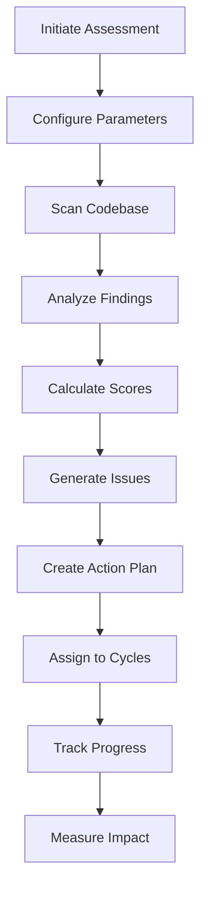
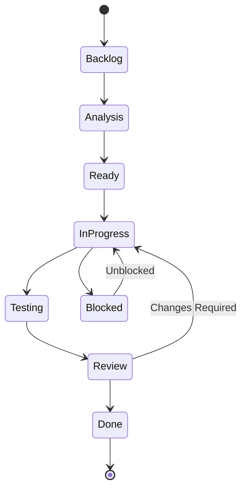

# Clean Code Assessment & Action Plan Workflow

## Table of Contents
1. [Overview](#1-overview)
2. [Assessment Framework](#2-assessment-framework)
3. [Quality Dimensions](#3-quality-dimensions)
4. [Issue Identification](#4-issue-identification)
5. [Action Plan Generation](#5-action-plan-generation)
6. [Prioritization Strategy](#6-prioritization-strategy)
7. [Implementation Workflow](#7-implementation-workflow)
8. [Metrics & Reporting](#8-metrics--reporting)
9. [Templates & Examples](#9-templates--examples)

---

# 1. Overview

## Purpose

The Clean Code Assessment Framework provides a systematic approach to evaluate code quality, identify improvement opportunities, and generate actionable tasks in Linear. It combines automated analysis with intelligent prioritization to drive continuous code quality improvement.

## Core Objectives

1. **Comprehensive Analysis**: Multi-dimensional code quality assessment
2. **Actionable Insights**: Convert findings into executable tasks
3. **Smart Prioritization**: Risk-impact-effort based task ordering
4. **Cycle Integration**: Align improvements with development cycles
5. **Measurable Progress**: Track quality improvements over time

## Assessment Workflow



## Integration Points

- **Linear.app**: Task management and cycle planning
- **GitHub**: Code repository and PR management
- **CI/CD Pipeline**: Automated quality gates
- **Monitoring**: Real-time quality metrics

---

# 2. Assessment Framework

## 2.1 Configuration

### Assessment Parameters
```yaml
assessment_config:
  # Project Configuration
  project_name: "${PROJECT_NAME}"
  codebase_path: "${ROOT_PATH}"
  linear_project: "${LINEAR_PROJECT}"
  linear_team: "a-coders"

  # Assessment Scope
  assessment_depth: "comprehensive"  # quick|standard|comprehensive
  languages: ["javascript", "typescript", "python"]
  exclude_paths: ["node_modules", "vendor", "build", "dist"]
  include_tests: true

  # Analysis Settings
  min_file_size: 10          # Lines
  max_file_size: 2000        # Lines
  sample_rate: 1.0           # 100% of files

  # Output Configuration
  generate_report: true
  create_linear_issues: true
  create_pr_templates: true
  estimate_remediation: true
  suggest_quick_wins: true

  # Thresholds
  quality_threshold: 70      # Minimum acceptable score
  priority_threshold: "medium"  # Minimum priority for issues
  batch_size: 10             # Issues per batch

  # Integration
  auto_assign_cycles: true
  respect_cycle_capacity: true
  create_milestones: true
```

## 2.2 Execution Phases

### Phase 1: Initialization
```typescript
async function initializeAssessment(config: AssessmentConfig): Promise<AssessmentContext> {
  // Validate configuration
  validateConfig(config);

  // Connect to services
  const linear = await connectLinear(config.linearApiKey);
  const github = await connectGitHub(config.githubToken);

  // Prepare workspace
  const workspace = await prepareWorkspace(config.codebasePath);

  // Load code standards
  const standards = await loadStandards(config.standardsPath);

  // Initialize metrics collectors
  const collectors = initializeCollectors(config.languages);

  return {
    config,
    linear,
    github,
    workspace,
    standards,
    collectors,
    startTime: Date.now()
  };
}
```

### Phase 2: Code Scanning
```typescript
async function scanCodebase(context: AssessmentContext): Promise<ScanResults> {
  const results: ScanResults = {
    files: [],
    metrics: {},
    issues: [],
    patterns: []
  };

  // Discover files
  const files = await discoverFiles(
    context.workspace,
    context.config.includePatterns,
    context.config.excludePaths
  );

  // Process each file
  for (const file of files) {
    const fileResult = await analyzeFile(file, context);
    results.files.push(fileResult);

    // Aggregate metrics
    aggregateMetrics(results.metrics, fileResult.metrics);

    // Collect issues
    results.issues.push(...fileResult.issues);

    // Detect patterns
    detectPatterns(results.patterns, fileResult);
  }

  return results;
}
```

### Phase 3: Analysis & Scoring
```typescript
async function analyzeFindings(scanResults: ScanResults): Promise<Analysis> {
  // Calculate quality scores
  const qualityScore = calculateQualityScore(scanResults);

  // Identify hotspots
  const hotspots = identifyHotspots(scanResults);

  // Detect anti-patterns
  const antiPatterns = detectAntiPatterns(scanResults);

  // Calculate technical debt
  const technicalDebt = calculateTechnicalDebt(scanResults);

  // Generate recommendations
  const recommendations = generateRecommendations(scanResults);

  return {
    qualityScore,
    hotspots,
    antiPatterns,
    technicalDebt,
    recommendations,
    summary: generateSummary(scanResults)
  };
}
```

---

# 3. Quality Dimensions

## 3.1 Code Complexity

### Metrics & Thresholds
```typescript
interface ComplexityMetrics {
  cyclomatic: {
    threshold: 10,
    critical: 20,
    calculation: "branches + 1"
  },
  cognitive: {
    threshold: 15,
    critical: 30,
    calculation: "nesting + conditions + breaks"
  },
  nesting: {
    threshold: 4,
    critical: 6,
    calculation: "max_depth"
  },
  halstead: {
    difficulty: 30,
    effort: 1000000,
    calculation: "operators * operands"
  }
}
```

### Detection Algorithm
```typescript
function assessComplexity(ast: AST): ComplexityAssessment {
  const metrics = {
    cyclomatic: calculateCyclomaticComplexity(ast),
    cognitive: calculateCognitiveComplexity(ast),
    nesting: calculateMaxNesting(ast),
    halstead: calculateHalsteadMetrics(ast)
  };

  const violations = [];

  // Check thresholds
  if (metrics.cyclomatic > THRESHOLDS.cyclomatic.critical) {
    violations.push({
      type: "CRITICAL_COMPLEXITY",
      metric: "cyclomatic",
      value: metrics.cyclomatic,
      threshold: THRESHOLDS.cyclomatic.critical,
      impact: "Very difficult to test and maintain"
    });
  }

  return {
    metrics,
    violations,
    score: calculateComplexityScore(metrics),
    recommendations: generateComplexityRecommendations(metrics)
  };
}
```

## 3.2 Maintainability

### Assessment Criteria
```yaml
maintainability_criteria:
  readability:
    - clear_naming: Variable and function names are descriptive
    - consistent_style: Code follows consistent formatting
    - adequate_comments: Complex logic is documented
    - logical_structure: Code organization follows patterns

  modularity:
    - single_responsibility: Each module has one clear purpose
    - loose_coupling: Minimal dependencies between modules
    - high_cohesion: Related functionality grouped together
    - clear_interfaces: Well-defined module boundaries

  testability:
    - dependency_injection: Dependencies are injected
    - pure_functions: Functions avoid side effects
    - mockability: External dependencies can be mocked
    - isolation: Units can be tested independently
```

### Maintainability Index
```typescript
function calculateMaintainabilityIndex(file: File): number {
  // Microsoft's Maintainability Index formula
  const halsteadVolume = calculateHalsteadVolume(file);
  const cyclomaticComplexity = calculateCyclomaticComplexity(file);
  const linesOfCode = file.lines.length;
  const commentPercentage = calculateCommentPercentage(file);

  let mi = 171 -
    5.2 * Math.log(halsteadVolume) -
    0.23 * cyclomaticComplexity -
    16.2 * Math.log(linesOfCode);

  // Add comment bonus
  mi += 50 * Math.sin(Math.sqrt(2.4 * commentPercentage));

  // Normalize to 0-100
  return Math.max(0, Math.min(100, mi * 100 / 171));
}
```

## 3.3 SOLID Principles Compliance

### Principle Violations
```typescript
interface SOLIDViolations {
  singleResponsibility: {
    check: "Multiple reasons to change",
    detection: "High afferent/efferent coupling",
    example: "Class handles both data and UI"
  },
  openClosed: {
    check: "Modification instead of extension",
    detection: "Switch statements on type",
    example: "Adding cases to existing switch"
  },
  liskovSubstitution: {
    check: "Subtype breaks parent contract",
    detection: "Overridden methods throw exceptions",
    example: "Square inheriting from Rectangle"
  },
  interfaceSegregation: {
    check: "Fat interfaces",
    detection: "Unused interface methods",
    example: "IWorker with irrelevant methods"
  },
  dependencyInversion: {
    check: "Concrete dependencies",
    detection: "Direct instantiation",
    example: "new ConcreteClass() instead of interface"
  }
}
```

### Detection Patterns
```typescript
function detectSOLIDViolations(codebase: Codebase): SOLIDViolation[] {
  const violations = [];

  // Single Responsibility
  for (const cls of codebase.classes) {
    const responsibilities = analyzeResponsibilities(cls);
    if (responsibilities.length > 1) {
      violations.push({
        principle: "SRP",
        location: cls.location,
        severity: "HIGH",
        description: `Class has ${responsibilities.length} responsibilities`,
        suggestedFix: "Split into separate classes"
      });
    }
  }

  // Open/Closed
  const switchStatements = findSwitchStatements(codebase);
  for (const sw of switchStatements) {
    if (isSwitchOnType(sw)) {
      violations.push({
        principle: "OCP",
        location: sw.location,
        severity: "MEDIUM",
        description: "Switch statement on type violates OCP",
        suggestedFix: "Use polymorphism or strategy pattern"
      });
    }
  }

  return violations;
}
```

## 3.4 Security Assessment

### Vulnerability Patterns
```typescript
const SECURITY_PATTERNS = {
  critical: {
    sql_injection: {
      pattern: /(SELECT|INSERT|UPDATE|DELETE).*\+.*input/i,
      message: "Potential SQL injection vulnerability",
      fix: "Use parameterized queries"
    },
    command_injection: {
      pattern: /(exec|system|eval|Process).*\+.*input/i,
      message: "Potential command injection",
      fix: "Sanitize inputs and use safe APIs"
    },
    path_traversal: {
      pattern: /\.\.\/.*file.*operation/i,
      message: "Path traversal vulnerability",
      fix: "Validate and sanitize file paths"
    },
    hardcoded_secrets: {
      pattern: /(api_key|password|secret|token)\s*=\s*["']/i,
      message: "Hardcoded credentials detected",
      fix: "Use environment variables or secret management"
    }
  },
  high: {
    xss_vulnerable: {
      pattern: /innerHTML.*=.*user.*input/i,
      message: "Potential XSS vulnerability",
      fix: "Sanitize HTML or use textContent"
    },
    weak_crypto: {
      pattern: /(MD5|SHA1|DES|RC4)/i,
      message: "Weak cryptographic algorithm",
      fix: "Use modern algorithms (SHA-256, AES)"
    }
  }
};
```

## 3.5 Performance Analysis

### Performance Antipatterns
```typescript
interface PerformanceAntipatterns {
  database: {
    n_plus_one: "Multiple queries in loop",
    missing_indexes: "Unindexed query fields",
    large_transactions: "Transaction scope too broad",
    connection_leaks: "Unclosed connections"
  },
  memory: {
    memory_leaks: "Unreleased references",
    large_allocations: "Excessive object size",
    circular_references: "Circular dependency chains"
  },
  algorithms: {
    nested_loops: "O(n²) or worse complexity",
    inefficient_search: "Linear search in large datasets",
    unnecessary_sorting: "Sorting when not needed"
  },
  io_operations: {
    sync_blocking: "Synchronous I/O in async context",
    unbuffered: "Unbuffered read/write operations",
    excessive_api_calls: "Too many external requests"
  }
}
```

---

# 4. Issue Identification

## 4.1 Issue Categories

### Category Matrix
```yaml
issue_categories:
  critical:
    - security_vulnerabilities
    - data_corruption_risks
    - system_crashes
    - compliance_violations

  high:
    - performance_bottlenecks
    - memory_leaks
    - broken_functionality
    - missing_error_handling

  medium:
    - code_complexity
    - test_coverage_gaps
    - documentation_missing
    - deprecated_dependencies

  low:
    - style_violations
    - minor_refactoring
    - optimization_opportunities
    - convenience_improvements
```

## 4.2 Issue Generation

### Issue Template
```typescript
interface IssueTemplate {
  title: string;
  description: string;
  category: IssueCategory;
  severity: Severity;
  effort: StoryPoints;
  priority: Priority;
  labels: string[];
  acceptance_criteria: string[];
  implementation_notes: string;
  test_requirements: string;
}

function generateIssue(finding: Finding): IssueTemplate {
  return {
    title: `[CCA-${finding.category}] ${finding.summary}`,
    description: formatDescription(finding),
    category: finding.category,
    severity: finding.severity,
    effort: estimateEffort(finding),
    priority: calculatePriority(finding),
    labels: generateLabels(finding),
    acceptance_criteria: generateAcceptanceCriteria(finding),
    implementation_notes: generateImplementationNotes(finding),
    test_requirements: generateTestRequirements(finding)
  };
}
```

### Linear Issue Creation
```typescript
async function createLinearIssue(issue: IssueTemplate): Promise<LinearIssue> {
  const linearIssue = await linear.createIssue({
    title: issue.title,
    description: issue.description,
    teamId: LINEAR_TEAM_ID,
    projectId: LINEAR_PROJECT_ID,
    priority: mapToLinearPriority(issue.priority),
    estimate: issue.effort,
    labels: issue.labels,
    state: "backlog"
  });

  // Add detailed implementation plan
  await linear.createComment({
    issueId: linearIssue.id,
    body: formatImplementationPlan(issue)
  });

  return linearIssue;
}
```

---

# 5. Action Plan Generation

## 5.1 Plan Structure

### Action Plan Template
```yaml
action_plan:
  metadata:
    project: "${PROJECT_NAME}"
    generated: "${TIMESTAMP}"
    total_issues: ${COUNT}
    estimated_effort: "${TOTAL_POINTS} story points"
    timeline: "${ESTIMATED_CYCLES} cycles"

  phases:
    - phase: "Critical Fixes"
      cycle: "Current"
      focus: "Security and stability"
      issues: [...]

    - phase: "Performance"
      cycle: "Next"
      focus: "Optimization and efficiency"
      issues: [...]

    - phase: "Quality"
      cycle: "Future"
      focus: "Refactoring and cleanup"
      issues: [...]
```

## 5.2 Cycle Planning

### Capacity Allocation
```typescript
function planCycles(issues: Issue[], teamVelocity: number): CyclePlan[] {
  const cycles: CyclePlan[] = [];
  let currentCycle = {
    issues: [],
    capacity: teamVelocity,
    allocated: 0
  };

  // Sort by priority
  const sorted = issues.sort((a, b) =>
    a.priority - b.priority || a.effort - b.effort
  );

  for (const issue of sorted) {
    if (currentCycle.allocated + issue.effort <= currentCycle.capacity) {
      currentCycle.issues.push(issue);
      currentCycle.allocated += issue.effort;
    } else {
      // Start new cycle
      cycles.push(currentCycle);
      currentCycle = {
        issues: [issue],
        capacity: teamVelocity,
        allocated: issue.effort
      };
    }
  }

  if (currentCycle.issues.length > 0) {
    cycles.push(currentCycle);
  }

  return cycles;
}
```

### Milestone Creation
```typescript
async function createMilestones(plan: ActionPlan): Promise<Milestone[]> {
  const milestones = [];

  for (const phase of plan.phases) {
    const milestone = await linear.createMilestone({
      name: phase.name,
      description: phase.description,
      targetDate: phase.targetDate,
      projectId: plan.projectId
    });

    // Link issues to milestone
    for (const issue of phase.issues) {
      await linear.updateIssue(issue.id, {
        milestoneId: milestone.id
      });
    }

    milestones.push(milestone);
  }

  return milestones;
}
```

---

# 6. Prioritization Strategy

## 6.1 Priority Calculation

### Multi-Factor Scoring
```typescript
interface PriorityFactors {
  risk: number;       // 0-10: Security/stability risk
  impact: number;     // 0-10: User/business impact
  effort: number;     // 1-13: Story points
  value: number;      // 0-10: Business value
  dependencies: number; // Count of blocking issues
  quick_win: boolean;  // Low effort, high value
}

function calculatePriority(factors: PriorityFactors): Priority {
  // Weighted scoring
  const score =
    (factors.risk * 0.3) +
    (factors.impact * 0.3) +
    ((13 - factors.effort) / 13 * 10 * 0.2) +
    (factors.value * 0.2) +
    (factors.dependencies * -1) +
    (factors.quick_win ? 2 : 0);

  // Map to priority levels
  if (score >= 8) return Priority.CRITICAL;
  if (score >= 6) return Priority.HIGH;
  if (score >= 4) return Priority.MEDIUM;
  return Priority.LOW;
}
```

## 6.2 Quick Wins Identification

### Quick Win Criteria
```typescript
function identifyQuickWins(issues: Issue[]): Issue[] {
  return issues.filter(issue => {
    const isQuickWin =
      issue.effort <= 2 &&                    // Small effort
      issue.impact >= 5 &&                    // Good impact
      issue.dependencies.length === 0 &&      // No blockers
      issue.risk <= 3 &&                      // Low risk
      issue.testability === "high";           // Easy to verify

    if (isQuickWin) {
      issue.labels.push("quick-win");
      issue.priority = Math.max(issue.priority - 1, Priority.HIGH);
    }

    return isQuickWin;
  });
}
```

---

# 7. Implementation Workflow

## 7.1 Execution Pipeline

### Workflow Stages


## 7.2 Implementation Process

### Fix Implementation
```typescript
class IssueImplementation {
  async execute(issue: Issue): Promise<ImplementationResult> {
    // 1. Analysis
    const analysis = await this.analyzeIssue(issue);

    // 2. Test First (TDD)
    const tests = await this.writeFailingTests(issue);

    // 3. Implementation
    const implementation = await this.implement(issue, tests);

    // 4. Verification
    const verification = await this.verify(implementation, tests);

    // 5. Documentation
    const documentation = await this.document(implementation);

    // 6. PR Creation
    const pr = await this.createPullRequest({
      issue,
      implementation,
      tests,
      documentation
    });

    return {
      issue,
      pr,
      metrics: this.collectMetrics()
    };
  }
}
```

---

# 8. Metrics & Reporting

## 8.1 Quality Metrics

### Tracking Dashboard
```yaml
quality_dashboard:
  overall_health:
    quality_score: 72/100
    trend: "+5% this cycle"

  key_metrics:
    code_coverage: 78%
    complexity_average: 8.2
    duplication_ratio: 4.3%
    technical_debt_hours: 320

  improvement_velocity:
    issues_resolved: 23
    points_completed: 67
    quality_improvement: +8%

  remaining_work:
    critical_issues: 2
    high_priority: 12
    total_backlog: 47
    estimated_cycles: 4
```

## 8.2 Progress Reporting

### Report Generation
```typescript
async function generateProgressReport(): Promise<Report> {
  const metrics = await collectMetrics();
  const completed = await getCompletedIssues();
  const remaining = await getRemainingWork();

  return {
    summary: {
      period: "Current Cycle",
      progress: `${completed.count}/${remaining.total} issues`,
      velocity: metrics.velocity,
      quality_delta: metrics.qualityImprovement
    },

    achievements: completed.map(issue => ({
      title: issue.title,
      impact: issue.impact,
      metrics_improved: issue.metricsImproved
    })),

    upcoming: remaining.slice(0, 10).map(issue => ({
      title: issue.title,
      priority: issue.priority,
      effort: issue.effort,
      cycle: issue.plannedCycle
    })),

    risks: identifyRisks(remaining),
    recommendations: generateRecommendations(metrics)
  };
}
```

---

# 9. Templates & Examples

## 9.1 Issue Templates

### Complexity Issue
```markdown
# [CCA-Complexity] High complexity in PaymentProcessor.processTransaction()

## Problem
The method `PaymentProcessor.processTransaction()` has a cyclomatic complexity of 23, exceeding the threshold of 10. This makes the code difficult to test, understand, and maintain.

## Location
- **File**: `src/services/PaymentProcessor.ts`
- **Lines**: 145-287
- **Method**: `processTransaction()`

## Metrics
| Metric | Current | Threshold | Impact |
|--------|---------|-----------|--------|
| Cyclomatic Complexity | 23 | 10 | Very High |
| Cognitive Complexity | 31 | 15 | Critical |
| Lines of Code | 142 | 50 | High |
| Test Coverage | 45% | 80% | Low |

## Acceptance Criteria
- [ ] Cyclomatic complexity reduced to <10
- [ ] Method split into smaller functions
- [ ] Test coverage increased to >80%
- [ ] All existing tests still pass
- [ ] Performance not degraded

## Implementation Plan
1. Extract validation logic to `validateTransaction()`
2. Extract payment gateway logic to `processGatewayPayment()`
3. Extract notification logic to `sendPaymentNotifications()`
4. Simplify error handling with early returns
5. Add comprehensive unit tests

## Effort Estimate: 5 points
## Priority: High
## Labels: ["clean-code", "complexity", "refactoring"]
```

### Security Issue
```markdown
# [CCA-Security] SQL Injection vulnerability in UserRepository

## Problem
Direct string concatenation in SQL query construction creates SQL injection vulnerability.

## Location
- **File**: `src/repositories/UserRepository.js`
- **Line**: 89
- **Method**: `findByEmail()`

## Vulnerable Code
```javascript
const query = `SELECT * FROM users WHERE email = '${email}'`;
```

## Risk Assessment
- **Severity**: Critical
- **Exploitability**: High
- **Impact**: Data breach, unauthorized access
- **OWASP Category**: A03:2021 – Injection

## Fix Required
Replace with parameterized query:
```javascript
const query = 'SELECT * FROM users WHERE email = ?';
const results = await db.query(query, [email]);
```

## Acceptance Criteria
- [ ] All SQL queries use parameterized statements
- [ ] Input validation added
- [ ] Security tests added
- [ ] Penetration test passes

## Effort Estimate: 2 points
## Priority: Critical
## Labels: ["security", "critical", "sql-injection"]
```

## 9.2 Action Plan Example

### Complete Action Plan
```yaml
action_plan:
  project: "E-Commerce Platform"
  generated: "2024-11-27T10:00:00Z"

  executive_summary:
    total_issues: 47
    critical: 3
    high: 12
    medium: 20
    low: 12
    estimated_effort: "156 story points"
    estimated_duration: "4 cycles (8 weeks)"

  cycle_1_current:
    name: "Critical Security & Stability"
    capacity: 40
    allocated: 38
    issues:
      - id: "CCA-001"
        title: "SQL Injection in UserRepository"
        effort: 2
        priority: critical

      - id: "CCA-002"
        title: "XSS vulnerability in comment system"
        effort: 3
        priority: critical

      - id: "CCA-003"
        title: "Memory leak in real-time notifications"
        effort: 5
        priority: critical

  cycle_2_next:
    name: "Performance Optimization"
    capacity: 40
    allocated: 37
    issues:
      - id: "CCA-010"
        title: "N+1 queries in product listing"
        effort: 5
        priority: high

      - id: "CCA-011"
        title: "Optimize image processing pipeline"
        effort: 8
        priority: high

  cycle_3_future:
    name: "Code Quality & Refactoring"
    capacity: 40
    allocated: 40
    issues:
      - id: "CCA-020"
        title: "Refactor PaymentProcessor complexity"
        effort: 8
        priority: medium

      - id: "CCA-021"
        title: "Extract OrderService from monolith"
        effort: 13
        priority: medium

  cycle_4_future:
    name: "Test Coverage & Documentation"
    capacity: 40
    allocated: 41
    issues:
      - id: "CCA-030"
        title: "Increase test coverage to 80%"
        effort: 13
        priority: medium

      - id: "CCA-031"
        title: "Add API documentation"
        effort: 8
        priority: low
```

---

## Summary

The Clean Code Assessment & Action Plan Workflow provides a comprehensive framework for:

1. **Systematic Assessment**: Multi-dimensional code quality analysis
2. **Smart Prioritization**: Risk-impact-effort based task ordering
3. **Cycle Integration**: Alignment with development velocity
4. **Continuous Improvement**: Measurable progress tracking
5. **Actionable Insights**: Clear implementation paths

By following this workflow, teams can systematically improve code quality while maintaining development velocity and delivering business value.

---

*This document is maintained by the Engineering Excellence Team and updated based on assessment findings and team feedback.*