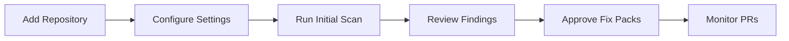
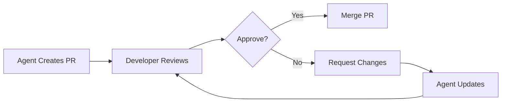
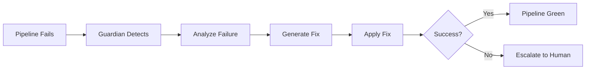

# Linear TDD Workflow System - Product Requirements Document

## Document Control
- **Version**: v1.3.0
- **Owner**: Engineering Excellence Team
- **Approvers**: Security Lead, Platform Lead, Compliance, Product
- **Stakeholders**: IC Developers, SRE, QA, DevEx, Risk/Legal
- **Status**: Active Development
- **Repository**: linear-tdd-workflow
- **Last Review**: November 2024

## Scope Definition

### In-Scope
- **Repositories**: JavaScript/TypeScript, Python (v1.3+)
- **Environments**: Development, Staging, CI/CD
- **Operations**: Code assessment, Fix Pack implementation, Pipeline recovery
- **Integration**: Linear.app, GitHub, GitFlow
- **Coverage**: Up to 200k LOC per repository, max 3 concurrent

### Out-of-Scope (Non-Goals)
- Direct production merges without human review
- Secret rotation or credential management
- Infrastructure provisioning beyond CI/CD
- Database migrations without approval
- Breaking changes without feature flags

---

# 1. Executive Overview

## Problem Statement
Engineering teams spend 40-60% of their time on maintenance tasks, technical debt management, and repetitive code quality improvements. This reduces velocity on feature development and increases time-to-market for new capabilities.

## Target Users
- **Primary**: Individual Contributor Developers
- **Secondary**: Tech Leads, SRE Teams, QA Engineers
- **Tertiary**: Engineering Managers, Security Teams, Compliance Auditors

## Value Proposition
The Linear TDD Workflow System delivers measurable engineering efficiency gains through:
- **40% reduction** in maintenance time through autonomous Fix Pack execution
- **50% faster** Mean Time to Recovery (MTTR) via automated pipeline recovery
- **30-35% improvement** in PR cycle time through pre-validated changes
- **20+ percentage point increase** in test coverage on touched code

## Autonomy Level
**Level 2 - Guided Automation**: System proposes changes via PRs with full documentation, test evidence, and risk assessment. Human approval required for merge. Autonomous execution limited to sandboxed environments.

---

# 2. Business Requirements

## 2.1 Functional Requirements (SMART)

### FR-01: Continuous Code Assessment
- **Specific**: Scan repositories for quality issues, technical debt, and improvement opportunities
- **Measurable**: ≥80% actionable items identified, ≤10% false positive rate
- **Achievable**: Using AST/CFG analysis and pattern detection
- **Relevant**: Drives proactive quality improvement
- **Time-bound**: Initial scan ≤12min (JS/TS), ≤15min (Python) for 150k LOC

### FR-02: Test-Driven Development Enforcement
- **Specific**: Every change follows RED→GREEN→REFACTOR cycle
- **Measurable**: 100% PRs include failing tests first, diff coverage ≥80%
- **Achievable**: Automated test generation and validation
- **Relevant**: Ensures quality and prevents regressions
- **Time-bound**: Test creation ≤5min per Fix Pack

### FR-03: Fix Pack Implementation
- **Specific**: Implement pre-approved, low-risk improvements autonomously
- **Measurable**: ≤300 LOC per PR, ≥8 PRs/day throughput
- **Achievable**: Constrained to safe change categories
- **Relevant**: Reduces maintenance burden
- **Time-bound**: Implementation ≤15min average

### FR-04: Pipeline Recovery Automation
- **Specific**: Detect and recover from CI/CD failures automatically
- **Measurable**: ≥90% auto-recovery success, ≤0.3% rollback rate
- **Achievable**: Pattern-based failure analysis and fix generation
- **Relevant**: Maintains development velocity
- **Time-bound**: Detection ≤5min, recovery ≤10min p95

### FR-05: Linear.app Integration
- **Specific**: Bi-directional sync between code assessment and task management
- **Measurable**: 100% findings tracked, real-time status updates
- **Achievable**: Linear API integration with webhook support
- **Relevant**: Provides visibility and accountability
- **Time-bound**: Sync latency ≤2s p95

### FR-06: Pattern Learning System
- **Specific**: Extract and reuse successful improvement patterns
- **Measurable**: ≥25% pattern reuse rate, ≥2 new patterns/month
- **Achievable**: Machine learning on successful PRs
- **Relevant**: Improves efficiency over time
- **Time-bound**: Pattern extraction ≤1hr post-merge

## 2.2 Non-Functional Requirements (SMART)

### NFR-01: System Availability
- **Target**: 99.0% monthly uptime for core services
- **Monitoring**: OpenTelemetry instrumentation on all components
- **Recovery**: Automated failover and self-healing

### NFR-02: Performance
- **Latency**: Assessment p95 ≤12min, Fix implementation p50 ≤15min
- **Throughput**: ≥8 Fix Pack PRs/day per repository
- **Concurrency**: Support 3 repositories simultaneously

### NFR-03: Cost Efficiency
- **Budget**: ≤$2.5k per repository monthly
- **Optimization**: Intelligent caching, incremental scanning
- **Monitoring**: Real-time cost tracking and alerts

### NFR-04: Security & Compliance
- **Access**: Read-only by default, PR-only writes
- **Audit**: 90-day retention of all agent actions
- **Compliance**: NIST SSDF, OWASP ASVS L2+, SLSA L3 target

### NFR-05: Observability
- **Coverage**: 100% services instrumented
- **Metrics**: Latency, throughput, error rates, cost per operation
- **Dashboards**: Real-time visibility into system health

---

# 3. Core Features & Capabilities

## 3.1 Code Quality Assessment (AUDITOR)

### What it does
Continuously scans codebases for quality issues, anti-patterns, security vulnerabilities, and improvement opportunities.

### Why it matters
- Reduces technical debt accumulation
- Prevents bug introduction
- Improves maintainability
- Ensures consistent code standards

### How it works (Agent Loop)
1. **Perception**:
   - Repository cloning and incremental updates
   - AST/CFG parsing for code structure
   - Pattern matching against known issues
   - Security vulnerability scanning

2. **Reasoning**:
   - Priority scoring based on impact and risk
   - Categorization into Fix Pack eligible items
   - Effort estimation for remediation
   - Dependency analysis for safe changes

3. **Action Tools**:
   - `code_search`: Find patterns across codebase
   - `analyze_complexity`: Calculate cyclomatic complexity
   - `detect_patterns`: Identify anti-patterns and code smells
   - `create_linear_task`: Track findings in Linear

4. **Verification**:
   - Cross-reference with existing issues
   - Validate findings against false positive patterns
   - Ensure actionable recommendations

### Guardrails & Approvals
- Read-only access to repositories
- No direct code modifications
- All findings require human review
- Respects .gitignore and exclusion patterns

### Success Metrics
- ≥80% actionable findings
- ≤10% false positive rate
- ≤12min scan time for 150k LOC
- 100% Linear task creation success

## 3.2 Fix Pack Execution (EXECUTOR)

### What it does
Implements pre-approved categories of low-risk improvements following strict TDD practices.

### Fix Pack Categories
| Category | Description | Example | Risk Level |
|----------|-------------|---------|------------|
| **Linting** | Style and formatting fixes | ESLint, Prettier | Minimal |
| **Dead Code** | Remove unused code | Unused imports, variables | Low |
| **Documentation** | Add missing documentation | JSDoc, docstrings | Minimal |
| **Refactoring** | Simplify code structure | Extract constants | Low |
| **Dependencies** | Update non-breaking patches | Security patches | Medium |
| **Tests** | Add test coverage | Unit test scaffolds | Low |

### Implementation Process
1. **RED Phase**: Write failing test for the improvement
2. **GREEN Phase**: Implement minimal code to pass test
3. **REFACTOR Phase**: Optimize with test coverage maintained
4. **PR Creation**: Full documentation with evidence

### Constraints
- Maximum 300 lines of code per PR
- Diff coverage must be ≥80%
- Mutation testing score ≥30%
- No breaking changes allowed
- Full rollback plan required

### Success Metrics
- ≥8 PRs/day throughput
- ≤0.3% rollback rate
- 100% test coverage on changes
- ≥95% PR acceptance rate

## 3.3 Pipeline Guardian (GUARDIAN)

### What it does
Monitors CI/CD pipelines, automatically diagnoses failures, and implements recovery strategies.

### Failure Categories & Recovery
| Failure Type | Detection Method | Recovery Strategy |
|--------------|------------------|-------------------|
| Test Failures | Exit codes, logs | Rerun, fix flaky tests |
| Dependency Issues | Package manager errors | Clear cache, update lock |
| Environment Problems | Resource limits | Restart, scale resources |
| Configuration Errors | Validation failures | Rollback, fix config |
| Integration Failures | API/service errors | Retry with backoff |

### Recovery Process
1. **Detection**: Monitor pipeline status and logs
2. **Analysis**: Identify failure patterns and root cause
3. **Planning**: Select appropriate recovery strategy
4. **Execution**: Apply fixes with validation
5. **Verification**: Ensure pipeline returns to green

### Guardrails
- Maximum 3 retry attempts
- Escalate to humans after repeated failures
- No production deployments
- Preserve all logs for audit

### Success Metrics
- ≤5min detection time
- ≤10min recovery time p95
- ≥90% auto-recovery success
- ≥95% pipeline uptime

## 3.4 Multi-Agent Orchestration (STRATEGIST)

### What it does
Coordinates the 20-agent system, manages task allocation, resolves conflicts, and optimizes resource utilization.

### Orchestration Capabilities
- Task prioritization using impact/effort matrix
- Agent assignment based on specialization
- Dependency resolution for complex tasks
- Conflict prevention through locking
- Resource allocation and budget management

### Coordination Protocol
```yaml
task_assignment:
  input: [task_details, agent_capabilities, current_load]
  process:
    - evaluate_requirements
    - match_to_agent
    - check_dependencies
    - allocate_resources
  output: [agent_assignment, priority, deadline]
```

### Success Metrics
- ≥90% on-time task completion
- ≤5% orchestration overhead
- Zero deadlocks or conflicts
- ≥75% resource utilization

## 3.5 Pattern Learning Engine (SCHOLAR)

### What it does
Learns from successful fixes, extracts reusable patterns, and improves system efficiency over time.

### Learning Process
1. **Pattern Extraction**: Analyze successful PRs for common solutions
2. **Validation**: Test patterns against known good practices
3. **Cataloging**: Store patterns with metadata and examples
4. **Distribution**: Share patterns across agent network
5. **Optimization**: Refine patterns based on outcomes

### Pattern Categories
- Code transformations
- Test generation templates
- Refactoring strategies
- Bug fix approaches
- Performance optimizations

### Success Metrics
- ≥2 new patterns/month validated
- ≥25% pattern reuse rate
- ≥10% efficiency improvement month-over-month
- 100% pattern documentation

---

# 4. Technical Architecture

## 4.1 System Components

### Core Infrastructure
| Component | Purpose | Technology | SLA |
|-----------|---------|------------|-----|
| **Orchestrator** | Agent coordination | Node.js/TypeScript | 99.9% |
| **Task Queue** | Work distribution | Redis/BullMQ | 99.9% |
| **State Store** | Persistence | PostgreSQL | 99.95% |
| **Code Index** | Search/analysis | Elasticsearch | 99.5% |
| **Metrics Store** | Observability | Prometheus | 99.5% |

### Agent Framework
- **Execution Engine**: Temporal workflows for reliability
- **Communication**: gRPC for inter-agent messaging
- **Tool Registry**: Standardized tool interfaces
- **Security Layer**: RBAC with JWT authentication

## 4.2 Integration Architecture

### GitHub Integration
```yaml
webhooks:
  - push: trigger assessment
  - pull_request: validate changes
  - workflow_run: monitor pipeline
api_operations:
  - create_branch
  - create_pull_request
  - add_comments
  - update_status_checks
```

### Linear Integration
```yaml
webhooks:
  - issue_create: assign to agent
  - issue_update: sync status
  - comment_added: trigger action
api_operations:
  - create_issue
  - update_status
  - add_attachments
  - link_pull_requests
```

## 4.3 Data Model

### Core Entities
```typescript
interface Repository {
  id: string;
  url: string;
  branch: string;
  language: Language;
  size_loc: number;
  last_scan: Date;
}

interface Assessment {
  id: string;
  repository_id: string;
  findings: Finding[];
  metrics: QualityMetrics;
  timestamp: Date;
}

interface FixPack {
  id: string;
  type: FixPackType;
  files: string[];
  diff: string;
  tests: Test[];
  pr_url?: string;
  status: Status;
}

interface Pattern {
  id: string;
  category: string;
  template: string;
  success_rate: number;
  usage_count: number;
}
```

## 4.4 Security Architecture

### Access Control
- **Authentication**: GitHub OAuth2 for users, service accounts for agents
- **Authorization**: Role-based with repository-level permissions
- **Secrets Management**: HashiCorp Vault for API keys and credentials

### Security Scanning
- **Static Analysis**: CodeQL, Semgrep
- **Dependency Scanning**: Snyk, Dependabot
- **Secret Detection**: TruffleHog, Gitleaks

### Audit & Compliance
- **Logging**: Structured logs with correlation IDs
- **Audit Trail**: Immutable event store with 90-day retention
- **Compliance Mapping**: NIST SSDF, OWASP ASVS, SLSA

---

# 5. User Experience & Workflows

## 5.1 User Personas

### Individual Contributor Developer
**Needs**: Reduce time on maintenance, focus on features
**Workflow**: Review agent PRs, approve fixes, monitor progress

### Tech Lead
**Needs**: Maintain code quality, reduce technical debt
**Workflow**: Configure policies, review metrics, approve high-impact changes

### Engineering Manager
**Needs**: Visibility into progress, ROI metrics
**Workflow**: Dashboard monitoring, report generation, budget management

## 5.2 Key User Journeys

### Journey 1: Onboarding a Repository


### Journey 2: Fix Pack Approval


### Journey 3: Pipeline Recovery


## 5.3 Interface Touchpoints

### Primary Interfaces
- **GitHub**: PRs, comments, status checks
- **Linear**: Task management, progress tracking
- **CLI**: `npm run agent:invoke` commands
- **Dashboard**: Metrics, logs, configuration

### Notification Channels
- **GitHub**: PR notifications, review requests
- **Linear**: Task updates, comments
- **Slack**: Critical alerts, daily summaries (optional)
- **Email**: Weekly reports, escalations

---

# 6. Implementation Roadmap

## Phase 0: Foundation (Current)
**Status**: ✅ Complete

### Deliverables
- [x] 20-agent system architecture
- [x] Core agent implementations (AUDITOR, EXECUTOR, GUARDIAN, STRATEGIST, SCHOLAR)
- [x] Linear.app integration
- [x] Basic PR creation capability
- [x] Command-line interface

### Success Criteria
- Agents can read code
- Linear tasks created automatically
- Basic PR comments functional

## Phase 1: Assessment & Planning
**Status**: 🚧 In Progress

### Deliverables
- [ ] Complete AST/CFG analysis engine
- [ ] Pattern detection library
- [ ] Priority scoring algorithm
- [ ] Fix Pack categorization
- [ ] Comprehensive test coverage

### Success Criteria
- ≥80% actionable assessment items
- ≤10% false positive rate
- Assessment SLAs consistently met

## Phase 2: Autonomous Execution
**Status**: 📋 Planned

### Deliverables
- [ ] TDD workflow automation
- [ ] Fix Pack implementation engine
- [ ] PR generation with full documentation
- [ ] Rollback mechanism
- [ ] Cost tracking system

### Success Criteria
- ≥8 Fix Pack PRs/day
- Diff coverage ≥80% achieved
- ≤0.3% rollback rate

## Phase 3: Pipeline Intelligence
**Status**: 📋 Planned

### Deliverables
- [ ] Pipeline monitoring system
- [ ] Failure pattern recognition
- [ ] Automated recovery strategies
- [ ] Flaky test detection
- [ ] Performance optimization

### Success Criteria
- GUARDIAN auto-recovery operational
- Pipeline uptime ≥95%
- Recovery time ≤10min p95

## Phase 4: Learning & Optimization
**Status**: 📋 Planned

### Deliverables
- [ ] Pattern extraction engine
- [ ] Knowledge base system
- [ ] Pattern validation framework
- [ ] Efficiency metrics tracking
- [ ] Self-optimization algorithms

### Success Criteria
- ≥25% pattern reuse
- Efficiency gains documented
- ≥10% month-over-month improvement

## Phase 5: Scale & Enterprise
**Status**: 🔮 Future

### Deliverables
- [ ] Multi-repository orchestration
- [ ] Enterprise security features
- [ ] Advanced compliance reporting
- [ ] Custom policy engine
- [ ] White-label capability

### Success Criteria
- 3 concurrent repositories
- Enterprise SLAs met
- GA readiness achieved

---

# 7. Success Metrics & KPIs

## Primary Metrics

### Efficiency Metrics
| Metric | Current | Target | Measurement |
|--------|---------|--------|-------------|
| Engineering Time Saved | Baseline | 40% | Time tracking analysis |
| PR Cycle Time | Baseline | -30% | GitHub API metrics |
| MTTR | Baseline | -50% | Pipeline recovery logs |
| Test Coverage Delta | Baseline | +20pp | Coverage reports |

### Quality Metrics
| Metric | Target | Measurement |
|--------|--------|-------------|
| Code Quality Score | 90+/100 | Composite metric |
| Cyclomatic Complexity | <10 avg | Static analysis |
| Security Vulnerabilities | 0 critical | Security scans |
| Technical Debt | -15% monthly | SonarQube/similar |

### Operational Metrics
| Metric | Target | Measurement |
|--------|--------|-------------|
| Agent Availability | 99.0% | Uptime monitoring |
| Task Success Rate | 90% | Completion tracking |
| Pattern Reuse | 25% | Pattern analytics |
| Cost per Fix | ≤$3 | Cost allocation |

## Secondary Metrics

### Developer Experience
- Developer satisfaction score (quarterly survey)
- Time to onboard new repository (<30min)
- False positive rate (<10%)
- PR review time reduction (>25%)

### System Performance
- Assessment latency (p95 <12min)
- Fix implementation time (p50 <15min)
- Linear sync latency (p95 <2s)
- Memory/CPU utilization (<70%)

---

# 8. Risk Management

## Technical Risks

### Risk: Model Hallucination / Incorrect Fixes
**Probability**: Medium
**Impact**: High
**Mitigation**:
- Strict TDD enforcement ensures tests validate changes
- Diff coverage requirements catch untested code
- Human review required before merge
- Rollback capability for all changes

### Risk: Pipeline Disruption
**Probability**: Low
**Impact**: High
**Mitigation**:
- Read-only access by default
- Sandboxed execution environment
- Maximum retry limits
- Human escalation path

### Risk: Cost Overrun
**Probability**: Medium
**Impact**: Medium
**Mitigation**:
- Per-repository budget limits
- Real-time cost tracking
- Automatic throttling
- Incremental scanning optimization

## Operational Risks

### Risk: Developer Resistance
**Probability**: Medium
**Impact**: High
**Mitigation**:
- Gradual rollout with opt-in
- Extensive documentation
- Clear value demonstration
- Feedback incorporation

### Risk: Security Breach
**Probability**: Low
**Impact**: Critical
**Mitigation**:
- No production access
- Read-only by default
- Comprehensive audit logging
- Regular security reviews

---

# 9. Governance & Compliance

## Compliance Framework

### Standards Adherence
| Standard | Requirement | Implementation |
|----------|-------------|----------------|
| **NIST SSDF** | Secure SDLC | Automated security scanning, PR gates |
| **OWASP ASVS L2+** | Application security | Security test suites, vulnerability scanning |
| **SLSA L3** | Supply chain | SBOM generation, signed commits |
| **SOC 2 Type II** | Security controls | Audit logging, access controls |

## Data Governance

### Data Classification
- **Public**: Code metrics, aggregate statistics
- **Internal**: Repository contents, PR discussions
- **Confidential**: API keys, credentials (never stored)
- **Restricted**: Not applicable (no PII/PHI)

### Data Retention
- **Audit Logs**: 90 days minimum
- **Metrics**: 13 months for trending
- **Patterns**: Indefinite (anonymized)
- **Temporary**: 24 hours for processing

## Change Management

### Change Categories
| Category | Approval Required | Review Period |
|----------|------------------|---------------|
| **Configuration** | Tech Lead | 24 hours |
| **Policy Updates** | Manager | 48 hours |
| **New Patterns** | Automated + Tech Lead | 72 hours |
| **System Updates** | Platform Team | 1 week |

---

# 10. Appendices

## A. Glossary

| Term | Definition |
|------|------------|
| **Agent** | Autonomous AI component specialized for specific tasks |
| **Fix Pack** | Pre-approved category of low-risk code improvements |
| **FIL** | Feature Impact Level - classification system for changes |
| **Pipeline** | CI/CD automation workflow |
| **Pattern** | Reusable solution template learned from successful fixes |
| **TDD** | Test-Driven Development methodology |
| **MTTR** | Mean Time to Recovery |
| **Diff Coverage** | Test coverage on changed lines of code |

## B. Tool Specifications

### Core Tools
```yaml
code_search:
  inputs: [query, scope, language]
  outputs: [files[], snippets[], confidence]
  sla: <5s p95

code_patch:
  inputs: [file, diff, rationale]
  outputs: [patch_id, validation_result]
  sla: <10s p95

run_tests:
  inputs: [scope, timeout]
  outputs: [results, coverage, duration]
  sla: <5min p95

create_pr:
  inputs: [title, body, branch, files]
  outputs: [pr_url, number]
  sla: <30s p95
```

## C. Configuration Templates

### Repository Configuration
```yaml
repository:
  url: https://github.com/org/repo
  branch: develop
  language: typescript

assessment:
  frequency: daily
  scope: incremental
  exclude: ["vendor/*", "*.min.js"]

fix_packs:
  enabled: true
  categories: [linting, dead_code, documentation]
  max_loc: 300

thresholds:
  diff_coverage: 80
  mutation_score: 30
  complexity: 10
```

## D. Example Workflows

### Example 1: Linting Fix Pack
```yaml
trigger: assessment_complete
finding: "ESLint violations detected"
process:
  1. write_test: "Ensure linting passes"
  2. apply_fixes: "Run ESLint --fix"
  3. verify: "All tests pass, linting clean"
  4. create_pr: "fix: Apply ESLint automatic fixes"
result: PR merged after review
```

### Example 2: Dead Code Removal
```yaml
trigger: unused_code_detected
finding: "5 unused functions identified"
process:
  1. write_test: "Verify functions not called"
  2. remove_code: "Delete unused functions"
  3. verify: "No test failures, coverage maintained"
  4. create_pr: "refactor: Remove unused functions"
result: PR merged, -150 LOC
```

---

*This document represents the complete product requirements for the Linear TDD Workflow System. It serves as the authoritative reference for all development, integration, and operational decisions.*

**Document Status**: Living document, updated with each phase completion
**Next Review**: End of Phase 2
**Contact**: Engineering Excellence Team