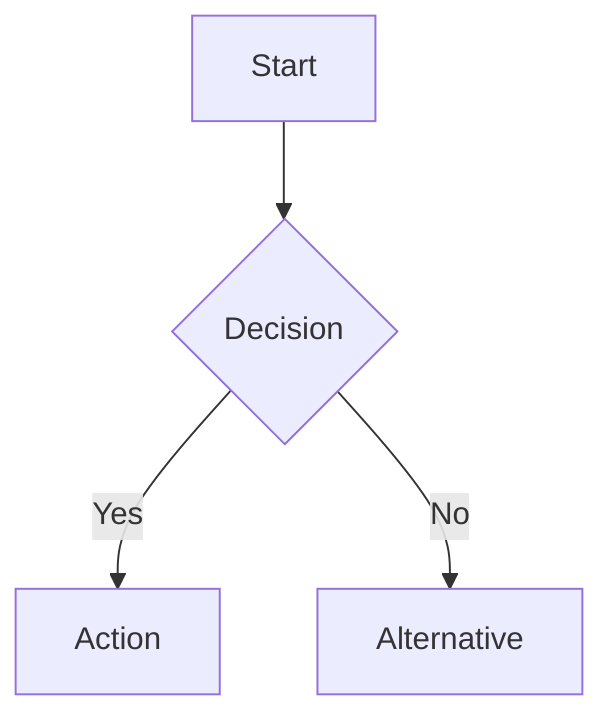
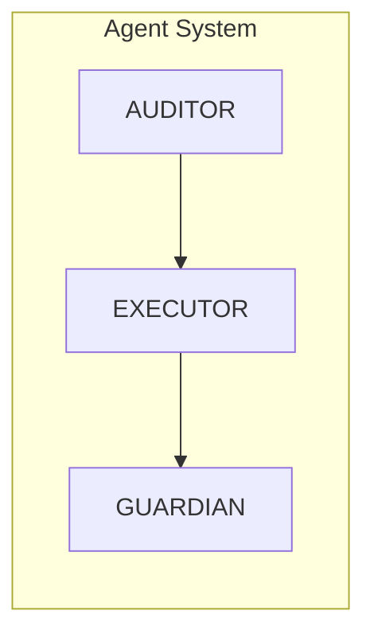
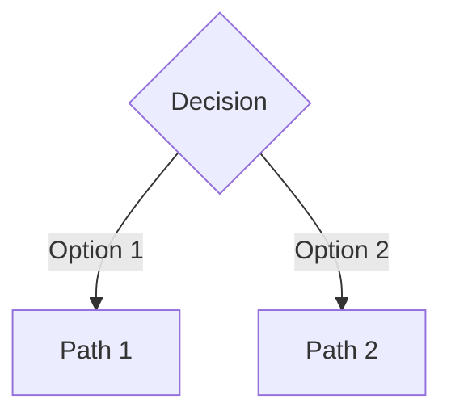
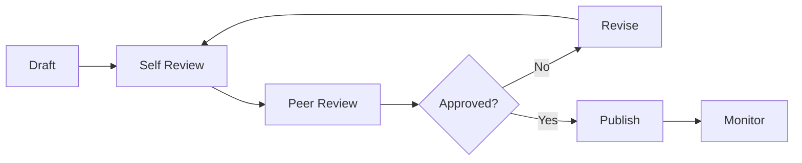

# Documentation Standards & Maintenance Guide

## Table of Contents
1. [Documentation Philosophy](#1-documentation-philosophy)
2. [Documentation Structure](#2-documentation-structure)
3. [Writing Standards](#3-writing-standards)
4. [Maintenance Procedures](#4-maintenance-procedures)
5. [Templates](#5-templates)
6. [Review Process](#6-review-process)

---

# 1. Documentation Philosophy

## Core Principles

1. **Clarity Over Completeness**: Clear, concise documentation that gets developers productive quickly
2. **Examples First**: Show, don't just tell - include working examples
3. **Maintenance-Friendly**: Easy to update and verify accuracy
4. **Progressive Disclosure**: Basic usage first, advanced topics deeper
5. **Machine-Readable**: Support automation and AI agent consumption

## Documentation-as-Code

Treat documentation with the same rigor as code:
- Version controlled
- Peer reviewed
- Tested for accuracy
- Automated where possible
- Continuously improved

---

# 2. Documentation Structure

## Repository Layout

```
/docs
  /WORKFLOW-*.md           # Core workflow documentation
  /ARCHITECTURE-*.md       # System architecture docs
  /INTEGRATION-*.md        # Integration guides
  /REFERENCE-*.md          # Reference materials
  /archive/                # Deprecated documentation
  index.md                 # Documentation hub

/README.md                 # Project overview
/CHANGELOG.md             # Version history
/CONTRIBUTING.md          # Contribution guidelines
/LICENSE                  # Legal information

/.claude
  /agents/                # Agent specifications
    CLAUDE.md            # Agent system overview
    *.md                 # Individual agent docs
  /commands/             # Command documentation
```

## Document Categories

### Workflow Documents (WORKFLOW-*)
- Purpose: Define processes and methodologies
- Audience: All team members
- Examples: TDD Protocol, Clean Code Assessment

### Architecture Documents (ARCHITECTURE-*)
- Purpose: Technical system design
- Audience: Developers, architects
- Examples: Agent Architecture, System Design

### Integration Documents (INTEGRATION-*)
- Purpose: External system connections
- Audience: DevOps, developers
- Examples: Linear, GitFlow, MCP Tools

### Reference Documents (REFERENCE-*)
- Purpose: Lookup and reference
- Audience: All stakeholders
- Examples: API Reference, Glossary

---

# 3. Writing Standards

## Document Template

```markdown
---
title: CATEGORY-NAME
version: 1.0.0
last_updated: YYYY-MM-DD
owner: Team Name
tags: [tag1, tag2, tag3]
---

# Document Title

## Table of Contents
[Auto-generated or manual TOC]

## Overview
Brief description and purpose

## [Main Content Sections]

## Summary
Key takeaways

## References
Related documents and resources

---

*Maintenance note or footer*
```

## Writing Guidelines

### Language & Tone
- **Active Voice**: "The system processes requests" not "Requests are processed"
- **Present Tense**: "The agent scans code" not "The agent will scan code"
- **Second Person**: "You can configure" not "One can configure"
- **Concise**: Average sentence length < 20 words

### Formatting Standards

#### Headers
```markdown
# H1: Document Title (one per document)
## H2: Major Sections
### H3: Subsections
#### H4: Details (use sparingly)
```

#### Code Examples
````markdown
```language
// Always include language identifier
// Add comments for clarity
const example = "working code";
```
````

#### Tables
```markdown
| Column | Column | Column |
|--------|--------|--------|
| Data   | Data   | Data   |
```

#### Lists
```markdown
- Unordered for related items
  - Nested with 2-space indent

1. Ordered for sequences
2. Or prioritized items
```

## Visual Elements

### Diagrams
Use Mermaid for maintainable diagrams:



### Architecture Diagrams


---

# 4. Maintenance Procedures

## Regular Maintenance

### Weekly Tasks
- [ ] Verify all links work
- [ ] Update version numbers
- [ ] Check for outdated examples
- [ ] Review recent changes

### Monthly Tasks
- [ ] Full accuracy review
- [ ] Update metrics and statistics
- [ ] Refresh command examples
- [ ] Archive outdated content

### Quarterly Tasks
- [ ] Major version updates
- [ ] Comprehensive review
- [ ] User feedback incorporation
- [ ] Tool/API updates

## Automated Checks

### Link Validation
```bash
#!/bin/bash
# Check all markdown links
find docs -name "*.md" -exec \
  markdown-link-check {} \;
```

### Spelling & Grammar
```bash
# Use aspell or similar
aspell check docs/*.md
```

### Code Example Validation
```typescript
async function validateCodeExamples(): Promise<ValidationResult> {
  const examples = extractCodeBlocks(markdown);

  for (const example of examples) {
    try {
      await compile(example);
      await lint(example);
    } catch (error) {
      reportInvalidExample(example, error);
    }
  }
}
```

---

# 5. Templates

## Feature Documentation Template

```markdown
# Feature: [Name]

## Purpose
What problem does this solve?

## Prerequisites
- Required setup
- Dependencies
- Permissions

## Basic Usage
```code
// Minimal example
```

## Configuration
```yaml
feature_config:
  option1: value
  option2: value
```

## Advanced Usage
Detailed examples and edge cases

## API Reference
Complete parameter documentation

## Troubleshooting
Common issues and solutions

## Related Features
Links to related documentation
```

## Agent Documentation Template

```markdown
# Agent: [NAME]

## Purpose
Single sentence description

## Capabilities
- Capability 1
- Capability 2

## Commands
### command-name
```bash
npm run agent:invoke AGENT:command -- [options]
```

**Parameters:**
- `--param`: Description

**Example:**
```bash
npm run agent:invoke AGENT:command -- --param value
```

## Integration Points
- Input sources
- Output destinations
- Tool usage

## Performance Metrics
| Metric | Target | Current |
|--------|--------|---------|
| SLA    | Value  | Value   |
```

## Process Documentation Template

```markdown
# Process: [Name]

## Overview
Process description and goals

## Participants
- Role 1: Responsibilities
- Role 2: Responsibilities

## Prerequisites
Requirements before starting

## Process Steps

### Step 1: [Name]
**Actor:** Who performs this
**Actions:**
1. Specific action
2. Specific action

**Output:** What is produced

### Step 2: [Name]
[Continue pattern]

## Decision Points


## Success Criteria
- [ ] Criterion 1
- [ ] Criterion 2

## Metrics
How to measure success
```

---

# 6. Review Process

## Documentation Review Checklist

### Content Review
- [ ] Technically accurate
- [ ] Complete information
- [ ] Clear examples
- [ ] Proper context
- [ ] No contradictions

### Style Review
- [ ] Follows template
- [ ] Consistent formatting
- [ ] Proper grammar
- [ ] Clear language
- [ ] Good structure

### Technical Review
- [ ] Code examples work
- [ ] Commands are correct
- [ ] Links are valid
- [ ] Versions are current
- [ ] APIs are accurate

## Review Workflow



## Quality Metrics

### Documentation Health Score
```typescript
interface DocHealth {
  accuracy: number;      // 0-100
  completeness: number;  // 0-100
  clarity: number;       // 0-100
  maintenance: number;   // 0-100
  overall: number;       // Average
}

function calculateHealth(doc: Document): DocHealth {
  return {
    accuracy: checkAccuracy(doc),
    completeness: checkCompleteness(doc),
    clarity: calculateReadability(doc),
    maintenance: daysSinceUpdate(doc),
    overall: calculateAverage()
  };
}
```

### Success Indicators
- Time to first contribution < 30 minutes
- Support ticket reduction > 25%
- Documentation satisfaction > 4.0/5.0
- Update frequency: monthly minimum
- Error report rate < 1%

---

## Summary

Professional documentation requires:
1. **Clear Standards**: Consistent format and style
2. **Regular Maintenance**: Scheduled reviews and updates
3. **Quality Control**: Automated and manual checks
4. **User Focus**: Prioritize developer experience
5. **Continuous Improvement**: Iterate based on feedback

Following these guidelines ensures documentation remains valuable, accurate, and maintainable.

---

*This guide is maintained by the Engineering Excellence Team and updated quarterly.*