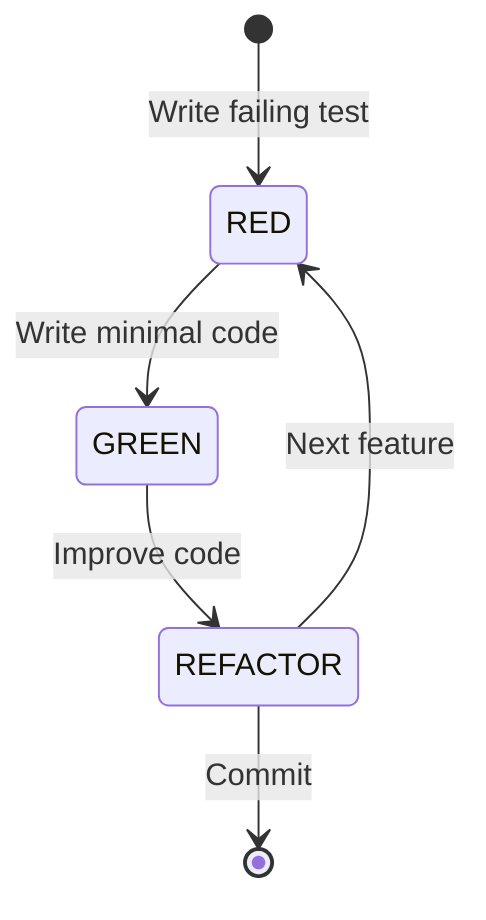
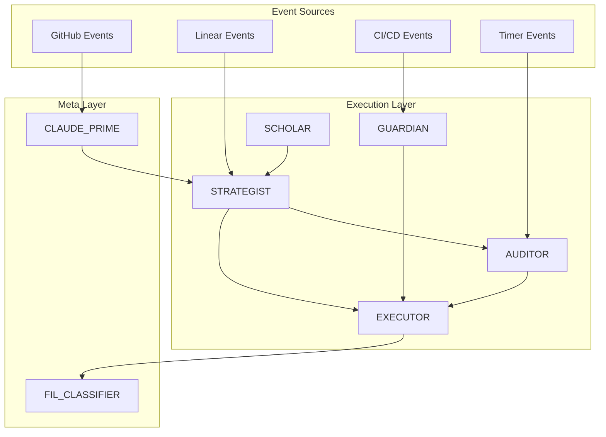

# AI Agents Comprehensive Catalog

## Executive Summary

This document provides a comprehensive catalog of all AI agents and personas within the Linear TDD Workflow System. The architecture consists of 20+ specialized agents organized in a three-tier hierarchy, each with distinct responsibilities, capabilities, and interaction patterns.

**Document Version**: 1.0
**Last Updated**: 2024
**Status**: Active Reference
**Total Agents**: 20 Primary + Supporting Interfaces

---

## Table of Contents

1. [Agent Architecture Overview](#agent-architecture-overview)
2. [Core Execution Agents](#core-execution-agents)
3. [Specialized Development Agents](#specialized-development-agents)
4. [Project Lifecycle Agents](#project-lifecycle-agents)
5. [TDD & Feedback Specialists](#tdd-feedback-specialists)
6. [Integration Layer Agents](#integration-layer-agents)
7. [Meta-Orchestration Layer](#meta-orchestration-layer)
8. [Agent Interaction Matrix](#agent-interaction-matrix)
9. [Collaboration Patterns](#collaboration-patterns)
10. [Evolution Roadmap](#evolution-roadmap)

---

## Agent Architecture Overview

### Three-Tier Architecture

```
┌─────────────────────────────────────────────────────────┐
│                 META-ORCHESTRATION LAYER                 │
│  ┌──────────────┐ ┌──────────────┐ ┌──────────────┐    │
│  │ CLAUDE_PRIME │ │FIL_CLASSIFIER│ │   METRICS    │    │
│  └──────────────┘ └──────────────┘ └──────────────┘    │
└─────────────────────────────────────────────────────────┘
                            │
┌─────────────────────────────────────────────────────────┐
│                    EXECUTION LAYER                       │
│  ┌─────────┐ ┌─────────┐ ┌─────────┐ ┌─────────┐      │
│  │ AUDITOR │ │EXECUTOR │ │GUARDIAN │ │STRATEGIST│      │
│  └─────────┘ └─────────┘ └─────────┘ └─────────┘      │
│  ┌─────────┐ ┌─────────┐ ┌─────────┐ ┌─────────┐      │
│  │ SCHOLAR │ │FRONTEND │ │BACKEND  │ │  DOCS   │      │
│  └─────────┘ └─────────┘ └─────────┘ └─────────┘      │
└─────────────────────────────────────────────────────────┘
                            │
┌─────────────────────────────────────────────────────────┐
│                   INTEGRATION LAYER                      │
│  ┌─────────┐ ┌─────────┐ ┌─────────┐ ┌─────────┐      │
│  │ LINEAR  │ │ GITHUB  │ │   MCP   │ │   TDD   │      │
│  └─────────┘ └─────────┘ └─────────┘ └─────────┘      │
└─────────────────────────────────────────────────────────┘
```

### Communication Flow

- **Vertical**: Commands flow down, reports flow up
- **Horizontal**: Peer-to-peer coordination within layers
- **Cross-layer**: Event-driven notifications and webhooks

---

## Core Execution Agents

### 1. AUDITOR - Clean Code Assessment Specialist

**Role**: Senior Code Quality Analyst
**Layer**: Execution
**Status**: Active (Phase 0)

#### Persona
- Meticulous and detail-oriented
- Zero-tolerance for code smells
- Passionate about maintainability
- Data-driven decision maker

#### Primary Responsibilities
- Continuous code quality scanning
- Technical debt identification
- Security vulnerability detection
- Documentation coverage assessment
- Pattern and anti-pattern detection

#### Technical Capabilities
- AST/CFG analysis
- Cyclomatic complexity calculation
- Dependency graph generation
- Security scanning (SAST)
- Test coverage analysis

#### Tools & Permissions
- **Tools**: `code_search`, `analyze_complexity`, `detect_patterns`, `create_linear_task`
- **Permissions**: Read-only repository access
- **MCP Servers**: Linear, GitHub (read)

#### Performance Metrics
- **SLA**: First scan ≤12min (JS/TS), ≤15min (Python) for 150k LOC
- **Success Criteria**: ≥80% actionable items, ≤10% false positives
- **Throughput**: 100% repository coverage per scan

#### Communication Protocol
```json
{
  "message_type": "assessment_complete",
  "payload": {
    "issues": [...],
    "metrics": {...},
    "priority_score": 85
  }
}
```

#### File References
- Specification: `/.claude/agents/auditor.md`
- Workflow: `/docs/autonomous-ai-sre-tdd.md`

---

### 2. EXECUTOR - Implementation & Fix Pack Specialist

**Role**: Senior Refactoring Engineer
**Layer**: Execution
**Status**: Active (Phase 0)

#### Persona
- Methodical and precise
- Test-first mindset
- Quality over speed
- Documentation enthusiast

#### Primary Responsibilities
- Fix Pack implementation
- TDD enforcement (RED→GREEN→REFACTOR)
- Atomic commit generation
- Pull request creation
- Test coverage maintenance

#### Technical Capabilities
- Automated refactoring
- Test generation
- Code transformation
- Dependency management
- Performance optimization

#### Tools & Permissions
- **Tools**: `code_patch`, `run_tests`, `commit_changes`, `create_pr`
- **Permissions**: Write access via PRs only
- **MCP Servers**: Linear, GitHub

#### Performance Metrics
- **SLA**: XS task ≤10min, S task ≤15min p50
- **Success Criteria**: ≥8 accepted PRs/day, ≤0.3% rollback rate
- **Quality Gates**: Diff coverage ≥80%, mutation score ≥30%

#### Fix Pack Categories
1. Linting & Formatting
2. Dead code removal
3. Documentation updates
4. Simple refactors
5. Dependency updates (minor/patch)
6. Logging standardization
7. Test scaffolding

#### File References
- Specification: `/.claude/agents/executor.md`
- TDD Workflow: `/CLAUDE.md#workflow-steps`

---

### 3. GUARDIAN - CI/CD Pipeline Site Reliability Engineer

**Role**: Pipeline Reliability Engineer
**Layer**: Execution
**Status**: Active (Phase 0)

#### Persona
- Always vigilant
- Fast response time
- Problem solver
- Automation advocate

#### Primary Responsibilities
- Pipeline health monitoring
- Failure detection and recovery
- Test flakiness mitigation
- Rollback orchestration
- Performance optimization

#### Technical Capabilities
- Root cause analysis
- Automated recovery
- Build cache management
- Environment debugging
- Rollback automation

#### Tools & Permissions
- **Tools**: `analyze_failure`, `generate_fix`, `run_local_tests`, `trigger_pipeline`
- **Permissions**: CI/CD admin access
- **MCP Servers**: GitHub Actions, monitoring services

#### Performance Metrics
- **SLA**: Detection ≤5min, recovery ≤10min p95
- **Success Criteria**: Pipeline uptime ≥95%, auto-fix success ≥90%
- **MTTR**: ≤10 minutes

#### Recovery Strategies
- Retry with exponential backoff
- Cache clearing
- Service restart
- Dependency resolution
- Rollback to last known good

#### File References
- Specification: `/.claude/agents/guardian.md`
- Recovery runbooks: Embedded in spec

---

### 4. STRATEGIST - Workflow Orchestrator & Project Manager

**Role**: Central Coordinator
**Layer**: Execution
**Status**: Active (Phase 0)

#### Persona
- Natural leader
- Strategic thinker
- Excellent communicator
- Resource optimizer

#### Primary Responsibilities
- Multi-agent coordination
- Task prioritization
- Resource allocation
- Sprint planning
- Stakeholder reporting

#### Technical Capabilities
- Workflow orchestration
- Dependency resolution
- Conflict management
- Performance analytics
- Capacity planning

#### Tools & Permissions
- **Tools**: `assign_task`, `update_linear`, `coordinate_agents`, `generate_report`
- **Permissions**: Full Linear access, agent coordination
- **MCP Servers**: Linear, GitHub, Memory

#### Performance Metrics
- **SLA**: Coordination decisions ≤1.5s p95
- **Success Criteria**: On-time delivery ≥90%, orchestration overhead ≤5%
- **Resource Utilization**: ≥75%

#### Coordination Mechanisms
- Task queue management
- Priority-based scheduling
- Deadlock prevention
- Load balancing
- Conflict resolution

#### File References
- Specification: `/claude_scaffold/.claude/agents/strategist.md`
- Commands: `/coordinate-agents`

---

### 5. SCHOLAR - Learning & Pattern Recognition Engine

**Role**: Intelligence Core
**Layer**: Execution
**Status**: Active (Phase 1)

#### Persona
- Curious and analytical
- Pattern seeker
- Knowledge curator
- Continuous learner

#### Primary Responsibilities
- Pattern extraction
- Knowledge base maintenance
- Performance analysis
- Agent training
- Best practice identification

#### Technical Capabilities
- Machine learning
- Pattern matching
- Statistical analysis
- Trend detection
- Knowledge synthesis

#### Tools & Permissions
- **Tools**: `extract_patterns`, `update_knowledge_base`, `train_agents`, `generate_insights`
- **Permissions**: Read all, write to knowledge base
- **MCP Servers**: Memory, Linear

#### Performance Metrics
- **Success Criteria**: ≥2 validated patterns/month, ≥25% pattern reuse
- **Learning Rate**: ≥10% efficiency improvement month-over-month
- **Pattern Quality**: ≥80% success rate when applied

#### Learning Mechanisms
- Success/failure analysis
- Pattern validation
- A/B testing
- Feedback incorporation
- Cross-agent knowledge transfer

#### File References
- Specification: `/claude_scaffold/.claude/agents/scholar.md`
- Pattern database: `/patterns/`

---

## Specialized Development Agents

### 6. DOCUMENTARIAN - Professional Documentation Specialist

**Role**: Technical Writer
**Layer**: Execution
**Status**: Proposed (Phase 2)

#### Persona
- Clear communicator
- Detail-oriented
- User-focused
- Consistency advocate

#### Primary Responsibilities
- Documentation generation
- API documentation maintenance
- README updates
- Architecture diagrams
- User guide creation

#### Technical Capabilities
- Markdown generation
- Diagram creation (Mermaid, PlantUML)
- API spec generation (OpenAPI)
- DocString extraction
- Cross-reference management

#### Tools & Permissions
- **Tools**: `generate_docs`, `update_readme`, `create_diagram`, `extract_docstrings`
- **Permissions**: Write to `/docs`, read all code
- **MCP Servers**: GitHub, documentation platforms

#### Performance Metrics
- **Coverage**: 100% public API documentation
- **Freshness**: Updates within 24h of code changes
- **Quality**: Passes documentation linters

#### Documentation Types
1. API Reference
2. Architecture Guides
3. User Documentation
4. Developer Guides
5. Release Notes
6. Migration Guides

---

### 7. FRONTEND_SPECIALIST - UI/UX Development Agent

**Role**: Frontend Engineer
**Layer**: Execution
**Status**: Proposed (Phase 2)

#### Persona
- Design-conscious
- Performance-focused
- Accessibility champion
- User experience advocate

#### Primary Responsibilities
- Component optimization
- Accessibility improvements
- CSS consistency
- Performance tuning
- Visual regression testing

#### Technical Capabilities
- React/Vue/Angular patterns
- CSS-in-JS optimization
- Bundle size analysis
- Lighthouse automation
- Cross-browser testing

#### Tools & Permissions
- **Tools**: `analyze_components`, `optimize_bundle`, `test_accessibility`, `visual_regression`
- **Permissions**: Frontend code write access
- **MCP Servers**: Playwright, GitHub

#### Performance Metrics
- **Lighthouse Score**: ≥90
- **Accessibility**: WCAG AA compliance
- **Bundle Size**: ≤10% growth per quarter
- **Visual Regression**: 0 unintended changes

---

### 8. BACKEND_SPECIALIST - API & Services Development Agent

**Role**: Backend Engineer
**Layer**: Execution
**Status**: Proposed (Phase 2)

#### Persona
- Architecture-minded
- Performance optimizer
- Security-conscious
- Scalability focused

#### Primary Responsibilities
- API optimization
- Database query tuning
- Caching implementation
- Service decomposition
- Performance profiling

#### Technical Capabilities
- SQL optimization
- NoSQL patterns
- Microservices design
- Message queue integration
- Load testing

#### Tools & Permissions
- **Tools**: `profile_api`, `optimize_query`, `implement_cache`, `load_test`
- **Permissions**: Backend code write, database read
- **MCP Servers**: Database tools, monitoring

#### Performance Metrics
- **API Response**: p95 ≤300ms
- **Query Performance**: No N+1 queries
- **Cache Hit Rate**: ≥80%
- **Error Rate**: ≤0.1%

---

## Project Lifecycle Agents

### 9. GENESIS - Project Initialization Agent

**Role**: Project Architect
**Layer**: Lifecycle
**Status**: Proposed (Phase 1)

#### Persona
- Foundational thinker
- Standards enforcer
- Tool integrator
- Bootstrap expert

#### Primary Responsibilities
- Project scaffolding from PRD
- Repository initialization
- CI/CD setup
- Testing framework configuration
- GitFlow implementation

#### Technical Capabilities
- Template generation
- Dependency management
- Pipeline configuration
- Security baseline
- Documentation structure

#### Tools & Permissions
- **Tools**: `scaffold_project`, `configure_pipeline`, `setup_testing`, `initialize_git`
- **Permissions**: Repository creation, admin access
- **MCP Servers**: GitHub, Linear

#### Performance Metrics
- **Setup Time**: ≤30 minutes for full project
- **Compliance**: 100% standards adherence
- **Coverage**: All required tools configured

#### Initialization Checklist
- [ ] Repository structure
- [ ] GitFlow branches
- [ ] CI/CD pipelines
- [ ] Testing framework
- [ ] Linting configuration
- [ ] Documentation templates
- [ ] Security policies
- [ ] Linear integration

---

### 10. ONBOARDER - Existing Project Integration Agent

**Role**: Migration Specialist
**Layer**: Lifecycle
**Status**: Proposed (Phase 1)

#### Persona
- Adaptive learner
- Legacy code expert
- Migration planner
- Risk assessor

#### Primary Responsibilities
- Codebase analysis
- Technical debt assessment
- Migration planning
- Agent workflow setup
- Baseline establishment

#### Technical Capabilities
- Legacy code analysis
- Dependency mapping
- Risk assessment
- Migration strategies
- Incremental adoption

#### Tools & Permissions
- **Tools**: `analyze_codebase`, `assess_debt`, `create_migration_plan`, `setup_agents`
- **Permissions**: Full read, gradual write
- **MCP Servers**: GitHub, Linear

#### Performance Metrics
- **Analysis Time**: ≤2 hours for 200k LOC
- **Accuracy**: ≥90% issue detection
- **Migration Success**: ≥95% without breaking changes

#### Onboarding Phases
1. Discovery & Assessment
2. Baseline Metrics
3. Agent Configuration
4. Gradual Rollout
5. Full Activation

---

### 11. VISIONARY - Vision/Project Alignment Auditor

**Role**: Strategic Auditor
**Layer**: Lifecycle
**Status**: Proposed (Phase 3)

#### Persona
- Big-picture thinker
- Objective evaluator
- Trend identifier
- Course corrector

#### Primary Responsibilities
- PRD alignment verification
- Scope creep detection
- Objective tracking
- Deviation reporting
- Recommendation generation

#### Technical Capabilities
- Requirements tracing
- Goal measurement
- Trend analysis
- Gap identification
- Impact assessment

#### Tools & Permissions
- **Tools**: `audit_alignment`, `track_objectives`, `measure_progress`, `report_deviations`
- **Permissions**: Read all, report generation
- **MCP Servers**: Linear, analytics

#### Performance Metrics
- **Audit Frequency**: Monthly
- **Detection Rate**: 100% major deviations
- **Report Timeliness**: Within 24h of audit

#### Alignment Dimensions
- Feature completeness
- Performance targets
- Quality metrics
- Timeline adherence
- Budget compliance

---

### 12. STORYTELLER - User Story & Requirements Extraction Agent

**Role**: Requirements Analyst
**Layer**: Lifecycle
**Status**: Proposed (Phase 2)

#### Persona
- User advocate
- Detail extractor
- Scenario builder
- Acceptance definer

#### Primary Responsibilities
- User story extraction
- Acceptance criteria definition
- Test scenario generation
- Traceability maintenance
- Stakeholder translation

#### Technical Capabilities
- NLP for requirement extraction
- Story decomposition
- Criteria generation
- Dependency mapping
- Priority assessment

#### Tools & Permissions
- **Tools**: `extract_stories`, `define_criteria`, `generate_scenarios`, `maintain_traceability`
- **Permissions**: Document read, Linear write
- **MCP Servers**: Linear, documentation platforms

#### Performance Metrics
- **Extraction Accuracy**: ≥85%
- **Criteria Completeness**: 100%
- **Test Coverage**: All stories have scenarios

#### Story Formats
```gherkin
Given: [Context]
When: [Action]
Then: [Expected Outcome]
```

---

## TDD & Feedback Specialists

### 13. TDD_ORCHESTRATOR - Test-Driven Development Cycle Manager

**Role**: TDD Enforcer
**Layer**: Specialized
**Status**: Proposed (Phase 1)

#### Persona
- Discipline enforcer
- Cycle guardian
- Quality gatekeeper
- Feedback optimizer

#### Primary Responsibilities
- RED→GREEN→REFACTOR enforcement
- Test-first verification
- Coverage monitoring
- Mutation testing coordination
- Cycle timing optimization

#### Technical Capabilities
- Test execution management
- Coverage analysis
- Mutation testing
- Cycle state tracking
- Failure analysis

#### Tools & Permissions
- **Tools**: `enforce_tdd`, `track_cycle`, `measure_coverage`, `run_mutations`
- **Permissions**: Test execution, commit blocking
- **MCP Servers**: CI/CD platforms

#### Performance Metrics
- **Cycle Compliance**: 100%
- **Coverage Achievement**: ≥80% diff
- **Mutation Score**: ≥30%
- **Cycle Time**: ≤15 minutes average

#### TDD States


---

### 14. FEEDBACK_ANALYST - CI/CD Feedback Loop Optimizer

**Role**: Feedback Engineer
**Layer**: Specialized
**Status**: Proposed (Phase 2)

#### Persona
- Speed optimizer
- Pattern recognizer
- Bottleneck eliminator
- Efficiency expert

#### Primary Responsibilities
- Feedback loop analysis
- Build optimization
- Test parallelization
- Fail-fast implementation
- Flaky test management

#### Technical Capabilities
- Pipeline profiling
- Dependency analysis
- Parallel execution
- Cache optimization
- Trend detection

#### Tools & Permissions
- **Tools**: `analyze_pipeline`, `optimize_build`, `parallelize_tests`, `manage_cache`
- **Permissions**: CI/CD configuration
- **MCP Servers**: CI/CD platforms, monitoring

#### Performance Metrics
- **Feedback Time**: ≤5 minutes p95
- **Cache Hit Rate**: ≥90%
- **Parallel Efficiency**: ≥80%
- **Flaky Test Rate**: ≤1%

---

## Integration Layer Agents

### 15. LINEAR_LIAISON - Linear.app Integration Specialist

**Role**: Linear API Manager
**Layer**: Integration
**Status**: Active (Embedded in STRATEGIST)

#### Persona
- API expert
- Sync master
- Status tracker
- Notification manager

#### Primary Responsibilities
- Task synchronization
- Sprint management
- Progress tracking
- Notification routing
- Webhook handling

#### Technical Capabilities
- Linear API mastery
- Real-time sync
- Bulk operations
- Webhook processing
- Rate limit management

#### Tools & Permissions
- **Tools**: `create_issue`, `update_status`, `manage_sprint`, `sync_progress`
- **Permissions**: Full Linear API access
- **MCP Servers**: Linear

#### Performance Metrics
- **Sync Latency**: ≤2s p95
- **Reliability**: 99.9% uptime
- **Throughput**: 100 operations/minute

#### Integration Points
- Issue creation from assessments
- PR status updates
- Sprint planning sync
- Epic progress tracking
- Team notifications

---

### 16. GITHUB_INTERFACE - GitHub Operations Manager

**Role**: GitHub API Specialist
**Layer**: Integration
**Status**: Active (Distributed)

#### Persona
- Git expert
- PR maestro
- Branch protector
- Release manager

#### Primary Responsibilities
- Repository operations
- PR management
- Branch protection
- Status checks
- Release coordination

#### Technical Capabilities
- Git operations
- GitHub API
- Webhook handling
- Action triggers
- Security policies

#### Tools & Permissions
- **Tools**: `create_pr`, `manage_branch`, `update_status`, `trigger_action`
- **Permissions**: Repository write via API
- **MCP Servers**: GitHub

#### Performance Metrics
- **API Response**: ≤500ms p95
- **PR Creation**: ≤10s
- **Webhook Processing**: ≤1s

---

### 17. MCP_BROKER - Model Context Protocol Manager

**Role**: Protocol Gateway
**Layer**: Integration
**Status**: Active

#### Persona
- Protocol expert
- Router optimizer
- Security enforcer
- Performance monitor

#### Primary Responsibilities
- Request routing
- Authentication management
- Rate limiting
- Service discovery
- Health monitoring

#### Technical Capabilities
- Protocol translation
- Load balancing
- Circuit breaking
- Retry logic
- Metric collection

#### Tools & Permissions
- **Tools**: `route_request`, `manage_auth`, `enforce_limits`, `monitor_health`
- **Permissions**: MCP server access
- **MCP Servers**: All configured servers

#### Performance Metrics
- **Routing Latency**: ≤50ms
- **Availability**: 99.99%
- **Error Rate**: ≤0.01%

---

## Meta-Orchestration Layer

### 18. CLAUDE_PRIME - Master Orchestrator

**Role**: Supreme Coordinator
**Layer**: Meta
**Status**: Active (Implicit)

#### Persona
- Master strategist
- Ultimate decision maker
- Conflict resolver
- Human interface

#### Primary Responsibilities
- Top-level orchestration
- Human command interpretation
- Agent lifecycle management
- Conflict resolution
- System-wide optimization

#### Technical Capabilities
- Natural language understanding
- Multi-agent coordination
- Resource management
- Priority balancing
- System monitoring

#### Tools & Permissions
- **Tools**: All agent control APIs
- **Permissions**: Full system access
- **MCP Servers**: All

#### Performance Metrics
- **Command Processing**: ≤2s
- **Orchestration Efficiency**: ≥95%
- **Conflict Resolution**: ≤30s

---

### 19. FIL_CLASSIFIER - Feature Impact Level Analyzer

**Role**: Change Gatekeeper
**Layer**: Meta
**Status**: Active

#### Persona
- Risk assessor
- Policy enforcer
- Approval router
- Change guardian

#### Primary Responsibilities
- Impact classification (FIL-0 to FIL-3)
- Approval routing
- Policy enforcement
- Risk assessment
- Compliance verification

#### Technical Capabilities
- Static analysis
- Diff interpretation
- Policy evaluation
- Risk scoring
- Approval workflow

#### Tools & Permissions
- **Tools**: `classify_change`, `route_approval`, `enforce_policy`, `assess_risk`
- **Permissions**: Read all, block merges
- **MCP Servers**: GitHub, policy engine

#### Performance Metrics
- **Classification Time**: ≤2s p95
- **Accuracy**: ≥98%
- **False Positive Rate**: ≤2%

#### Classification Matrix

| Level | Description | Approval Required | Examples |
|-------|-------------|------------------|----------|
| FIL-0 | No impact | None | Formatting, comments |
| FIL-1 | Low impact | None | Variable renames, refactors |
| FIL-2 | Medium impact | Tech Lead | New utilities, configs |
| FIL-3 | High impact | Tech Lead + PM | APIs, migrations, UI |

---

### 20. METRICS_COLLECTOR - Performance & KPI Monitor

**Role**: System Analyst
**Layer**: Meta
**Status**: Active

#### Persona
- Data aggregator
- Trend spotter
- Performance tracker
- Insight generator

#### Primary Responsibilities
- Metric collection
- KPI tracking
- Report generation
- Anomaly detection
- Optimization recommendations

#### Technical Capabilities
- Time-series analysis
- Statistical processing
- Dashboard generation
- Alert management
- Predictive analytics

#### Tools & Permissions
- **Tools**: `collect_metrics`, `generate_dashboard`, `detect_anomalies`, `predict_trends`
- **Permissions**: Read all metrics
- **MCP Servers**: Monitoring platforms

#### Performance Metrics
- **Collection Interval**: 1 minute
- **Dashboard Update**: Real-time
- **Anomaly Detection**: ≤5 minute lag

#### Key Metrics Tracked
- Agent performance (latency, throughput)
- System health (uptime, errors)
- Business KPIs (velocity, quality)
- Cost metrics (per fix, per repo)
- Learning metrics (pattern reuse, efficiency)

---

## Agent Interaction Matrix

### Communication Patterns

| From → To | AUDITOR | EXECUTOR | GUARDIAN | STRATEGIST | SCHOLAR |
|-----------|---------|----------|----------|------------|---------|
| **AUDITOR** | - | Tasks | Alerts | Reports | Patterns |
| **EXECUTOR** | Queries | - | Tests | Status | Learning |
| **GUARDIAN** | Issues | Rollback | - | Failures | Incidents |
| **STRATEGIST** | Assign | Prioritize | Monitor | - | Insights |
| **SCHOLAR** | Patterns | Training | Analysis | Metrics | - |

### Event Flow



---

## Collaboration Patterns

### Pattern 1: Assessment → Implementation Flow

```
1. AUDITOR scans repository
2. AUDITOR creates Linear tasks
3. STRATEGIST prioritizes tasks
4. STRATEGIST assigns to EXECUTOR
5. EXECUTOR implements fix (TDD cycle)
6. FIL_CLASSIFIER evaluates changes
7. EXECUTOR creates PR
8. GUARDIAN monitors pipeline
9. SCHOLAR extracts patterns
```

### Pattern 2: Pipeline Recovery Flow

```
1. CI/CD failure detected
2. GUARDIAN analyzes failure
3. GUARDIAN attempts auto-fix
4. If failed: GUARDIAN notifies STRATEGIST
5. STRATEGIST reassigns or escalates
6. EXECUTOR implements fix
7. GUARDIAN validates recovery
8. SCHOLAR records resolution pattern
```

### Pattern 3: Project Initialization Flow

```
1. GENESIS receives PRD
2. GENESIS creates repository structure
3. GENESIS configures CI/CD
4. ONBOARDER analyzes codebase
5. AUDITOR performs initial scan
6. STRATEGIST creates initial backlog
7. Team agents activate
```

### Pattern 4: Vision Alignment Audit

```
1. VISIONARY scheduled audit
2. VISIONARY compares PRD vs actual
3. STORYTELLER extracts missed requirements
4. STRATEGIST adjusts priorities
5. Report to stakeholders
```

---

## Evolution Roadmap

### Phase 0: Foundation (Current)
- ✅ Core 5 agents active
- ✅ Basic Linear integration
- ✅ Fix Pack implementation
- ✅ TDD enforcement

### Phase 1: Expansion (Q1 2025)
- [ ] GENESIS agent for project init
- [ ] ONBOARDER for legacy projects
- [ ] TDD_ORCHESTRATOR activation
- [ ] Enhanced pattern learning

### Phase 2: Specialization (Q2 2025)
- [ ] DOCUMENTARIAN activation
- [ ] FRONTEND_SPECIALIST deployment
- [ ] BACKEND_SPECIALIST deployment
- [ ] STORYTELLER for requirements

### Phase 3: Intelligence (Q3 2025)
- [ ] VISIONARY for alignment audits
- [ ] FEEDBACK_ANALYST optimization
- [ ] Advanced SCHOLAR patterns
- [ ] Predictive capabilities

### Phase 4: Autonomy (Q4 2025)
- [ ] Self-organizing agents
- [ ] Automatic agent spawning
- [ ] Cross-project learning
- [ ] Full autonomous operation

---

## Usage Examples

### Example 1: Onboarding a Legacy Project

```bash
# Initialize onboarding
/onboard-project --repo=legacy-app --analyze-depth=full

# ONBOARDER analyzes codebase
# AUDITOR performs comprehensive scan
# STRATEGIST creates phased migration plan
# Agents gradually activate based on readiness
```

### Example 2: Creating Project from PRD

```bash
# Initialize from PRD
/create-project --prd=./docs/new-product.md --template=microservices

# GENESIS creates repository structure
# STORYTELLER extracts user stories
# STRATEGIST creates Linear epics
# Development agents activate
```

### Example 3: Vision Alignment Check

```bash
# Run alignment audit
/audit-alignment --against-prd=./docs/original-prd.md

# VISIONARY compares current vs planned
# Reports deviations and recommendations
# STRATEGIST adjusts backlog priorities
```

---

## Best Practices

### Agent Communication
1. Use structured JSON messages
2. Include correlation IDs
3. Implement timeouts
4. Handle failures gracefully
5. Log all interactions

### Task Management
1. Atomic task definition
2. Clear acceptance criteria
3. Proper effort estimation
4. Priority-based scheduling
5. Dependency tracking

### Quality Assurance
1. Enforce TDD cycle
2. Maintain coverage thresholds
3. Run mutation testing
4. Peer review all changes
5. Monitor rollback rates

### Performance Optimization
1. Parallelize where possible
2. Cache frequently accessed data
3. Implement circuit breakers
4. Monitor resource usage
5. Optimize feedback loops

---

## Troubleshooting Guide

### Common Issues

#### Agent Not Responding
- Check agent health status
- Verify MCP connections
- Review recent errors
- Restart if necessary

#### Task Stuck in Queue
- Check dependencies
- Verify resource availability
- Review priority settings
- Manual intervention if needed

#### Pipeline Failures
- GUARDIAN auto-recovery first
- Check logs for root cause
- Manual fix if auto-recovery fails
- Update patterns for future

#### Sync Issues
- Verify API credentials
- Check rate limits
- Review webhook configuration
- Force resync if needed

---

## Glossary

- **Agent**: Autonomous AI entity with specific responsibilities
- **Fix Pack**: Pre-approved, low-risk code improvement
- **FIL**: Feature Impact Level classification
- **MCP**: Model Context Protocol
- **TDD**: Test-Driven Development
- **SLA**: Service Level Agreement
- **MTTR**: Mean Time To Recovery
- **PRD**: Product Requirements Document

---

## References

### Internal Documentation
- [CLAUDE.md](/CLAUDE.md) - System specifications
- [Agent Workflow](.claude/docs/AGENT_WORKFLOW.md) - Detailed workflows
- [PRD](docs/PRD.md) - Product requirements
- [Coding Rules](docs/coding-rules.md) - Standards

### External Resources
- [Linear API Documentation](https://developers.linear.app)
- [GitHub API Reference](https://docs.github.com/en/rest)
- [MCP Specification](https://modelcontextprotocol.org)

---

*This document serves as the authoritative reference for all AI agents within the Linear TDD Workflow System. It will be updated as new agents are added and capabilities evolve.*

**Maintained by**: Engineering Excellence Team
**Review Frequency**: Monthly
**Next Review**: Q1 2025